# The Skinny Bob post-processing stack — reconstructed, and tested against the 2026 videos

Compiled 2026-07-27. Sources: skinnybob.info (full site text + all 201 media assets pulled),
the r/SkinnyBob threads it cites (recovered via Wayback since Reddit is IP-blocked here),
and new measurements on the seven local video files.

Assets archived under `analysis/prior-work/`:
- `skinnybob_site_media/` — all 201 images/videos from skinnybob.info
- `skinnybob_site_text.txt`, `skinnybob_site.html` — full site text
- `reddit/` — the five key threads (HTML) + the four evidence images
- `reddit_videos/thhiddkgwv661.mp4` — **BrooklynRobot's original side-by-side stock-match video** (40 s, 1080p)
- `reddit_videos/azpkvqhsddy51.mp4` — the Consolas/timecode animation demo
- `sheets/` — contact sheets, incl. `stack_final_crop.png` (the annotated final stack diagram)
- `sapphire_probe.py`, `sapphire_probe.json` — new measurements described in §4

---

## 1. What the community actually established

The site's `#visual_effects` section is short, but it links out to the threads that did the work.
Recovered in full, they establish three separate things that often get conflated:

**(a) The effect stack itself.** u/BrooklynRobot enumerated nine visual phenomena in order of
appearance and reasoned about the cause of each. The ordering matters: order of phenomena
constrains the chronology of transfer/modification.

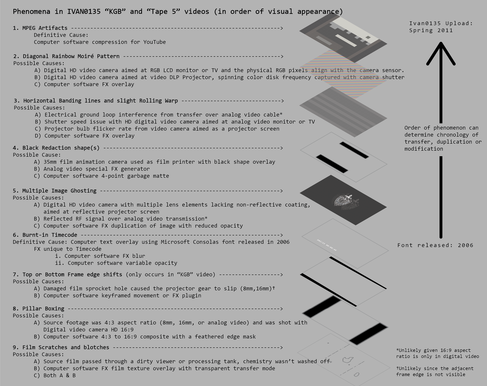
*The original diagram (`analysis/prior-work/reddit/j1ezyqh7zl061.png`). Each layer is listed with
candidate causes; note how often "Computer software FX overlay" appears as the last option.*

The final, annotated version — where two layers are circled in red as *traced to stock footage* —
never made it to the site. It exists only inside BrooklynRobot's video, at ~36 s:

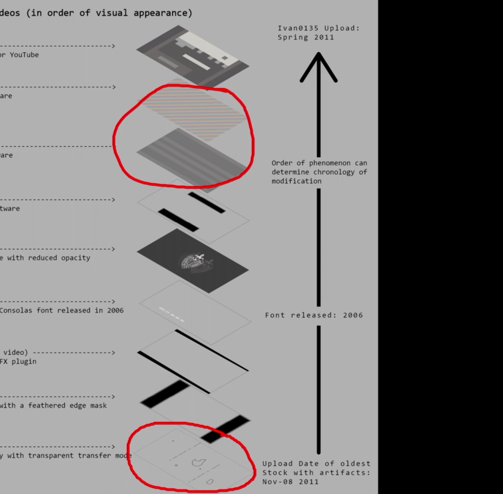
*Extracted from `reddit_videos/thhiddkgwv661.mp4`. Red circles: the moiré/banding layer (top) and
the scratch/blotch layer (bottom) — the only two ever tied to purchased assets. Right margin
carries the two dating anchors: "Font released: 2006" and "Upload Date of oldest Stock with
artifacts: Nov-08 2011".*

| # | Phenomenon | Cause as finally assessed |
|---|---|---|
| 1 | MPEG artifacts | Definitive: YouTube compression |
| 2 | Diagonal rainbow moiré | **Stock video FX overlay** (red-circled) |
| 3 | Horizontal banding + slight rolling warp | **Stock video FX overlay** (red-circled) |
| 4 | Black redaction shape(s) | Computer software 4-point garbage matte |
| 5 | Multiple image ghosting | Software FX duplication of image at reduced opacity |
| 6 | Burned-in timecode | Definitive: text overlay in **Consolas** (released 2006), plus FX blur + variable opacity |
| 7 | Top/bottom frame-edge shifts (KGB video only) | Software keyframed movement or FX plugin |
| 8 | Pillar boxing | 4:3→16:9 composite with a feathered edge mask |
| 9 | Film scratches and blotches | **Stock footage FX film-texture overlay**, transparent transfer mode (red-circled) |

Note what the diagram does *not* claim: layers 4–8 were assessed as software manipulation, not
matched to any purchased asset. Only the moiré/banding layer and the scratch/blotch layer were
tied to specific stock clips.

**(b) The stock overlay lineage.** u/BrooklynRobot found the scratch/blotch overlay for sale on
Pond5/Shutterstock/Getty, matching Ivan's footage almost exactly when time-stretched. The
signature is a recurring blotch the thread nicknamed the **"duck"**, which lands at ~00:04 in
every version of the clip. u/Jazzlike_Squirrel then found the duck is *also* Brush 10 of the
free **Obsidian Dawn "Old Film" Photoshop/GIMP brush set** — rotated 90°. The two of them
never fully resolved whether the brushes were derived from the film clip or vice versa; the
brush author (Stephanie Shimerda) replied that she couldn't recall the source. The practical
consequence is that the duck proves *an asset family*, not one specific vendor.

His working method is visible in the video itself:

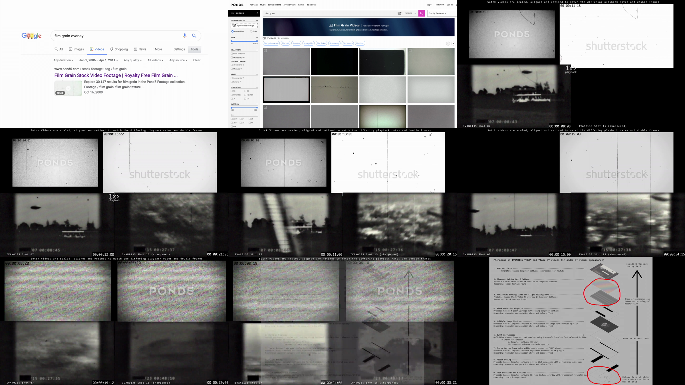
*`reddit_videos/thhiddkgwv661.mp4`, sampled every 4 s. Top row: date-restricted Google and Pond5
searches. Middle rows: Ivan's shots beside POND5- and shutterstock-watermarked overlays, retimed
to match. Bottom-left: the same treatment applied to the rainbow-moiré / "bad TV" layer. Bottom
-right: the annotated stack diagram reproduced above.*

Dates matter here and are frequently misreported. The oldest stock upload carrying the duck is
**2011-11-08** — six months *after* the last Ivan video. The best-looking visual match
(iStock gm146102427) was posted **2011-06-08**, three weeks after. Neither can be Ivan's source;
they are siblings from a shared upstream. The one item that genuinely predates Ivan is
**Getty 104161830, February 2009** — and it is the only one that ships with **sound**.

Here is the overlay in isolation — the site ships a 31-frame sample, which is the clearest single
view of what the layer actually contributes:

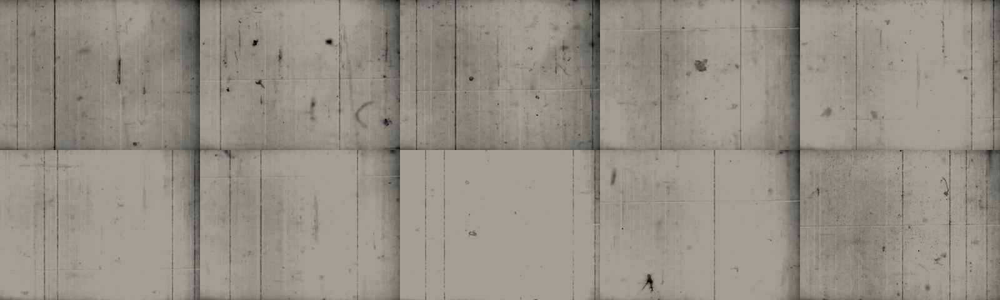
*`skinnybob_site_media/effects/old_film_damage.mp4`, every 3rd frame. Vertical scratch lines, dust,
blotches, a strong vignette, and — visible as black bands at the top of several frames — the
interframe border that §2 attributes to Sapphire's Shake parameter.*

And the "duck" itself, as it appears inside Ivan's footage:

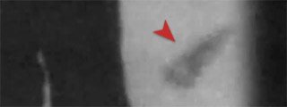
*The recurring blotch (arrowed) that let BrooklynRobot tie Ivan's overlay to the stock clips.*

**(c) The software.** u/Jazzlike_Squirrel identified **Boris FX Sapphire — S_FilmDamage** as the
plugin that produces the whole family. An overlay vendor
confirmed to them that they used Sapphire to generate the overlays they sell. This is the piece
that ties (a) and (b) together: the "stock clips" are themselves Sapphire renders, which is why
so many sellers' clips share artifacts, and why Lex_Visuals answered "the footage is
procedurally generated."

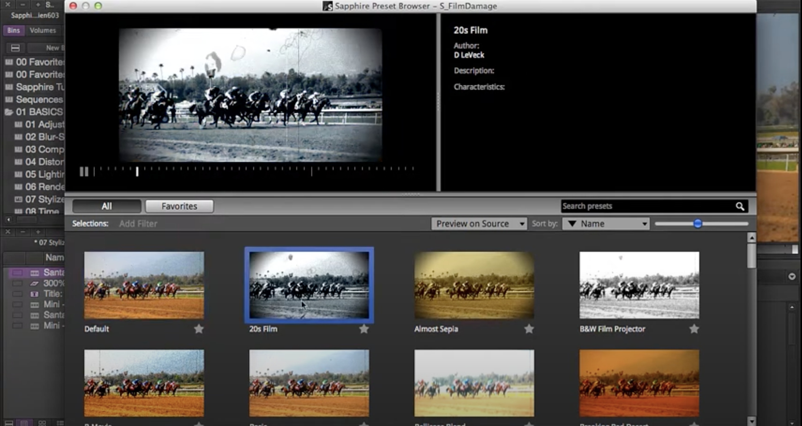
*`reddit/s9c4zpp9vb861.png` — the S_FilmDamage preset browser. Note the two presets most relevant
to this footage: **20s Film** (selected) and **B&W Film Projector**.*

**(d) Audio: never resolved.** The site is explicit — the projector sound "might be just another
stock effect", u/RedDwarfBee discussed it "without a conclusion", and the site argues it's not
worth chasing now that the visual stock was found. That reasoning is a mistake, and §5 below
says why.

---

## 2. The stack expressed as Sapphire parameters

S_FilmDamage is a single plugin bundling exactly the sub-effects the stack lists. Its parameter
groups (from the Boris FX docs) are: **Grain** (Amplitude per-channel, Blur, **Mono**, Hold),
**Color Correction** (Saturation, Scale Lights, Offset Darks, Tint Lights, Tint Darks),
**Stains** (Density, Size, Opacity, **Print/Negative ratio**), **Dust** (same set),
**Hairs** (Count, **Persistence**, Wiggle Amp/Freq), **Scratches** (Count, Black/White ratio,
Length, Width, Taper, Roughness, Weave), **Shake** (Amplitude, Frequency, Jumpiness,
**Interframe Border Height**, Motion Blur), **Vignette** (Darkness, Radius, Edge Softness),
**Flicker** (Random Amp/Freq + **Wave** Amp/Freq), **Defocus** (Random + Wave), plus Seed.

Two of these deserve emphasis because they explain long-running arguments:

- **Shake → Interframe Border Height** renders a black bar at the frame edge while the picture
  translates *inside a fixed outer boundary*. That is precisely the geometry measured in both
  eras (§4): a gate matte locked to ~0.02 px with the picture floating inside it. Real projector
  physics is the inverse — the gate is fixed to the camera and the *print* weaves through it, so
  the matte should move with the image, not against it. The "frame-edge shift" of layer 7 is a
  Shake parameter, not a damaged sprocket hole.

  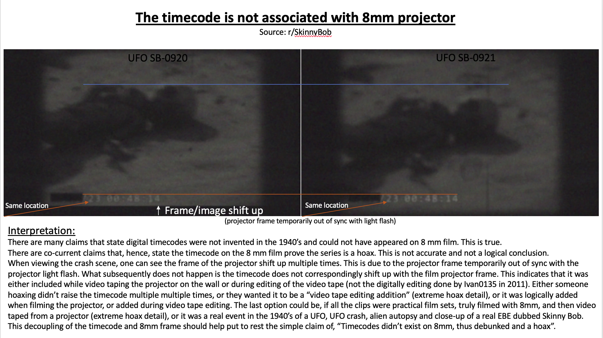
  *`reddit/gypmixc8rvo51.png` — u/RedDwarfBee's demonstration. The picture shifts up between the
  two frames while the burned-in timecode stays put. They read this as proving the timecode was
  added at a video-tape stage; under the Sapphire reading it is simpler still — the Shake is a
  plugin parameter applied beneath a separately-composited text layer.*
- **Stains/Dust → Print/Negative ratio** sets the balance of dark marks (print dirt) versus
  bright marks (negative dirt). It is a single authored number, and it is directly measurable.

---

## 3. What is preserved in the 2026 qtecqot videos

Cross-referencing the nine layers against prior work in `FINDINGS.md` (§5, §5b, §12, §17) and
the new measurements in §4:

| Layer | 2026 status | Basis |
|---|---|---|
| 1 MPEG artifacts | **Preserved** (AV1 now, not H.264) | all seven files sit at the AV1 reconstruction floor (§17) |
| 2 Rainbow moiré | **Not reproduced** | no moiré component found; banding absent in both eras (§17) |
| 3 Horizontal banding / rolling warp | **Not reproduced** — and it was never really there in 2011 either | the "CRT banding" readings of the 2011 files are caption line-pitch (25.6 px @480p) + AV1's static block comb (§17) |
| 4 Black redaction bars | **Preserved, executed worse** | 2026 leaks the prefixes `T6-02/31` and `BL04`; 2011 never leaks (§2b, §12) |
| 5 Multiple image ghosting | **Untested as such** | v1 does carry a separate ghosted-text layer (the hidden Cyrillic, §2) but that is not the same phenomenon |
| 6 Burned-in timecode | **Preserved but re-authored** | character pitch 42.18–42.56 px (2026) vs 43.94–44.00 px (2011), 12–25σ apart; zero-slash 39° vs 45° — two different fonts (§12) |
| 7 Frame-edge shift / gate | **Preserved, including the tell** | gate matte locked to ~0.02 px with the picture floating inside, in *both* eras — the Sapphire-Shake signature, not projector physics (§12, §17) |
| 8 Pillar boxing | **Preserved** | 4:3 active area inside 16:9 in both eras |
| 9 Scratches / blotches | **Preserved, same behaviour** | damage is frame-referenced, *not* image-locked (motion retention −0.05…+0.02), overwhelmingly single-frame, never recurring — in both eras (§17) |
| Vignette | **Preserved at comparable depth** | new: edge/centre luma 0.595 / 0.626 / 0.515 (2026 v1/v2/v3) vs 0.604 / 0.503 (2011 ZB788/RsQCX) |
| Dust/Stains polarity | **Differs** | new: dark:bright transient-mark ratio 4.88 / 2.40 / 0.69 (2026) vs 0.46 / 0.91 / 0.95 / 1.05 (2011) |
| Audio projector bed | **Preserved and specifically derived** | 12–14 Hz mechanical modulation, ~7 kHz band limit in both eras; spectrogram cosine 2026↔2011 `RsQCXN4o4Ps` = 0.998 / 0.995, vs 0.543 between ivan's own two videos (§5, §5b) |

**Reading.** Everything preserved is something visible in the published 2011 uploads. Everything
that differs is an invisible authoring parameter — font metrics, dust polarity, frame rate,
tint geometry, step-printing. That is the profile of a careful external reconstruction rather
than a reused project file, and it is consistent with the independent conclusion in §12 of
`FINDINGS.md`. The 2026 author reproduced the *look* of the stack, not the stack.

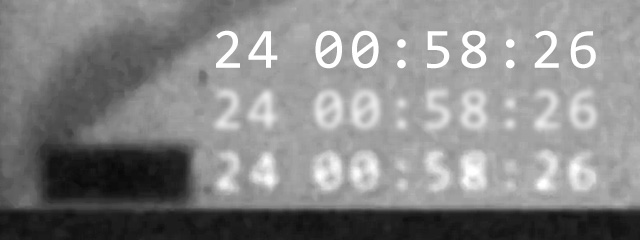
*The timecode layer, enlarged. u/BrooklynRobot identified the face as Microsoft **Consolas**
(released 2006) with blur and variable opacity on top — the single hardest date floor on the 2011
videos. The 2026 videos carry the same design at measurably different metrics (row 6 above),
which is why §3 calls the layer preserved but re-authored.*

The single strongest continuity is the audio, and it is the one thing they could have taken
verbatim from a public file — because they did.

---

## 4. New measurements (this session)

`analysis/prior-work/sapphire_probe.py`, results in `sapphire_probe.json`. All seven videos,
probing observables that map onto S_FilmDamage parameter groups.

**Solid:**
- **Vignette** — radial luma profile over the brightest percentile of frames. Present at similar
  depth in 2026 v1/v2/v3 and 2011 ZB788/RsQCX (edge/centre 0.50–0.63); essentially absent in
  2011 a6TL (0.953) and weak in Xju (0.828), both of which are the static-text videos.

  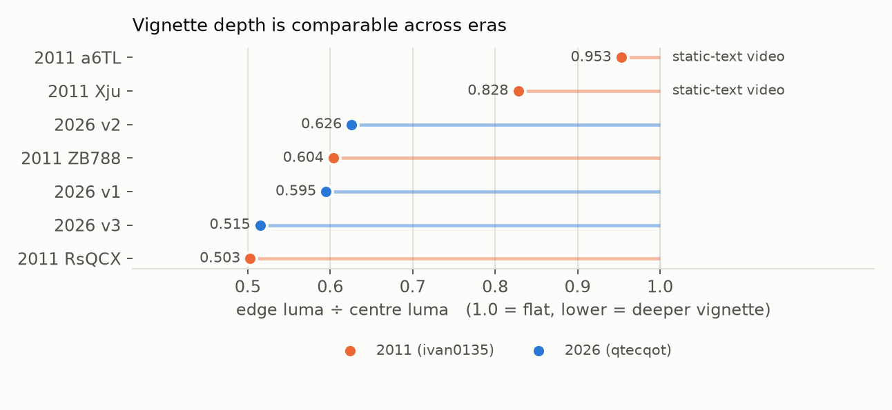
  *Five of the seven cluster tightly at 0.50–0.63 regardless of era. The two outliers are exactly
  the 2011 videos that are static text cards rather than footage.*

- **Dust/stains polarity** — count of transient pixels ≥6σ dark vs bright against a 4-frame
  temporal median. 2026 v1 and v2 are strongly dark-dominant (4.88, 2.40); all four 2011 videos
  sit near parity (0.46–1.05). 2026 v3 (0.69) is the exception and sits inside the 2011 range.
- **Shake** — 81–95 % of frame pairs show sub-half-pixel global motion; residual RMS 0.4–1.7 px.
  Consistent with a low-amplitude Shake setting in both eras.

**Weak / not usable as stated — flagged rather than dressed up:**
- **Flicker and Defocus** both return large low-frequency spectral peaks (0.36–1.09 Hz), but the
  two land on the *same* frequencies within each video, which means the "defocus" measure is
  picking up the same global luma modulation rather than an independent sharpness term. Neither
  is cleanly separated from scene content at this detrend window. Not evidence either way.
- **Grain Mono** — inter-channel correlation of the temporal high-pass is ≈0.99 nearly everywhere,
  but at the working resolution that statistic is dominated by content motion, not grain. It does
  not test the Mono flag.
- **Persistent vertical scratch lines** — the detector found none anywhere, *including in the
  isolated overlay clip that visibly has them* (`skinnybob_site_media/effects/old_film_damage.mp4`).
  The method under-detects; the null is about the detector, not the footage. Needs redoing with
  per-column vertical-gradient energy instead of column means.

---

## 5a. RESULT: the Getty audio lead is closed — negative

The three clips were obtained (`analysis/prior-work/gettyimages-104161830-640_adpp.mp4`,
`gettyimages-160602429-640_adpp.mp4`, `istockphoto-146102427-640_adpp_is.mp4`) and tested.
Scripts: `audio_test.py`, `resample_scan.py`, `tick_shape.py`.

**Method validation first.** The §5 measurements replicate exactly on the local files —
envelope-modulation peak 12.03 / 13.06 / 12.96 / 14.04 Hz and 99.9 % spectral edge
7878 / 7655 / 6554 / 7327 Hz for RsQCX / ZB788 / 2026-v1 / 2026-v2, against FINDINGS' published
12.0 / 13.1 / 13.0 / 14.0 Hz and 7.9 / 7.6 / 6.7 / 7.3 kHz. So the instrument is trustworthy.

**Getty 104161830 is a real projector recording, and the right class of asset.** Its envelope
ticks at **23.99 Hz**, rock-stable in every quarter of the clip, prominence 416× over the local
median — i.e. a genuine 24 fps mechanism, not a stock hiss loop. Its spectral edge is 11372 Hz.
Both numbers are what a full-speed 24 fps projector should give, and the Skinny Bob tracks are
in turn consistent with *some* 24 fps source slowed to 0.50–0.59× (24 × 0.55 = 13.2 Hz;
11372 × 0.55 = 6255 Hz, against SB's 6.5–7.9 kHz). That coincidence is why this lead was worth
chasing.

**But it is not the source.** Two tests kill it:

1. *Joint constraint fails.* Slowing by r scales the tick rate and the whole spectrum by the same
   r, so one r must explain both. Scanning r = 0.30–1.00 and scoring the long-term average
   spectrum against each SB track gives a broad, flat curve peaking at r ≈ 0.42–0.45 — where the
   tick lands at 10.1–10.8 Hz, *not* SB's 12.0–14.0 Hz. At the r that does fix the tick (≈0.55),
   the spectral score is below its own maximum. No single r satisfies both.
2. *Speed-invariant tick shape differs, decisively.* The harmonic ratios of the amplitude-envelope
   spectrum (h2…h5 / h1) describe the shape of one tick and are unchanged by playback speed.
   Measured per quarter-clip:

   | Track | h5/h1 across segments | mean ± sd |
   |---|---|---|
   | getty_104161830 | 0.443, 0.474, 0.624, 0.503 | **0.511 ± 0.069** |
   | 2011 ZB788 | 0.180, 0.150, 0.138, 0.114 | 0.146 ± 0.024 |
   | 2011 RsQCX | 0.157, 0.116, 0.082 | ≈0.12 |
   | 2026 v1 | 0.151, 0.149 | ≈0.15 |
   | 2026 v2 | 0.101, 0.112, 0.138, 0.120 | 0.118 ± 0.014 |

   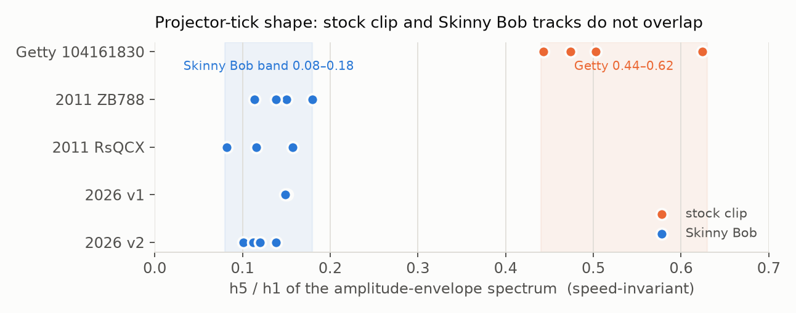
   *Each dot is one quarter-clip. The two bands never touch.*

   Every SB segment carrying a real tick sits in **0.08–0.18**; every Getty segment sits in
   **0.44–0.62**. No overlap, a ~3× gap, and within-track spread is small. Playback speed cannot
   move this number, so no slowdown reconciles the two.

   (Segments where f₀ latched onto 3–6 Hz are silence or v1's colour segment and are excluded.)

**The other two clips are excluded trivially.** Getty 160602429 has audio but no mechanical tick
at all (f₀ 3.1 Hz, prominence 18×) — it is not a projector recording. iStock 146102427 has **no
audio stream**.

**Where this leaves it.** The lead was well-posed and is now answered: the Skinny Bob projector
bed comes from a 24 fps projector recording slowed to roughly 0.5–0.6×, but not from the oldest
sounded asset in the traced overlay lineage. So the visual lineage and the audio lineage are
*separate acquisitions* — which weakens the tidy "one 2009 asset supplied everything" story and
means the audio remains an independent, still-open thread. The next candidates are general
projector-sound libraries rather than film-damage overlays: Freesound (`16mm projector`,
`8mm projector loop`), the BBC Sound Effects library, and Getty/Pond5 audio-only SFX categories.
Any candidate can now be accepted or rejected in one step with `tick_shape.py` — the h5/h1 band
0.08–0.18 plus a 24 Hz-class f₀ is a tight, speed-invariant target.

A caveat worth recording: both sides are lossy-encoded (Getty preview AAC; SB via YouTube twice).
The discriminator lives at 65–120 Hz *envelope* modulation, which codecs preserve well, and it is
stable within every track — so this is very unlikely to be a codec artifact. But it is not a
zero-assumption result.

**Visual side, briefly.** iStock 146102427 is a clean dust/hair/scratch/vignette overlay of the
right family (contact sheet: `sheets/istockphoto-146102427-640_adpp_is.png`, boosted crops in
`sheets/duck_istock.png`). I did not attempt to re-derive the duck match: the claimed duck lives
in the Pond5/Shutterstock clips, these previews are 768×432 and watermarked, and BrooklynRobot's
published side-by-side (`reddit_videos/thhiddkgwv661.mp4`, already archived) does that job better
than a re-run on preview-quality files would.

## 5. The lead as originally posed (superseded by §5a)

The site closed the audio question on the grounds that once the visual stock was found, chasing
the projector sound adds nothing. That holds for the *2011* provenance question. It does not hold
now, for two reasons.

First, `FINDINGS.md` §5b established that the 2026 sound bed is spectrally the same recording
family as the 2011 `RsQCXN4o4Ps` track specifically — closer to it than ivan's own two 2011
videos are to each other. So the audio is the one layer with a demonstrated cross-era link.

Second, one asset in the lineage predates Ivan *and* carries sound: **Getty 104161830, "Film
effect with sound", uploaded February 2009, contributor `onuroner`**. Every other candidate
post-dates the uploads. If that clip's audio carries a ~13 Hz mechanical modulation band-limited
near 7 kHz, the entire chain resolves in one step: one 2009 stock asset supplies both the film
damage and the projector track for 2011, and the 2026 videos then resample the 2011 upload.
It is a cheap test with a decisive outcome either way, and nobody appears to have run it.

Related loose end from the same thread: BrooklynRobot noted the Getty clip matches when
**time-stretched 221 %**, but carries extra scratches — so it is a *relative* of the source, not
the source. Whether the 221 % figure survives against the audio is worth checking.

---

## 6. Download list

Reddit and the stock sites are blocked from this box; Reddit content was recoverable via Wayback,
the rest was not. Priority ordering is by how much each item would settle.

### P0 — settles the audio question
1. **Getty 104161830** — "Film effect with sound", Feb 2009, contributor `onuroner`.
   `https://www.gettyimages.com/detail/video/film-effect-with-sound-stock-footage/104161830`
   Want: the **audio track**, even from the watermarked preview. Test for 12–14 Hz envelope
   modulation and a ~7 kHz spectral edge, then cross-correlate against `videos/2011/RsQCXN4o4Ps.mkv`.
2. **Getty 160602429** — "Old film effect", contributor `selincevizli`.
   `https://www.gettyimages.com/detail/video/old-film-effect-stock-footage/160602429`

### P1 — the overlay assets themselves (preview/watermarked is enough for artifact matching)
3. **iStock gm146102427-16870092** — "Old film effect", 2011-06-08. Called the closest visual
   match to Ivan's overlay. `https://www.istockphoto.com/video/old-film-effect-gm146102427-16870092`
4. **Pond5 8956463** — "8mm film damage yellow scratch", DCP Media, uploaded 2011-11-08 — the
   oldest upload carrying the duck.
5. **Pond5 102173887** — "damage frame old movie mask overlay HD 1920x1080", 2019-02-01 — one of
   the two clips used in BrooklynRobot's comparison video.
6. **Shutterstock 1018941496** — "movie film vintage design old 4k" — contributor name stripped;
   support refused to identify. The other clip in the comparison.
7. **Pond5 22384932** — "bad tv1" — the analog-video/rainbow-moiré layer (stack layers 2–3).
8. **Pond5 50295795** "old film high quality"; **Pond5 10595009** "16mm film damage soft scratches".
9. **MotionArray "old film overlay" #108000** — duck at 0:03, otherwise a different-looking overlay.

### P2 — tooling, to reproduce rather than merely match
10. **Boris FX Sapphire trial** (S_FilmDamage). Render the **20s Film** and **B&W Film Projector**
    presets and compare against both eras. Also grab the **version history** — which presets
    shipped before May 2011 bounds Ivan; which exist now bounds the 2026 author.
11. **Obsidian Dawn "Old Film" Photoshop/GIMP brushes** (45 brushes; the duck is Brush 10, rotated
    90°). Free. `https://www.obsidiandawn.com/old-film-photoshop-gimp-brushes`
    Mirror: deviantart `redheadstock/art/Old-Film-Photoshop-and-GIMP-Brushes-820386627`.
12. **Font set for the 2026 timecode.** Consolas is already obtained (§16). The 2026 face is
    *not* Consolas — pitch 42.18–42.56 px, zero-slash 39°. Candidate monospace faces with a
    slashed zero to test: DejaVu Sans Mono, Liberation Mono, JetBrains Mono, Roboto Mono,
    Source Code Pro, Inconsolata, PT Mono, Ubuntu Mono, Menlo, Andalé Mono, IBM Plex Mono.

### P3 — context, lower value
13. Imgur albums from the threads (JS-rendered, need a browser): `mZmWt5n` (2013 overlay claimed
    identical to Ivan's), `aEtJTza` (Getty 221 % time-stretch comparison), `A6Tqwj9` (duck =
    Brush 10), `BsT6pRD` (Photoshop-brush recreation), `zahpp9c` + `HGv2xDf` (Consolas/timecode).
14. Sapphire tutorial videos cited in-thread: `xXMP2o6y3hQ` (film damage), `R2UOaIBj4-Q` (TV
    damage / moiré), `H1ZtAgDdqr0`, `0GkDf7FjXvQ`.
15. *The Secret KGB UFO Files* (1998, IMDb tt0224072) — source of the KGB logo still in video 1.
16. US National Archives 1940s films — the site's own visual control (`old_footage_comparison.mp4`
    is already archived locally).

Already obtained this session, no longer needed: BrooklynRobot's stock-match video
(`v.redd.it/thhiddkgwv661`), the timecode demo (`azpkvqhsddy51`), all four thread evidence images,
and the whole of skinnybob.info's media.

---

## 6a. Acquisition status and corrected metadata (2026-07-27)

Run via Claude-for-Chrome. Contributor/date fields below are from the live listing pages and
**supersede** the values inferred from the Reddit threads in §1.

| Item | Contributor | Upload date | Obtained |
|---|---|---|---|
| Getty 104161830 "Film Effect with Sound" | onuroner | **2009-02-25** | ✅ video + audio (audio confirmed non-silent: `webkitAudioDecodedByteCount` 731022) |
| Getty 160602429 "Old Film Effect" | **selincevizli** | **2011-11-03** | ✅ |
| iStock 146102427 "Old Film Effect" | **selincevizli** | **2011-06-28** | ✅ (watermarked comp) |
| Pond5 8956463 "8mm Film Damage – Yellow Scratch" | DCProductionMedia | not shown by Pond5 | ❌ signup wall |
| Pond5 102173887 "Damage Frame Old Movie" | **Mastak80** | not shown | ❌ signup wall |
| Pond5 22384932 "Bad TV1" | SatiSai | not shown | ❌ signup wall |
| Pond5 50295795 "Old Film High Quality" | **SatiSai** | not shown | ❌ signup wall |
| Pond5 10595009 "16mm Film Damage – Soft Scratches" | DCProductionMedia | not shown | ❌ signup wall |
| MotionArray 108000 "Old Film Overlay" | TopStyler | — | ❌ sign-in wall |
| Shutterstock 1018941496 | not legible | — | ❌ **dead (HTTP 410)**; Wayback Dec-2020 snapshot yields page text only, render errors 500 |

Notes that change the picture:

- **iStock 146102427 and Getty 160602429 are the same contributor, `selincevizli`** — and Getty
  104161830 is `onuroner`. The Reddit thread had already spotted that these two accounts are
  linked (the Vimeo handle `selincevizli` appears on the `onuroner` Getty listing). Two accounts,
  one overlay family, all uploads 2009–2011.
- The **date ordering is now firm**: Getty 104161830 (2009-02-25) → iStock 146102427 (2011-06-28)
  → Getty 160602429 (2011-11-03) → Pond5 8956463 (2011-11-08, per BrooklynRobot's stored
  timestamp). Only the first predates the Ivan uploads.
- **Pond5 does not display upload dates at all**, and neither Pond5 nor Shutterstock offers an
  upload-date filter reaching back to 2011 (Shutterstock's only goes back 12 months). The
  "search for anything older than 2009 with a duck" task in §7 is **not executable** as written;
  the dates BrooklynRobot cited came from an internal/API field, not the public listing.
- **Obsidian Dawn**: the free 45-brush set is gone. The live page now sells "Old Film Brushes"
  (48 brushes: 39 stamp + 9 stroke, €4.95, Shopify). The DeviantArt mirror is a 404 and is not in
  Wayback. A Jan-2021 Wayback snapshot of the original free page does exist, with the download
  button intact — not yet pulled.

### What the recovered images show

**This is the strongest single artefact in the whole record:**

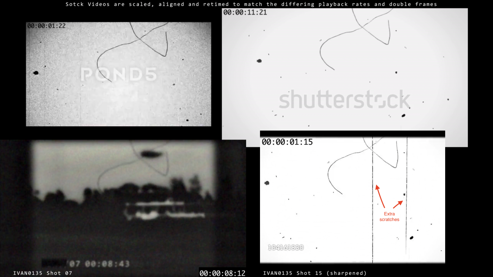
*`dYfOF60.png` (imgur album aEtJTza). One distinctive hooked hair, present in all four panels:
**Pond5** top-left (00:00:01:22), **Shutterstock** top-right (00:00:11:21), **Ivan0135 Shot 07**
bottom-left (00:00:08:43, over the sky above the horizon), and **Getty 104161830** bottom-right
(00:00:01:15). BrooklynRobot's own header says the stock videos were "scaled, aligned and retimed
to match the differing playback rates and double frames" — this is hand-alignment, not an
automated match. The red arrows on the Getty panel mark "Extra scratches" it carries and the
others don't: precisely why he kept Getty in the family but ruled it out as the source.*

**This tightens the §5a audio conclusion rather than weakening it.** Getty 104161830 is
demonstrably in the same *visual* family as Ivan's overlay, yet its audio fails the
speed-invariant tick test against every Skinny Bob track. So Ivan took the damage layer from one
member of this family and the projector sound from somewhere else entirely. The two lineages are
independent — now shown from both directions.

The same finding at the 0:04 mark, which is where the duck is supposed to sit:

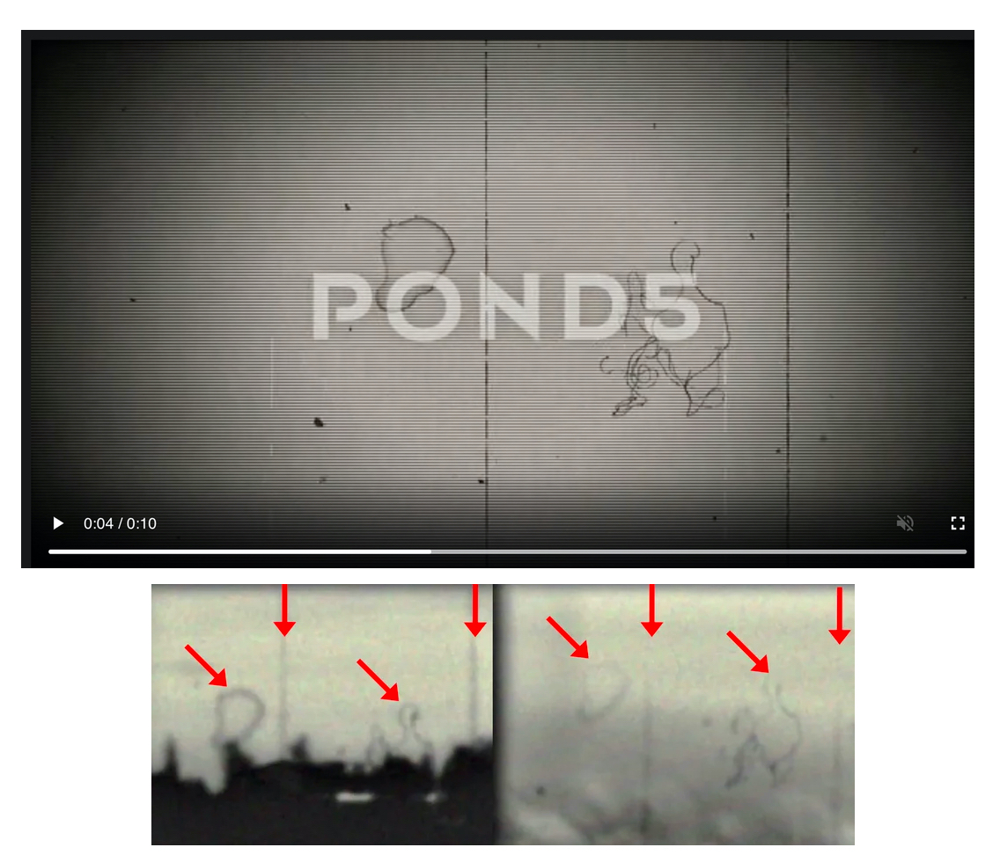
*`Nj51u77.jpeg` (album mZmWt5n). Top: the Pond5 preview paused at 0:04. Bottom: Ivan's frame
(left) beside the overlay (right), arrows onto four matching hair shapes and two vertical
scratch lines.*

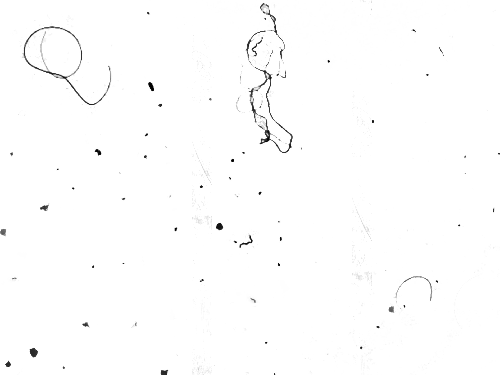
*`OMZSRrO.png` — the same overlay frame cleaned up and inverted at higher resolution. The loop at
top-left and the large curl at centre are the shapes the arrows above point to; three vertical
scratch lines run the full height.*

The brush counter-argument:

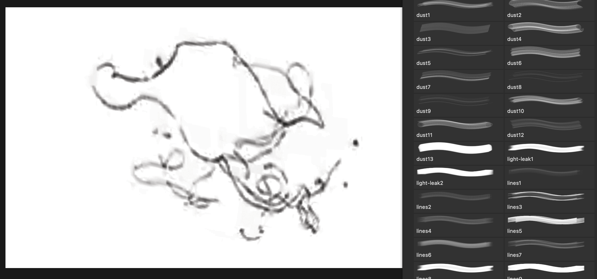
*`cC7jD1u.png` (album BsT6pRD). A canvas painted with hair/scratch brushes, palette at right named
`dust1…dust13`, `light-leak1–2`, `lines1…lines9` — a **different** set from Obsidian Dawn. This
supports the weaker of the two readings in §1: the overlay class is trivially reconstructable from
brushes, so shared artefacts across vendors do not by themselves prove a shared source clip.*

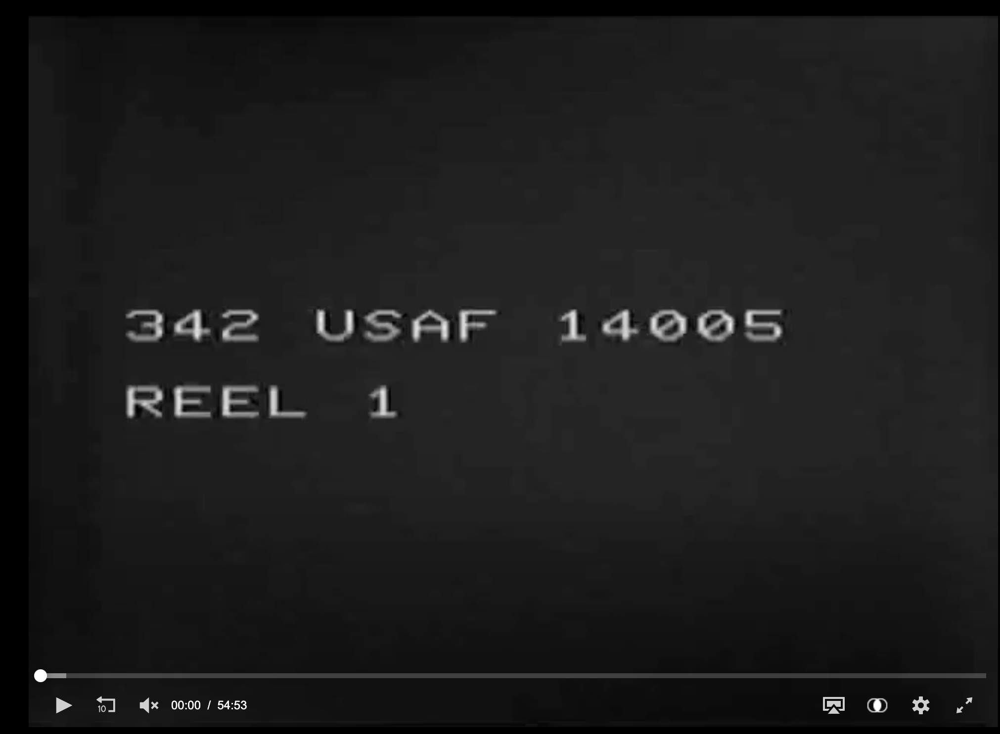
*`6shc7LC.png` (album zahpp9c) — a 54:53 archival reel opening "342 USAF 14005 / REEL 1", a
National Archives USAF record-group header, filed under the "Font" discussion. Relevant to the
*style* the timecode/case-number cards imitate, not to Consolas identification.*

## 6b. Attempted and FAILED: does the 2026 footage reuse this stock overlay family?

This is the natural question the new assets raise, and I could not answer it. Recording the
attempts so nobody repeats them, and so the numbers are not mistaken for findings.

The target is the hair from `dYfOF60.png` above. If it (or a sibling) turns up in the qtecqot
videos, the 2026 author reused the family. The 2011 videos are a built-in positive control — the
hair is *demonstrably* there. This is the template I searched with:

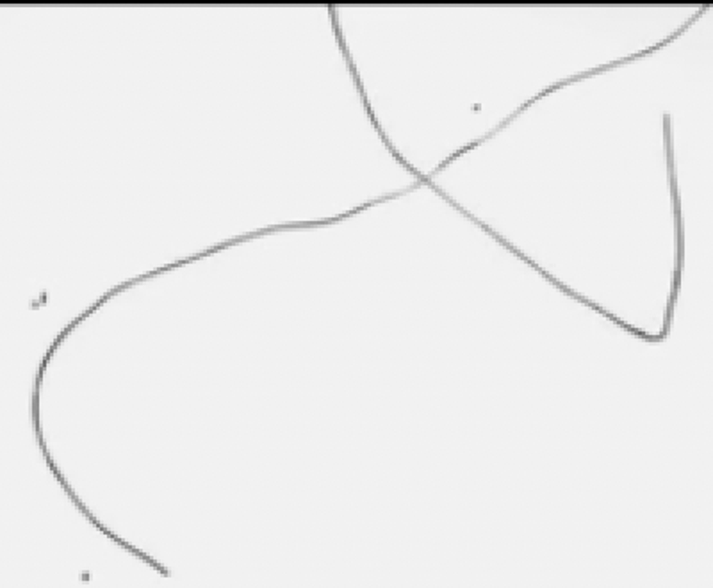
*Cropped from the Shutterstock panel of `dYfOF60.png` — the crossing hook, ~400×330 px.*

Three methods, all uninformative:

1. **Persistent vertical scratch lines** (`scratchlines.json`). Detector found none anywhere,
   including in an overlay clip that visibly has them. Column-mean averaging washes out thin
   lines. Detector failure, not a result.
2. **Multi-scale normalised cross-correlation** (`hair_match2.py`). The template is >95 % empty
   background, so NCC scored background/vignette similarity rather than the curve. On the Getty
   clip itself the flipped-template null *beat* the signal (0.485 vs 0.479).
3. **Chamfer matching on the extracted curve** (`hair_chamfer.py`, `hair_chamfer` output below).
   Correct formulation for a sparse curve, and it still fails its control: on 2011 ZB788 the null
   scores better than the signal (−0.140), and the null−signal margins scatter without pattern
   from −0.71 to +2.36 across all ten files. 2026 v2 happens to post the largest margin (+2.36);
   because the control failed, **that number means nothing** and must not be quoted as evidence.

| File | chamfer (px) | null (px) | null − signal |
|---|---|---|---|
| stock getty104161830 | 4.44 | 3.73 | −0.71 |
| stock getty160602429 | 3.23 | 5.04 | +1.81 |
| stock istock146102427 | 4.47 | 4.53 | +0.06 |
| 2011 ZB788 *(control)* | 4.19 | 4.05 | **−0.14** |
| 2011 RsQCX | 4.59 | 5.01 | +0.42 |
| 2011 Xju | 5.54 | 5.36 | −0.19 |
| 2011 a6TL | 3.88 | 4.62 | +0.74 |
| 2026 v1 | 4.24 | 4.71 | +0.47 |
| 2026 v2 | 4.17 | 6.53 | +2.36 |

4. **Mark persistence across frames** (`persistence.py`, `persistence.json`). Intended to separate
   "scanned-film overlay whose hairs last many frames" from "layer re-randomised per frame". The
   ridge detector picks up *scene* edges — buildings, faces, horizon — so retention is dominated by
   content, and chance levels swing from 0.014 to 0.807 depending on how busy the picture is. The
   excess-retention figures it produces (+0.4 to +0.8 for the SB videos) are measuring scene
   continuity, **not** damage, and do **not** contradict §17 of `FINDINGS.md`, whose ≤13 %
   next-frame retention was measured with damage properly isolated from content.

For reference, this is the material the search had to work with — the iStock clip is a clean,
high-contrast example and even it yields nothing automatable at preview resolution:

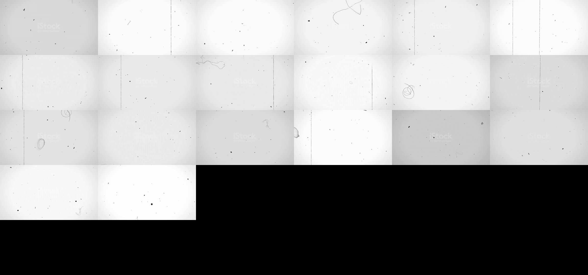
*`istockphoto-146102427-640_adpp_is.mp4`, every 15th frame. Dust, hairs, vertical scratches and a
vignette — the right family, but at 768×432 with a watermark.*

**Why these fail, and what would work.** The available overlays are 768×432 watermarked previews;
Ivan's are 640×480 twice-transcoded; the hair is a one-pixel-wide, low-contrast curve. BrooklynRobot
got the match by scaling, aligning and *retiming* by hand, per shot — his own annotation on
`dYfOF60.png` says exactly that. Reproducing it needs the full-resolution clips (paywalled) and
manual per-shot alignment, not an automated sweep. Anyone picking this up should start from the
full-res Pond5/Shutterstock files and BrooklynRobot's retiming, not from a template search.

**What does survive.** The one solid new inference needs no pixel matching: Getty 104161830 is in
the visual family (`dYfOF60.png`, four-way hair match) but its audio fails the speed-invariant tick
test against every SB track (§5a). Damage layer and projector sound were acquired separately —
established from both directions.

## 7. Prompt for Claude-for-Chrome

> I need you to collect stock-footage assets for a forensic comparison. For each item below, open
> the page, and get me (a) a screenshot of the full page including the contributor name, upload
> date and clip ID, and (b) the preview/watermarked file itself — video where possible, otherwise
> the preview GIF or thumbnail sequence. Watermarked previews are fine; do not buy anything. Save
> each as `<site>_<id>.<ext>` plus a `<site>_<id>.txt` holding the title, contributor, upload date,
> duration, resolution and URL. If a page is gone, check `web.archive.org` and say so.
>
> 1. https://www.gettyimages.com/detail/video/film-effect-with-sound-stock-footage/104161830 —
>    **highest priority, and I specifically need the AUDIO**. If the preview player has sound,
>    capture it; if not, tell me exactly what audio options the page offers.
> 2. https://www.gettyimages.com/detail/video/old-film-effect-stock-footage/160602429
> 3. https://www.istockphoto.com/video/old-film-effect-gm146102427-16870092
> 4. https://www.pond5.com/stock-footage/item/8956463-8mm-film-damage-yellow-scratch
> 5. https://www.pond5.com/stock-footage/item/102173887-damage-frame-old-movie-mask-overlay-hd-1920x1080
> 6. https://www.shutterstock.com/video/clip-1018941496-movie-film-vintage-design-old-4k
> 7. https://www.pond5.com/stock-footage/item/22384932-bad-tv1
> 8. https://www.pond5.com/stock-footage/item/50295795-old-film-high-quality
> 9. https://www.pond5.com/stock-footage/item/10595009-16mm-film-damage-soft-scratches
> 10. https://motionarray.com/stock-motion-graphics/old-film-overlay-108000
>
> Then: on Pond5 and Shutterstock, search "old film damage overlay" / "film grain scratches",
> filter to uploads before 2011-05-18, and list every result with contributor and upload date —
> I am looking for anything older than 2009 that shows a distinctive blotch shaped a little like
> a duck, roughly four seconds into the clip.
>
> Separately: download the free Obsidian Dawn "Old Film" Photoshop/GIMP brush set from
> https://www.obsidiandawn.com/old-film-photoshop-gimp-brushes (mirror:
> https://www.deviantart.com/redheadstock/art/Old-Film-Photoshop-and-GIMP-Brushes-820386627),
> and render me each of the 45 brushes as a separate PNG on a transparent background at 2000 px —
> I want brush 10 in particular, unrotated.
>
> Finally, these Imgur albums render client-side and I can't read them without a browser. Open
> each and save every image at full resolution, plus any caption text:
> imgur.com/a/mZmWt5n, imgur.com/a/aEtJTza, imgur.com/a/A6Tqwj9, imgur.com/a/BsT6pRD,
> imgur.com/a/zahpp9c, imgur.com/gallery/HGv2xDf
>
> Report back as a table of what you got and what failed. Don't summarise the images — I'll read
> them myself.

---

## 8. Corrections to the received wisdom

Three things repeated in the community record do not survive measurement, and are worth stating
plainly since this document will be read alongside them:

1. **"The oldest stock upload dates the hoax."** It doesn't. Every duck-bearing clip found so far
   post-dates the final Ivan upload (2011-05-18); the earliest is 2011-11-08. The only pre-Ivan
   asset in the lineage is the Feb 2009 Getty clip, which BrooklynRobot showed is a relative
   rather than the source.
2. **"The 2011 videos were filmed off a CRT / show projector banding."** Measured absent in both
   eras; what people are reading is burned-in caption line pitch plus AV1 block comb (§17).
3. **"Same look ⇒ same author."** The look is reproducible from published material. Every
   invisible authoring parameter tested differs between eras (§12). The stack being preserved is
   evidence of imitation, not of continuity.

The site makes point 3 better than any argument does, by running genuine 1940s US National
Archives footage through the same treatment:

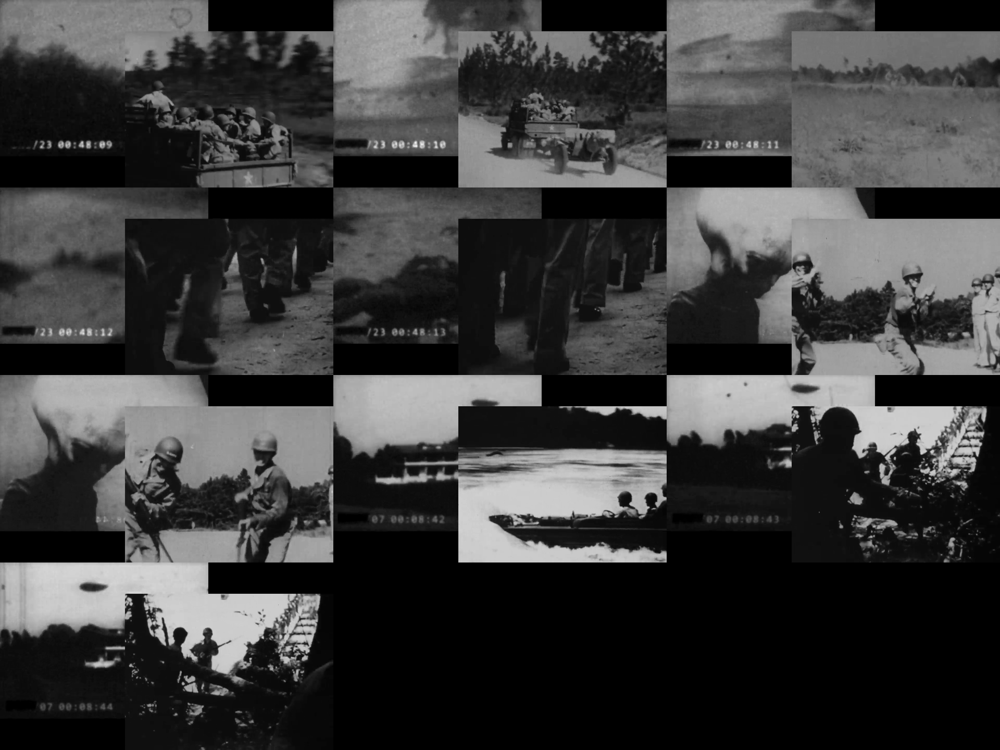
*`skinnybob_site_media/old_footage_comparison.mp4`, sampled. Ivan's clips (left of each pair, with
timecode and redaction bar) beside contemporaneous National Archives material (right). The
"authentically old" impression survives the swap intact — which is the point: the look certifies
nothing about the underlying footage.*
