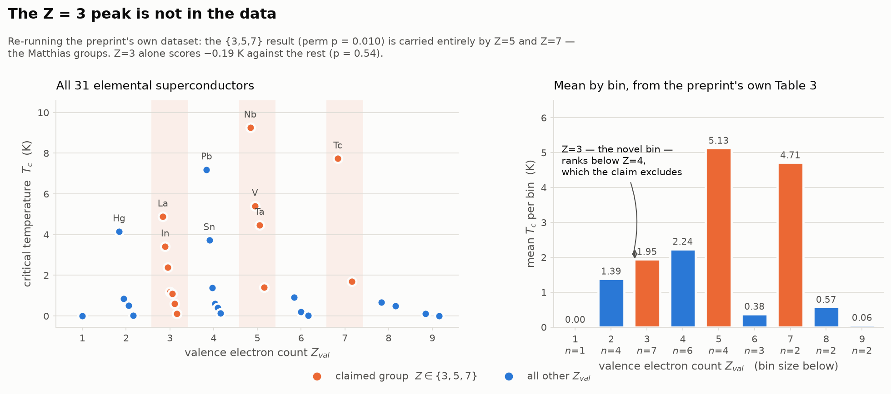

# *Engineering Infinity* — a technical assessment

**This is tangential.** It does not bear on the seven videos, and nothing in it should be read
as evidence about them. It exists because one deleted qtecqot post named Valerijs Černohajev,
and `CERNOHAJEV_LEAD.md` listed "pull the manuscripts and compare their diagrams against
`analysis/symbol-panel/`" as testable next step #1. That step is now done — §9 — and it is a
clean miss. Everything else here is an assessment of the manuscripts *on their own terms*,
recorded because it was cheap to do once the corpus was in hand, not because it tells us
anything about ivan0135 or qtecqot.

Opened 2026-08-02.

## What was obtained

Two public Drive folders, enumerated via `embeddedfolderview` and downloaded whole.

- **Engineering Infinity Scan Collection** — 119 pages, 5100×6600 JPEG, 214 MB.
- **Černohajev Archive Research Reports** — 105 items. About 80 of these are the **public
  AAWSAP/DIRD corpus** (the 38 Defense Intelligence Reference Documents, the Reid/AATIP
  memos, the 1991 KGB "Setka" letters, Knapp thread pages). Those are real and long public;
  they are framing, not support. The novel material is 12 "Critical Editions" of the
  manuscripts, two 2026 preprints, and a set of CARI/Blackgrove analysis documents.

Scratch copies and the three agent reports are in the session scratchpad, not committed
(214 MB). `figs/technical/ei_valence_claim.png` is committed.

---

## 1. The drive is a self-force

Work No. 2 is the engineering core. Its "master thrust formula" is obtained by setting the
field a solenoid *produces* equal to the field a current *feels*:

```
μμ₀nI  =  F/(I·L)      →      F = μ·μ₀·N·I²
```

Both sides are teslas, so this is dimensionally clean — μ₀NI² does evaluate to newtons for any
N. But `B = μμ₀nI` is the field generated by the coil, and `B = F/(IL)` is the force on a
current sitting in an *external* field. Equating them asserts that a solenoid pushes on its own
field. The net force of a coil's own field on itself is zero; that is momentum conservation,
not a modelling refinement. What the formula describes is a reactionless drive, and the
manuscript is open about needing one — the carrier is a "neutrino-magnetic flux propagating
instantaneously" (Work No. 1 §II).

Note also that it is not the magnetic-pressure force, which is real but internal: that goes as
`B²A/2μ₀ ∝ μ₀N²I²A/L²`, scaling as N² with an area term. `μ₀NI²` is neither. It is dimensional
analysis producing a force with no mechanism attached.

**The build does not close on its own numbers.** Design point: 30 m saucer, solid silicon,
3,160 t, 10 g for the pilots → 3.1×10⁸ N, so N·I² = 2.5×10¹⁴.

| | |
|---|---|
| solenoids (1000/m² × 678 m²) | 678,000 |
| total turns | 3.39×10⁸ — his 3.3×10⁸ ✓ |
| current implied by his own N | **853 A** |
| current he specifies | **10⁵ A** |

At 10⁵ A his own formula returns 4.3×10¹² N ≈ **137,000 g**, not 10 g. The CARI editor flags
the discrepancy and attributes it to a "low permeability of the Si medium" correction that is
never quantified. At 10⁵ A through 2 mm wire the current density is 3.2×10¹⁰ A/m² — ~16×
above Nb₃Sn's critical current density and ~3,000× copper's sustained limit; in copper the
array would dissipate ~10¹⁵ W, some 380× world electricity generation, inside a silicon block
that melts at 1687 K. Even at the self-consistent 853 A it needs ~83 GW continuously.

## 2. The charge postulate contradicts tabletop measurement

GCD requires every body to carry one excess electron per 5×10¹⁷ protons, q/M = 9.568×10⁻¹¹ C/kg.

That value is **1.11 × √(G/k)** = 8.617×10⁻¹¹ C/kg — the ratio at which Coulomb repulsion
exactly cancels gravity. Landing within 11 % of it is not a result; it is what the free
parameter 5×10¹⁷ was chosen to do. The preprint's headline `F_C/F_G = 1.233` is the tell: it
is independent of mass and distance, so it can only ever restate the input.

Applied to Earth it gives Q = 5.7×10¹⁴ C and a surface field of **1.3×10¹¹ V/m**:

| against | ratio |
|---|---|
| measured fair-weather field, ~100 V/m | 1.3×10⁹ |
| dielectric breakdown of air, 3×10⁶ V/m | 4.2×10⁴ |
| atomic unit of field, 5.14×10¹¹ V/m | 0.25 |

The last row matters most: a quarter of the field that binds electrons to atoms. Separately,
neutrality-of-matter experiments bound net atomic charge at ~10⁻²¹ e; GCD needs ~10⁻¹⁸ e,
about three orders of magnitude above the limit. The electrostatic self-energy also exceeds
Earth's gravitational binding energy by the same factor 1.233 — the planet is unbound.

The preprint does report the Model-1 failure (10³–10⁴ T fields with no observational
counterpart) and calls it "a fundamental difficulty." That is honest. It does not report any
of the above.

## 3. Fusion (Work No. 8)

The arithmetic here is the cleanest in the corpus — the 16.65 T → 32 solenoids → 1.65 kA chain
checks to <0.5 %. The failures are premises.

- **The γ branch is treated as co-equal with the other two.** No branching ratio appears
  anywhere. Q-values recomputed from atomic masses: d+d→t+p 4.033 MeV, d+d→³He+n 3.269 MeV,
  d+d→⁴He+γ 23.847 MeV. Real branchings are ~50 % / ~50 % / **~10⁻⁷**. Equal-weighting gives a
  mean Q of 10.38 MeV against a true 3.65 MeV — a **2.84× energy overestimate**, with the γ
  branch supplying 77 % of the implied energy versus 7×10⁻⁷ in reality.
- The 2.45 MeV neutron he does not budget for occurs in half of all events, which contradicts
  Work No. 2's selection of d+⁶Li *because* it is aneutronic.
- **No ignition temperature, no Lawson criterion, no triple product anywhere.** Ignition is
  specified as a *charge* condition. d+d needs ~40–50 keV; the stated mechanism (gas
  breakdown) reaches ~10⁴ K. Four orders short.
- The 32-solenoid step is a physics error, not just an unjustified choice: `B = μ₀nI` depends
  on turns per metre of *one* solenoid, so multiplying by a solenoid count is invalid (the
  correct single-solenoid current for 16.65 T is 53 kA, not 1.65 kA). And 32 solenoids drawn
  as radial spokes cancel by symmetry at the centre.
- "2×10³ kg/m³ ~ 2000 atm" is a density-as-pressure category error; the 4/3 is missing from
  the mean-density formula; the *mean* solar density is assigned to the *photosphere*, off by 10⁷.

## 4. The galactic chain rests on a ruler reading

Works 5, 9 and 12 claim to "refine" the Solar System's motion in the Galaxy. The whole chain
hangs on one dimensionless factor, **29.78**, which Work 12 p. 4 finally discloses as two
measurements off a hand-drawn star chart: 461.58 mm / 15.5 mm.

Four independent problems:

1. ±0.5 mm on the small reading swings the answer from 6920 to 7390 km/s, so four significant
   figures is unsupportable.
2. The chart is angular — its own scale bar reads 10°–25° — while the "shift" is a linear
   6.38 pc. An angle is being divided by a length.
3. The construction is **circular**: at the scale the 60 pc answer requires, 6.38 pc plots at
   15.502 mm.
4. 29.78 coincides to 0.011 % with **Earth's orbital speed in km/s** (29.7827) — a dimensioned
   constant tabulated in the very textbook the works cite.

Two external kills, both available when the works were written. The claimed 7150 km/s orbit at
30 pc requires **3.6×10¹¹ M☉** inside the Sun's immediate neighbourhood, where a few hundred
solar masses actually sit — a Milky Way's worth of mass in the local bubble. And the CMB dipole
measures the Sun's absolute velocity at 369.8 km/s, **19× lower**.

Every accepted value in these works is taken verbatim from a 1966 Soviet textbook and
relabelled as a refinement. The planetary parameter table, though, is genuinely good: all 17
velocities recompute correct to sub-percent, except Neptune's rotation (−11 %).

## 5. Work No. 11 is falsified by Venus

The "methodology" is a single asserted proportionality, H ∝ q ∝ M, calibrated on Earth. It
holds to 0.98–1.01 for nine of ten tabulated rows — because it is an identity, not a
prediction. Venus falsifies it: 0.815 Earth masses, field below 10⁻⁵ of Earth's, so the
prediction is >4×10⁴ too high. Mars is 10³ too high; Saturn 224×.

Notably, **the corpus's single best planetary agreement — Mercury at 1.3× — is an artefact of
a transcription slip.** Mercury's tabulated charge is 10× below what the corpus's own rule
gives; corrected, the agreement becomes 13.6× high. The same 10× slip appears for Pluto's
field, and Saturn's and Uranus's central-current entries are transposed, making two columns of
one table mutually inconsistent. `H = I/r` in step 1 becomes `H = I/(2πr)` in step 2, on
consecutive lines.

H_centre(Sun) comes out at 1.76×10⁹ T — energy density 1.2×10²⁴ J/m³, mass-equivalent 90× the
solar core density, and 0.40 of the QED critical field.

## 6. The two 2026 preprints

Both are self-described "Preprint · Not peer-reviewed," dated 18 May 2026.

**Planetary fields.** Covered in §2. Its surviving positive result — Mercury to 7 % — comes
from a model with a hand-tuned composition parameter (proton fraction 0.47 / 0.87 / 0.60 by
body class), one hit in eight, the rest off by 20–150×. The mechanism is Blackett's 1947
rotating-body hypothesis, cited as ref [9] without its outcome: Blackett built an astatic
magnetometer, tested it on a gold cylinder, found no field, and by the early 1950s regarded it
as refuted. The magnetometer founded palaeomagnetism; the hypothesis did not survive.

**Superconductors.** The preprint's Table 3 is complete enough to reconstruct all 31 elements
exactly — every bin's n and mean reproduces. Re-running it:



| hypothesis | n | mean T_c | Δ vs rest | perm p |
|---|---|---|---|---|
| Z ∈ {3,5,7} — the claim | 13 | 3.352 K | +2.165 | 0.0097 |
| Z ∈ {5,7} only | 6 | 4.992 K | +3.592 | 0.0023 |
| **Z = 3 alone** | 7 | 1.947 K | **−0.191** | **0.54** |

All the signal is Z=5 and Z=7 — the vanadium and manganese columns, i.e. Matthias 1955
restated. Z=3 is the part explicitly billed as going beyond Matthias, and it sits *below* the
mean of everything else and below the Z=4 bin the hypothesis excludes. Adding it to {5,7}
weakens the result. Of the 84 possible three-valence subsets, {3,5,7} ranks 5th; {1,5,7},
{4,5,7}, {5,7,8} and {5,7,9} all score higher.

The "post-prediction confirmation" does not hold either. The Li–Al–B result is Hussain et al.,
*Scientific Reports* 2025 (10.1038/s41598-024-84542-6) — a **DFT calculation in CASTEP**, not a
measurement. No sample was synthesised; T_c is computed from electron–phonon coupling within
BCS/Eliashberg theory, the framework GCD claims to supersede. The preprint calls it "formal
publication pending" 16 months after publication. And the valence claim is self-contradictory:
it rests on "all three constituent elements have Z_val = 3," but the preprint's own Table 3
assigns lithium Z_val = 1.

| compound | e/a with Li=1 (their own table) | e/a with Li=3 (as claimed) |
|---|---|---|
| Li₃AlB₈ (peak, T_c > 77 K) | 2.50 | 3.00 |
| LiAlB₄ (most stable, T_c > 44 K) | 2.67 | 3.00 |
| MgB₂ (real, measured 39 K) | 2.67 | — |

They reach exactly 3 only by reassigning lithium mid-argument. MgB₂ — the actual
record-holding ambient-pressure BCS superconductor — sits at 2.67 and is not addressed.

## 7. Internal consistency

Of ~60 arithmetic operations recomputed across the corpus, 5 are wrong (~8 %, respectable for
hand calculation). Of ~12 physical premises, none survives comparison with measurement, and
three fail by ≥4 orders against data available when the works were written. **The arithmetic is
almost always right; the dimensional bookkeeping almost always is not.**

Sixteen cross-work inconsistencies were logged. The sharpest:

| quantity | one place | another | ratio |
|---|---|---|---|
| 16.65 T identified as | Sun's **surface** field (W8 add.) | Sun's **core** field (Rosetta Stone, ×2) | corpus's own core value is 1.76×10⁹ T — **10⁸×** |
| 16.65 T "independently derived" | Rosetta Stone: "Works 7 and 11 independently derive" | W8 p.9 is the sole derivation; W7 and W11 take it as input | not independent |
| solar mean density | 2×10³ kg/m³ (W8, where it is *used*) | 1.4 g/cm³ (W5/9/12 tables, ×3) | 1.43× — the corpus contains the right value and uses the wrong one |
| reactor fuel | d+⁶Li, chosen *because* aneutronic (W2) | d+d, ~50 % neutronic (W8) | unaddressed |
| retrograde planets | Venus + **Saturn** (W5 p.8) | Venus + Uranus (W5 p.3 table, W9, W12) | self-contradictory *within* W5 |
| excess-charge ratio | 1 per 5×10¹⁷ (W1) | 1 per 5×10¹⁸ (W7) | 10× (notational) |
| solenoid current | 1.65×10³ A (ball lightning, W8 add.) | 10⁵ A (W2) | 60× |
| H formula | H = I/r (W11 step 1) | H = I/(2πr) (W11 step 2) | 2π, consecutive lines |

W8 p.6 also writes `d+d → d+t+p`, which does not balance (A 4→6, Z 2→3).

Five further errors were logged in the CARI editor's *own* commentary — including a claim that
159 Oe is "within an order of magnitude" of Jupiter's 4.17 G, which is 38×.

## 8. What the scan files are

All 119 pages: 5100×6600 — **exactly US Letter at 600 dpi** — one identical JPEG quantisation
table, EXIF stripped to a bare 300 dpi tag, no JFIF/ICC/Photoshop APP markers. A single uniform
batch off one machine, no per-page editing.

But ~30 % of every frame is **pure 255 with zero variance**, while the paper interior retains
real scan noise (σ = 0.27–1.36 DN in flat areas). The surrounding canvas has been replaced with
flat white. The content is untouched, but **paper tone, sheet size, page edges and any platen
evidence are not recoverable from this copy.** Anyone leaning on physical-artifact arguments
needs the originals, not these files.

One page escaped the flattening: **p119** carries a strip of modern English-language printed
text along both margins, outside the manuscript sheet — the scanning substrate showing through.
Crisp digital typesetting, ~1–2 characters per line visible. This is a digitisation artifact and
says nothing about the manuscript's age; it does indicate a modern, English-language setup,
consistent with the US Letter platen. Not transcribed, per the inclusion rule.

## 9. The symbol-panel comparison — a clean miss

This is testable step #1 from `CERNOHAJEV_LEAD.md`, and the only part of this document that
touches the investigation.

**Nothing in the 119 pages resembles the symbol-panel cluster** (`FINDINGS.md` §8). No stamps,
seals, letterheads, logos, emblems, monograms or signature devices occur anywhere; the
manuscript is unsigned throughout. The complete inventory of Latin-script words in 119 pages is:
*USA, Spin, Const, max/min/cos,* NGC 4565, NGC 1300, M 51.

**Detection floor, measured by injection** — a glyph rendered into real pages at full resolution
and pushed through the identical downsampling path. Structure fully readable to ~3.7 mm on clean
paper (~7 mm on stained or dense pages); presence detectable but unreadable to ~1.9 mm;
undetectable below ~0.9 mm. Every deliberate mark in the corpus sits at or above the author's
capital-letter height, well above the floor. Two clean-room runs with hidden positive controls
both recovered the injected glyph and returned no resemblance on all 13 genuine pages.

**What this does not test:** injection measures sensitivity to an *added* mark. It says nothing
about a resemblance already embedded in the construction lines of a technical drawing. That is
the residual weakness of the null.

Four near-misses, all resolved. The strongest: rust-brown mark complexes at the top-left of ~13
sheets, which a blind describer rendered as "a crescent… a bold slanting stroke… a flag: a
horizontal bar from whose right end a stroke descends" — effectively a paraphrase of the target.
At 600 dpi they resolve to **the silhouette of a corroded paper clip**, they vary sheet to sheet,
and an independent observer shown them cold said "corroded metal paper clip" unprompted.

Recorded honestly: Russian orthography supplies the target's *primitives* (Н = stems + crossbar,
Ф = lobe on stem, Ш/Щ = minim clusters), so every page contains resembling sub-elements. What is
absent is the combination and the proportions — and the author's hand is a connected cursive
slanted 15–20°, where the target's stems are upright and separate.

**Cyrillic captions** (`FINDINGS.md` §6): «сообщен-» and «предупре-» do not occur at all, in the
images or the transcription corpus. «предыдущ-» occurs only in two ordinary senses — "on the
previous page," "of previous generations" — never nominative, never beside anything like
«сообщение». No "Mark 5" in any script; **1961 does not occur** (nearest 1963, 1965, 1966, the
last verified digit-by-digit at full resolution). Floor: reliable for all typescript, headings,
captions and folios; weaker for the densest blue cursive marginalia on p062, p064, p065, p070,
where a short root could hide in a cramped ligature; nothing recoverable from versos or the
trimmed edges of p040/p097.

This null is unsurprising rather than informative: the captions are narrative address to a
viewer, the manuscript is first-person technical argument, so that vocabulary has no occasion to
appear.

## 10. Provenance arguments

These can carry **"this reads as period-appropriate."** They cannot carry "this was produced in
the period," and they do not address authorship or institutional placement at all.

### The anachronism check returns a null, and it is the strongest thing here

This was the most valuable test available, and it comes back in the archive's favour. **No
numerical constant in the manuscript layer of any of the twelve works matches a post-2000
revision.** Where era and modern values diverge, the manuscript carries the era value:

- `G = 6.672×10⁻¹¹` — CODATA 1973, verbatim the value in the cited 1983 *Физический
  энциклопедический словарь*, excluding every revision from 1986 on. M⊕ and M☉ cohere with
  *that* G, not a modern one.
- A 30 eV neutrino mass bound.
- A nine-planet table with Uranus rotating in 10h49m — the 1930 spectroscopic value, not
  Voyager's 17h14m (a 1.59× difference) — Neptune at 22,300 km, Pluto at 410× its actual mass.
  Pre-1974 and pre-1978, excluding every spacecraft encounter.
- Superconductivity in pre-1986 Matthias framing, no cuprates. Nuclear model pre-1932. SI with
  Soviet conventions, no CGS leakage.

**The strongest element is that the errors propagate correctly.** The density column is wrong in
exactly the way its own era radii require, and the corpus assigns Venus and Mars magnetic fields
that have been known to be absent since 1965–67. That internal coherence is harder to construct
than the constants themselves.

Caveat on the Dictionary: the book and year are real and Work 8 cites it with full imprint in the
manuscript layer, with a plausible entry list. But the Work 2 and Work 11 citations carry no
year — the "1983" there is the editor's attribution, and a bare citation fits the earlier
five-volume ФЭС equally well.

### Four things that cut the other way

1. **One page self-dates to 2024.** Work 10 p.4, manuscript layer: «Сегодня в 2024 году» —
   *today, in 2024*. That is outside both claimed windows (`CERNOHAJEV_LEAD.md` records
   1980–2007; the preprints say 2004–2019). Work 6 separately self-dates to 2004 and references
   Putin replacing Yeltsin (≥2001). The corpus's only absolute self-datings are 2001, 2004 and
   2024. Whatever else is true, the physical corpus is heterogeneous in time.
2. **A custody gap where the best evidence should be.** The Biographical Foundation quotes an
   August 2012 my.mail.ru thread extensively — dated posts, eight direct quotations, a 128-photo
   album — while stating in the same document that recovering that thread is "the highest-value
   externally verifiable research vector." No URL, no snapshot, no statement of who captured it.
   The ACH, whose Terminus Condition B is a post-2007 production date, never mentions the thread
   at all. **Dated 2012 photographs of these pages would do more work than every other document
   combined.** Nothing produces them.
3. **A forensic claim contradicted in-house.** The Rosetta Stone rejects fabrication as
   "contradicted by forensic evidence: 85–95 % authentication confidence." That figure appears
   exactly once, unsourced. The ACH — same principal, three months earlier — lists paper and ink
   analysis as Priority 2, *not performed*. The Dossier and evidence map agree it is future work.
4. **The headline number is a textbook identity.** 16.65 T is Earth's surface field
   (0.5 Oe = 5×10⁻⁵ T) times the Sun/Earth mass ratio (3.330×10⁵). The product is **16.651 T**.
   The archive's own Work 08 critical edition spells this out and states that the 16.65 T /
   32-solenoid / 1.65 kA "triad is not three independent specifications but a single derivation
   chain." The ACH designates finding this its single highest-priority action, lists the three as
   separate exact specifications, and does not cite the edition.

### On the ACH itself

Genuinely methodological, not a brief in ACH clothing: five hypotheses at equal standing, stated
defeat conditions, a real terminus, a base-rate control, a reported null against its own
comparator, and it declines a Bayesian calculation it cannot support. Credit where due.

Its weaknesses are specific. The comparator that produced the headline was selected *because* it
matched ("the closest documented operational value to 16.65 T"); three of eight "pre-registered"
comparators are never tested; and the omitted hypothesis is the natural one — **later
interpolation into a genuine older corpus**, which is exactly what a corpus self-dating to 2004
and 2024 calls for.

### The rest

The two Rosetta Stone files are byte-identical PDFs, one document under two brandings. The
claimed key is the manuscripts decoding the US research portfolio; there is no parallel text and
no control. Its joint probability is stated four incompatible ways, it calls treating correlated
events as independent "conservative" (that is the inflating assumption, not the conservative
one), and three of its seventeen inputs are duplicates.

The media layer is professionally made and its stated posture is falsifiability, which is
creditable. But the register hardens outward from the scholarship: the archive's own critical
edition records the corpus's one dated forward prediction as **falsified** and says that should
be stated honestly in external presentation; the podcast kit says "the timing matches."

Two documents do no work at all — the computational-complexity paper and the Pais-patents
breakdown contain no reference to the manuscripts, the author, or the archive. Any connection is
supplied by framing. (The complexity paper also misapplies its one real theorem, Gold 1978, to a
case violating its stated preconditions, and treats the violation as escalating hardness.)

---

## ⚠ Before anything from this is published

The reports folder contains personal data that a text search will not catch and that the
project's two-name exception does **not** cover. Locations are listed in the agent report;
values are deliberately not reproduced here or there.

- Email addresses at three locations.
- A family member, a translation collaborator, and two co-compilers named in private capacity.
- Ten non-public third parties named from a comment thread, **including an explicit
  deanonymisation proposal**.
- Six to seven named Russian scientists in criminal proceedings, with institutions and sentences,
  cited to no source.

The prosecuted scientists are blocking for anything downstream. Build by inclusion: enumerate
what goes in, do not redact what comes out.

---

## What this does and does not establish

**Does.** The manuscripts are a coherent, sincere body of work by someone with real engineering
training — notation is consistent, units mostly track, Soviet reference tables are used
correctly, and the hand-arithmetic error rate is low. It is not gibberish. But the engineering
is unsound at the foundation and not recoverable by repair: the drive is a self-force, the
charge postulate contradicts tabletop electrostatics by nine orders of magnitude, the fusion
chapter omits the branching ratios and the ignition criterion, and the galactic chain reduces
to a ruler reading that reproduces a constant from the textbook it cites. The two 2026 preprints
offered in support do not survive re-running their own tables.

Worth stating plainly: the CARI Critical Editions are better scholarship than the material they
edit. They document the central error — that the relativity refutation conflates observer-
dependent clock rate with local invariance of c — and say in terms that everything downstream
inherits it.

Worth stating equally plainly in the other direction: the anachronism null (§10) is real and it
is the best-supported finding in the archive's favour. The manuscript layer reads as
period-appropriate in a way that is not trivial to fake, because its *errors* cohere. That does
not make the corpus what the archive says it is — a page self-dating to 2024, a physically
heterogeneous document set, and an unproduced 2012 custody record all sit against it — but the
period-plausibility argument is not empty, and it should not be dismissed as though it were.

**Does not.** Nothing here bears on the seven videos. §9 closes the one link that was proposed,
and closes it negative with a measured floor. Provenance stays undetermined, as it does
everywhere else in this repo — the material constrains how the corpus was assembled, not whether
any of it is what it claims. Work No. 6 is astrology (18-year planetary and 12-year
constellational cycles governing economics and politics), which is worth knowing before anyone
describes the corpus as a focused engineering document set.

## Corrections

- An earlier pass in-session asserted the §9 null after viewing **2 of 119 pages**. That was an
  absence claim with no detection floor, of exactly the kind `AGENTS.md` forbids. The conclusion
  survived the real test, which is luck, not method. The floor in §9 is the finding; the earlier
  statement was not.
- The same pass cited the caption findings as `FINDINGS.md` §2/§2a. They are §6 and §8.
