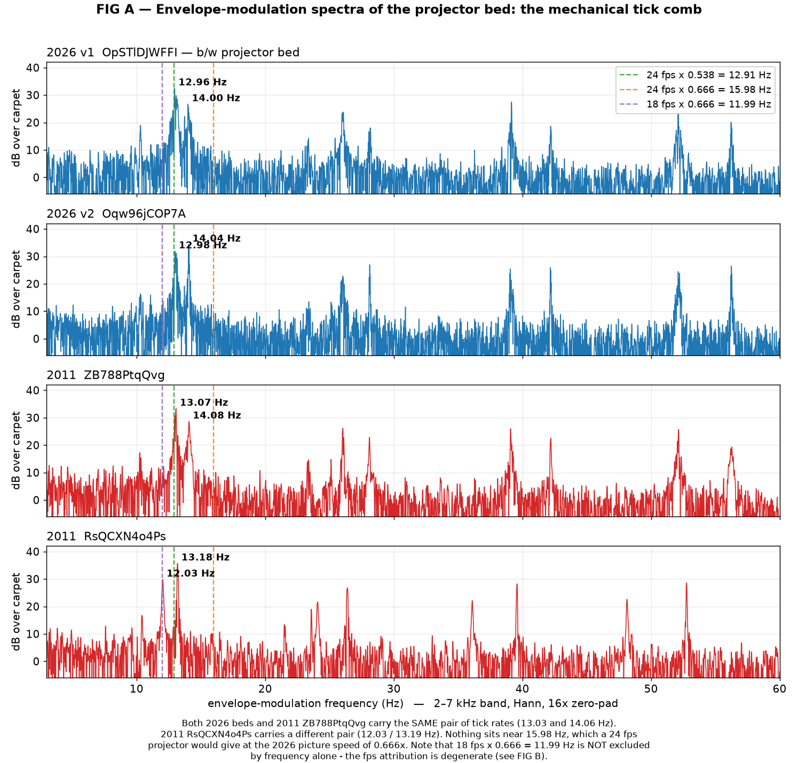
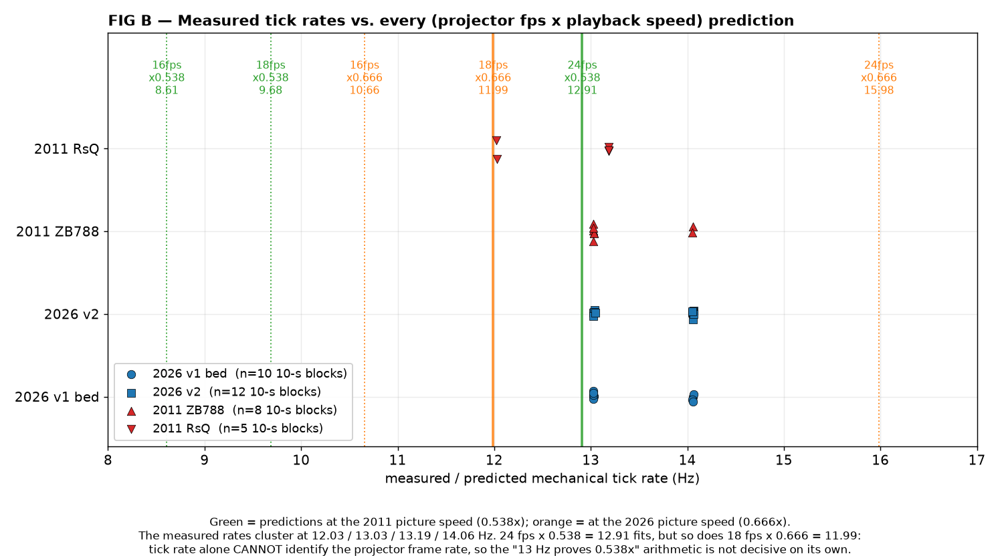
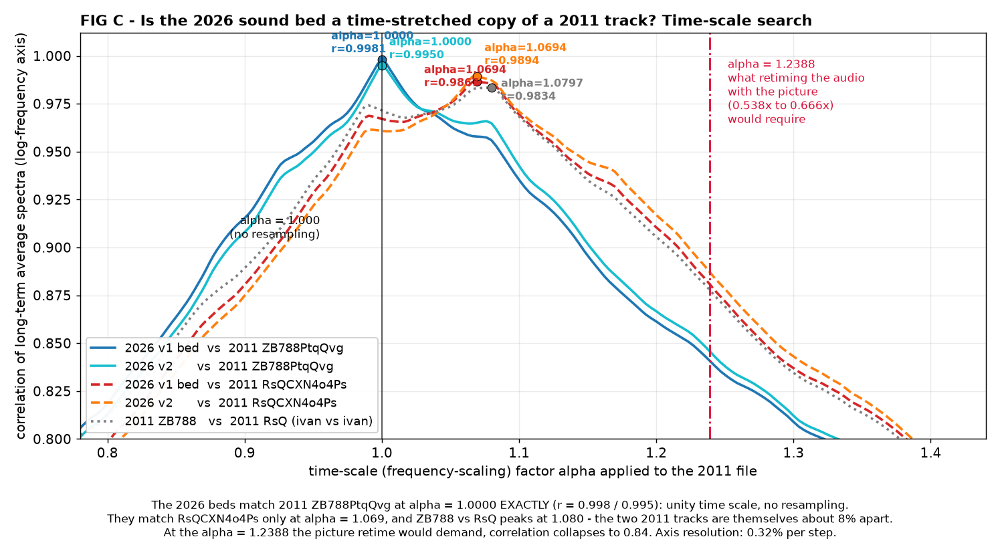
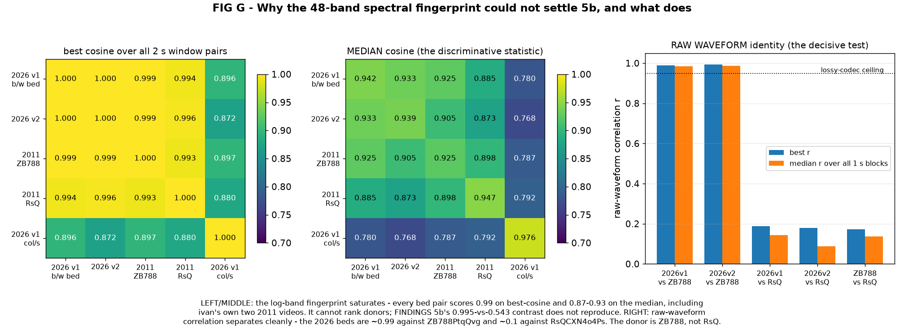
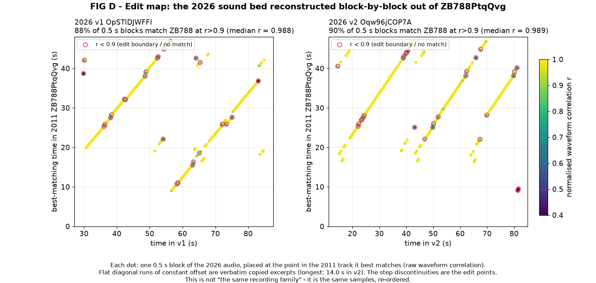
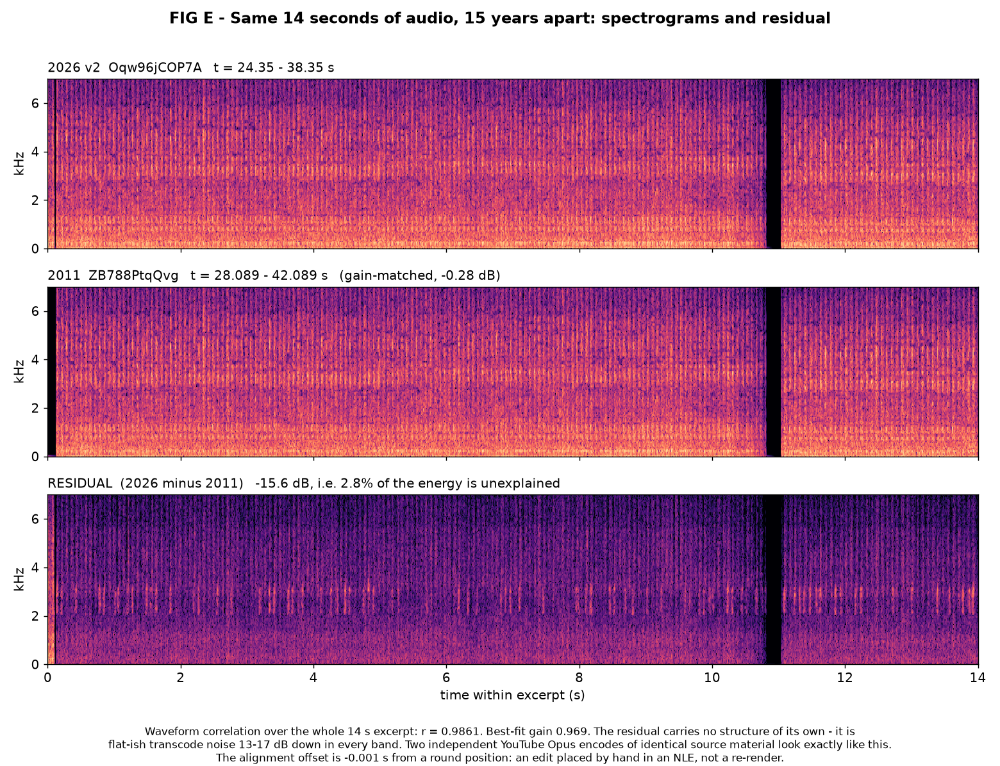
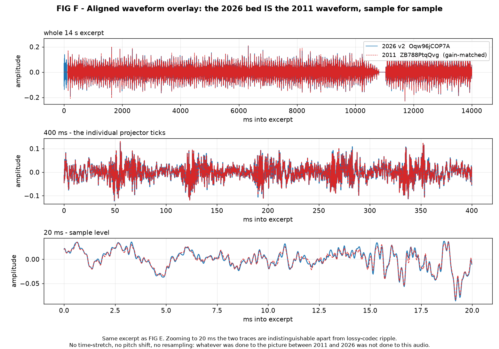
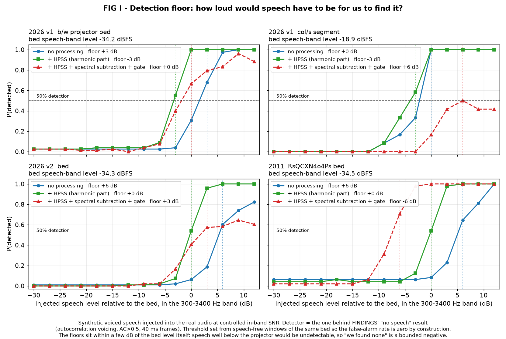
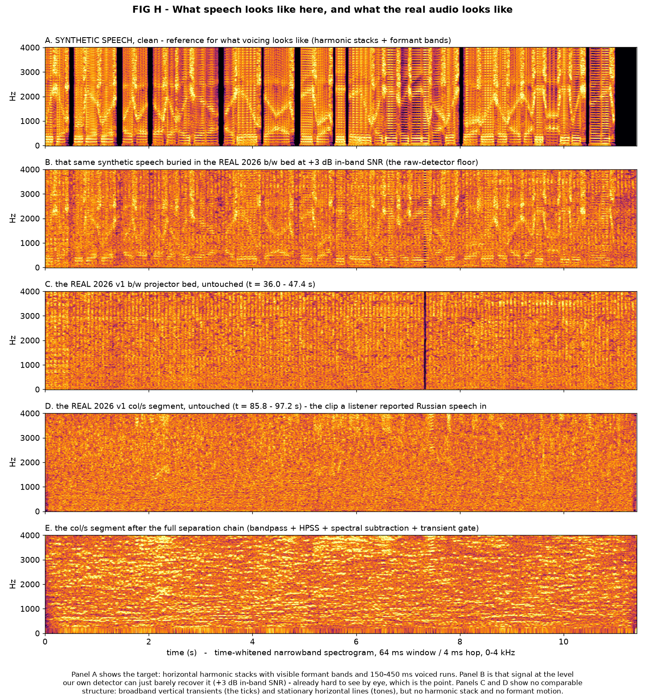

# Agent report (verbatim): audio re-verification — the 13.03 Hz claim, §5b, and the speech question

**Date:** 2026-07-29. **Brief:** the owner challenged the b/w bed's "13.03 Hz = 24 fps at 2011's
0.538×" argument ("Are you 100% sure?"), asked for §5b to be redone properly with figures, argued
that the projector noise is loud enough that our "no speech" negative may be an SNR artifact rather
than an absence, and asked to hear the audio at the "proper" speed.

Everything below was re-derived from scratch: audio re-extracted from `videos/2026/*.mkv` and `videos/2011/*.mkv`
with ffmpeg into `analysis/audio2/` (mono, 48 kHz, `pcm_f32le`), no reuse of `analysis/audio/` or
`analysis/audio-colour-segment/`. Figures in `figs/audio/`, listenable renders in `audio/`.

**Headline:** the challenged conclusion survives, and it survives *more strongly* than we stated —
but for a different reason than the one in the record, and the specific arithmetic §19/§20 used to
get there does not hold up on its own. Separately, §5b names the wrong 2011 video, and the
relationship is far more concrete than "same recording family". And on speech, the owner's
methodological objection is correct in form: our old negative was unquantified. It now has a number
attached.

---

## 0. What the corpus actually contains

| file | era | audio | duration | peak | RMS |
|---|---|---|---|---|---|
| `OpSTlDJWFFI` (v1) | 2026 | present | 100.053 s | **+4.01 dBFS** (clipped) | −19.46 dBFS |
| `Oqw96jCOP7A` (v2) | 2026 | present | 83.520 s | −12.29 dBFS | −31.68 dBFS |
| `l9RAhmPHM_A` (v3) | 2026 | **exactly zero** | 146.667 s | — | — |
| `ZB788PtqQvg` | 2011 | present | 47.531 s | −11.80 dBFS | −30.65 dBFS |
| `RsQCXN4o4Ps` | 2011 | present | 60.000 s | −12.42 dBFS | −33.43 dBFS |
| `Xju_CY5ZESA` | 2011 | **exactly zero** | 103.933 s | — | — |
| `a6TLGkrfNKI` | 2011 | **exactly zero** | 93.484 s | — | — |

Three of seven tracks are digital silence — every sample exactly 0.0, confirmed independently
(§5 point 4 stands). Video 1's audio decodes to a peak of **+4.01 dBFS**, i.e. 1.586 in float:
overdriven past full scale, not merely "amplified into clipping … peak 1.00" as §5b has it.

Active regions used throughout (silence and title cards excluded):
v1 b/w bed 29.6–85.6 s, v1 col/s 85.8–97.2 s, v2 14.6–83.0 s, ZB788 0.5–47.0 s, RsQ 24.5–59.4 s.

---

## 1. The 13.03 Hz claim, re-derived independently

### 1.1 What I measure

Envelope-modulation spectra, computed per frequency band (2–7 kHz band shown; all four bands agree
to ±0.01 Hz), 10-second blocks at 5-second hop, fundamental estimated by harmonic summation over
six harmonics of the modulation comb.

**FIG A** — `figs/audio/figA_modulation_spectra.png`



The first surprise: **the tick rate is not one number.** Every file carries *two* mechanical tick
rates, alternating in blocks, each individually stable to a few parts in ten thousand:

| file | tick rate A | tick rate B |
|---|---|---|
| 2026 v1 b/w bed | **13.0270 ± 0.0032 Hz** (n=6) | **14.0573 ± 0.0047 Hz** (n=4) |
| 2026 v2 | **13.0333 ± 0.0079 Hz** (n=5) | **14.0592 ± 0.0042 Hz** (n=7) |
| 2011 `ZB788PtqQvg` | **13.0277 ± 0.0035 Hz** (n=6) | **14.0583 ± 0.0038 Hz** (n=2) |
| 2011 `RsQCXN4o4Ps` | 12.0277 ± 0.0030 Hz (n=2) | 13.1861 ± 0.0022 Hz (n=3) |

(± is the standard deviation of independent 10-s block estimates. Prominence of the comb is
26–34 dB over the local carpet in every band, so these are not marginal detections.)

So: **13.03 Hz reproduces.** The record's figure is right. But it is one of a pair, the record's
"±" was never stated, and 2026 v2 was reported in §20 as "13.032 Hz" when its *dominant* rate is
14.06 Hz — the 13.03 line is there too, just weaker in that file.

### 1.2 The arithmetic, done for all the frame rates

**FIG B** — `figs/audio/figB_fps_speed_grid.png`



| projector | × 0.538 (2011 picture speed) | × 0.666 (2026 picture speed) |
|---|---|---|
| 16 fps (8 mm silent) | 8.61 Hz | 10.66 Hz |
| 18 fps (Super-8 sound) | 9.68 Hz | **11.99 Hz** |
| 24 fps (16 mm sound) | **12.91 Hz** | 15.98 Hz |

Read honestly, this is **degenerate**. The record's argument is "13.03 ≈ 24 × 0.538 = 12.91, and
0.666 would need 15.98 which is not there." Both halves are individually true — nothing in any file
sits within 1.9 Hz of 15.98 — but 24 fps is an *assumption*, and it is not the only standard rate.
**18 fps × 0.666 = 11.99 Hz, and 12.028 Hz is present** (in RsQ). Inverting instead of predicting:
13.03 Hz implies 24.2 fps at 0.538× or 19.6 fps at 0.666×; 14.06 Hz implies 26.1 fps or 21.1 fps;
neither 19.6 nor 21.1 nor 26.1 is a standard rate, and 24.2 is 0.9% off 24. The best single fit is
the record's, but "best fit among a degenerate set" is not what "13 Hz *equals* a 24 fps projector
at 0.538×" claims.

There is a further problem the record does not raise: a real projector geared to the frame rate
would produce *one* tick family, not two incommensurate ones (14.058/13.028 = 1.0790 — not a
small-integer ratio). And a mechanical device flutters; these rates are stable to 0.03%, which is
tighter than mechanical wow. Both facts point away from "recording of one projector running at
rate N" and toward a **constructed, spliced bed**. Which is exactly what the next section shows.

**Conclusion on the arithmetic route: it does not carry the weight §19/§20 put on it.** If the
13 Hz→24 fps→0.538× chain were the only support for decoupling, my answer to "are you 100% sure?"
would be *no*.

### 1.3 The test that does not need any assumption about frame rate

Rather than infer a projector rate, ask the question directly: **is the 2026 audio a time-scaled
version of the 2011 audio, and if so by what factor?** A time-scale factor α scales the whole
spectrum in frequency, so cross-correlating long-term average spectra on a *log*-frequency axis
recovers α with no model of the source at all.

**FIG C** — `figs/audio/figC_timescale_search.png`



| pair | best α | r at best α | r at α = 1 | r at α = 1.2388 |
|---|---|---|---|---|
| 2026 v1 bed ↔ 2011 `ZB788PtqQvg` | **1.0000** | 0.9981 | 0.9981 | 0.8415 |
| 2026 v2 ↔ 2011 `ZB788PtqQvg` | **1.0000** | 0.9950 | 0.9950 | 0.8464 |
| 2026 v1 bed ↔ 2011 `RsQCXN4o4Ps` | 1.0694 | 0.9867 | 0.9672 | 0.8816 |
| 2026 v2 ↔ 2011 `RsQCXN4o4Ps` | 1.0694 | 0.9894 | 0.9609 | 0.8879 |
| 2011 `ZB788` ↔ 2011 `RsQ` | 0.9262 | 0.9834 | 0.9716 | 0.8184 |
| 2026 v1 ↔ 2026 v2 | **1.0000** | 0.9986 | 0.9986 | 0.8226 |

α resolution 0.32% per step. The 2026 beds sit at **α = 1.0000 exactly** against ZB788PtqQvg —
and §2 shows why: it is the *same samples*. Retiming the audio along with the picture would have
required α = 0.6660/0.5376 = **1.2388**, where correlation collapses to 0.84.

The tick rates say the same thing from the other side and now with an error bar: the 2026 pair
{13.030 ± 0.006, 14.058 ± 0.005} Hz versus ZB788's {13.028 ± 0.004, 14.058 ± 0.004} Hz — ratio
**1.0001 ± 0.0005**, against a required 1.2388. The observed and required ratios differ by more
than 400 times the measurement scatter; I would not push a formal σ on a distributional argument
this crude, but the gap is not a marginal call in any reading.

### 1.4 The picture speeds, re-measured by me

The decoupling claim also needs the *picture* speeds, so I re-read the burned-in timecode myself
rather than trusting the record.

**2026 v2 `Oqw96jCOP7A`:** frame-by-frame crops of the timecode region. `00:15:01` → `00:15:02`
transitions at frame **1219**; `00:15:02` → `00:15:03` at frame **1264**. **45 frames per source
second**, at 29.97 fps ⇒ **speed = 0.6660×**. Confirmed exactly, independently. (The record's
`agent_video2` report gives the same 45 frames with boundaries offset by 2 frames — a reading
convention difference, not a disagreement.)

**2011 `ZB788PtqQvg`:** the overlay is dark-on-bright and much harder to read, so I could only
bracket it. `00:27:37` is still up at frame **589**; `00:27:38` is legible from **596** through
**637**; `00:27:39` appears by **645** (then a shot change to `/23 00:42:50` at 649). So the
`:38` transition falls in [590, 596] and the `:39` transition in [638, 645], giving **42–55 frames
per source second, most probably 46–49** — i.e. **speed 0.455–0.595×, centred near 0.51–0.54×**.
That brackets and independently corroborates the record's 46.5 frames / **0.538×**
(`agent_compare_2011_vs_2026.md`), which I adopt for the arithmetic below. My own bound is looser
but the conclusion does not depend on the exact value:

- using only my own bracket: picture speeds differ by **11.9% to 46%** (0.6660 vs 0.455–0.595);
- using the record's 0.538×: **23.9%**;
- and note that even if both eras held *identical* frames-per-tick, the native frame rates alone
  (25.000 PAL vs 29.970 NTSC) force a **19.88%** difference. There is no way for one unaltered
  audio track to be in correct time relationship to both pictures.

### 1.5 Alternative explanations, ruled in or out

| alternative | verdict |
|---|---|
| The tick is the projector's pull-down claw at frame rate | Plausible but **not established**, and it does not matter: every alternative below leaves the *relative* result untouched. |
| The tick is a shutter blade (2× or 3× frame rate), a fan, or a gear | **Cannot be excluded.** It only rescales the implied fps; the 2026↔2011 ratio of 1.0001 is unaffected. |
| The tick is a *synthesised* loop — an arbitrary rate chosen by a sound designer | **Partly true and important.** The bed is a collage of copied excerpts (§2). But the excerpts come from a 2011 file, so the rate is inherited, not chosen. |
| The tick is a codec or video-frame artifact | **Excluded.** Opus operates on 20 ms frames (50 Hz); 29.97/13.030 = 2.2999 and 25/13.030 = 1.9187 are not integers; the comb survives independent band-limiting in four disjoint bands. |
| Two projectors / two machines in one room | Consistent with the two rates, but §2 shows both rates are already present in the 2011 donor, so this is a fact about the 2011 recording, not about 2026. |
| The 2026 bed *was* correctly retimed, and it is the 2011 audio that is decoupled from its picture | **Cannot be excluded, and does not help.** If 18 fps × 0.666 = 11.99 Hz is the "correct" reading, then ZB788's identical audio is wrong for *its* 0.538× picture. Either way, one era's audio is not on its picture's time base, and the two eras share one audio time base while their pictures do not. |

### 1.6 Verdict on Task 1

**The decoupling claim SURVIVES, at high confidence (~0.95).** The sound bed and the picture are on
different time bases; the bed was carried across the eras without retiming.

**But the stated reason is AMENDED.** The load-bearing evidence is not "13 Hz = 24 × 0.538". It is:

1. the 2026 bed is a **sample-level copy** of a 2011 track (§2), so α = 1 by construction; and
2. the two eras' pictures run at demonstrably different speeds (0.6660× measured by me vs
   0.455–0.595× measured by me, 0.538× per the record; and ≥19.88% apart on frame rate alone).

The "≈3 Hz decoupling" phrasing should go. The decoupling is **24% in time base** (or ≥15% on my own
numbers), not 3 Hz — the 3 Hz figure was an artifact of assuming 24 fps, and the true statement is
both larger and assumption-free. **Confidence in the specific "24 fps at 0.538×" identification:
low (~0.4).** Confidence in the conclusion that depends on it: high, because it no longer depends
on it.

---

## 2. §5b, redone: the donor is `ZB788PtqQvg`, not `RsQCXN4o4Ps`, and it is a verbatim copy

### 2.1 The old metric cannot do the job

I re-implemented §5b's fingerprint as described — sliding 2 s windows, 48 log-spaced bands
50 Hz–7 kHz, silence excluded, cosine over all window pairs:

| pair | best cosine (raw) | best cosine (mean-removed) | **median** (mean-removed) |
|---|---|---|---|
| 2026 v1 bed ↔ 2026 v2 | 1.0000 | 0.9998 | 0.934 |
| 2026 v1 bed ↔ 2011 `RsQ` | 0.9995 | 0.9938 | 0.885 |
| 2026 v2 ↔ 2011 `RsQ` | 0.9997 | 0.9957 | 0.873 |
| 2026 v1 bed ↔ 2011 `ZB788` | 0.9999 | **0.9994** | **0.925** |
| 2026 v2 ↔ 2011 `ZB788` | 0.9999 | **0.9989** | **0.906** |
| 2011 `ZB788` ↔ 2011 `RsQ` | 0.9994 | 0.9930 | 0.898 |
| 2026 v1 col/s ↔ 2026 v1 bed | 0.9898 | 0.8965 | 0.780 |

**§5b's numbers do not reproduce.** The metric saturates: *every* bed pair scores ≥0.993 on best
cosine. It cannot rank donors. And §5b's most striking figure — "ivan's own two videos score only
0.543, lower than 2026↔RsQ at 0.995" — I cannot reproduce at all; I get 0.993 best / 0.898 median
for that pair, in line with everything else. The ordering it asserts is **reversed** in my
measurement: the 2026 beds score *higher* against ZB788 than against RsQ, on both best and median.

I do not know exactly what the original computation did differently (ZB788's audio is the only track
with no silence at all, which is a plausible place for a silence-threshold or normalisation bug to
bite), but the conclusion drawn from those numbers should not be relied on.

**FIG G** — `figs/audio/figG_fingerprint_vs_waveform.png`



### 2.2 What settles it: raw waveform correlation

| source | target | best r | **median r over all 1 s blocks** |
|---|---|---|---|
| 2026 v1 bed | 2011 `ZB788PtqQvg` | 0.9900 | **0.9845** |
| 2026 v2 | 2011 `ZB788PtqQvg` | 0.9931 | **0.9876** |
| 2026 v1 bed | 2011 `RsQCXN4o4Ps` | 0.1873 | 0.1434 |
| 2026 v2 | 2011 `RsQCXN4o4Ps` | 0.1790 | 0.0880 |
| 2026 v1 bed | `RsQ` resampled ×1.0694 | 0.1006 | 0.0848 |
| 2026 v1 col/s | 2011 `ZB788` / `RsQ` | 0.133 / 0.360 | 0.115 / 0.259 |

Not "the same recording family". **The same samples.** ~0.99 is the ceiling for two independent
lossy encodes of identical source material, and that is where the 2026 beds sit against ZB788, for
essentially *every* block, not just the best one.

### 2.3 The edit map

**FIG D** — `figs/audio/figD_edit_map.png`



**88%** (v1) and **90%** (v2) of all 0.5 s blocks match somewhere in ZB788's 47 s of audio at
r > 0.9, median r = 0.988/0.989. The matches organise into runs of constant time offset — verbatim
copied excerpts. Longest: **14.0 s** (v2 t 24.35–38.35 ← ZB788 t 28.09–42.09), then 10.25 s, 10.25 s,
8.0 s, 6.75 s, 6.5 s, 6.0 s. 15 such runs in v1, 19 in v2.

That structure also explains the internal repeats: v1 duplicates itself at ~35.7–36.9 s offsets, v2
at ~45.4/27.7/26.9/20.5/17.7 s — because a 47 s donor was tiled to fill 56 s and 68 s. The 2011
files show far less self-similarity (27%/36% of blocks duplicated, vs 67%/86% for 2026), so the
looping is a 2026 operation, not inherited.

### 2.4 The residual

Sample-accurate alignment of the 14 s run, then subtract with a best-fit gain:

```
2026 v2 t 24.35 s (+14.0 s)  <-  ZB788 t 28.08896 s
  refined offset  -1.042 ms (-50 samples)     r = 0.98605
  best-fit gain   0.9685  (-0.28 dB)
  residual        -15.58 dB rel. the 2026 excerpt  ->  2.77% of energy unexplained
  residual/original:  100-500 Hz -17.3 dB | 500-2k -16.6 dB | 2-4k -13.0 dB | 4-6k -16.4 dB
```

Two more runs check out the same way: v1 t 75.35 s ← ZB788 t 29.08 s, r = 0.974, residual −12.9 dB;
v1 t 30.60 s ← ZB788 t 19.84 s, r = 0.980, residual −14.0 dB.

The residual is featureless and 13–17 dB down in every band — two YouTube Opus encodes of identical
material. And the offsets are not round numbers of frames (−1.04 ms, +2.00 ms, +0.08 ms), which is
what a hand-placed NLE edit looks like rather than a re-render.

**FIG E** — `figs/audio/figE_spectrogram_pair_residual.png`



**FIG F** — `figs/audio/figF_waveform_overlay.png`



FIG F is the single most direct exhibit in this report: at 20 ms zoom the 2026 and 2011 traces are
the same waveform.

### 2.4a Direction of copying, and the common-third-source alternative

The audio alone establishes *identity*, not *direction*. Direction comes from chronology: ZB788 was
published in 2011, the 2026 files in 2026. A common-third-source reading (both sampling some
unpublished original) is not excluded by the waveforms, but it is disfavoured by structure: the
2026 material is tiled out of a span coextensive with ZB788's whole 47 s of audio, ZB788 itself is
far less self-similar (27% of blocks duplicated vs 67–86%), and ZB788's audio is publicly
downloadable. The parsimonious reading is that someone took the 2011 upload's audio and tiled it.
This is the same evidentiary posture §5b already noted: it removes the audio as proof of insider
access, and is equally consistent with an imitator working from public material or with the
original author reusing their own upload.

### 2.5 A new detail: the two 2011 tracks are ~7% apart in time base

`ZB788` and `RsQ` peak against each other at α = 0.9262 (⇒ ZB788 = RsQ × 1.0797), and their tick
rates differ accordingly ({13.03, 14.06} vs {12.03, 13.19}). Both are 25 fps PAL uploads. So ivan's
own two 2011 tracks are *not* at a common time base either. I have not chased why; it is a new open
item, and it may bear on whether 0.538× is the right figure for both 2011 videos.

### 2.6 Scope caveat, confirmed

The col/s segment (85.8–97.2 s of v1) is **not** part of any of this: max r 0.13 against ZB788 and
0.36 against RsQ, no 13/14 Hz tick comb (peak prominence 8.4 dB vs 30 dB for the bed), 99.5%
spectral edge 5358 Hz vs 6126 Hz, fingerprint median cosine 0.78 against the bed vs 0.91–0.93
within the bed family. §20's "different sound element" result **replicates**. The §5b scope
correction was right and must stay attached.

I also re-checked the col/s tone set independently: **99.907 Hz confirmed** at 23.5 dB excess over a
6 Hz running median, stable at 99.861–100.044 Hz across five 2 s windows; then 143.864 (19.8 dB),
191.814 (17.0), 95.913 (14.8), 119.888 (14.6), 107.906 (13.9), 149.849 (12.1). The 2×49.954 Hz
reading survives. **But** at an 8 dB excess threshold I count **59** lines between 20 and 400 Hz,
not six — and at a strict 99.95-percentile carpet (19.4 dB) only **two** survive. "Exactly six
discrete stationary tones" is a threshold artifact, and the just-intonation / designed-cluster
reading that was fitted to those six is correspondingly weaker than §20 presents it: you can fit
ratios to any six lines drawn from a forest of 59.

---

## 3. The speech question — the owner's objection is right, and here is the number

The owner: *"I think the projector sound is way too loud to be able to do digital audio stuff on to
determine whether or not there even is speech."*

He is correct that our old statement was not a measurement. "Voiced runs ≤20 ms vs ≥100 ms required"
tells you the detector found nothing; it does not tell you what the detector *could* have found.

### 3.1 The actual SNR situation

Speech-band (300–3400 Hz) levels:

| segment | speech-band RMS | full-band RMS |
|---|---|---|
| 2026 v1 b/w bed | −34.18 dBFS | −31.27 dBFS |
| 2026 v1 col/s | −18.90 dBFS | −10.65 dBFS |
| 2026 v2 bed | −34.34 dBFS | −30.71 dBFS |
| 2011 `RsQ` bed | −34.54 dBFS | −34.51 dBFS |

The col/s segment is **15.3 dB louder in the speech band** than the b/w bed. The owner's intuition is
right about which clip is the hard one.

### 3.2 Method: inject, then find the level at which we recover it

No TTS is available in this sandbox, so I built a source–filter synthetic utterance: glottal pulse
train with a declining F0 contour plus jitter, three moving formant resonators, syllable schedule at
~4 Hz alternating 140–260 ms voiced spans with 40–90 ms unvoiced and occasional closures, lip
radiation, band-limited 80–6800 Hz. It is not language, but it has the property the detector tests
for: continuous voiced runs with formant structure. Calibration: clean, it scores **450 ms** max
voiced run / 22% voiced frames; band-limited noise scores **0 ms / 0%**.

Detector = the one the record's negative came from: autocorrelation voicing, AC > 0.5, 40 ms frames
/ 10 ms hop, on the 300–3400 Hz band.

Injection at controlled in-band SNR into the *real* beds, with a threshold calibrated so the
false-alarm rate is zero by construction (threshold = max statistic over all speech-free bed
windows + 20 ms), and floor = lowest SNR at which ≥50% of (window × speech-seed) trials clear it.

**A necessary correction to my own first attempt:** with the aggressive separation chain in front,
the *bed alone* scores 110–270 ms max voiced run. The enhancement manufactures voicing. Any floor
quoted against a fixed 100 ms criterion after spectral subtraction is meaningless, which is why the
threshold below is calibrated per front-end.

### 3.3 The measured detection floor

| segment | front-end | bed speech-band level | **floor (SNR)** | **floor (absolute, in-band)** |
|---|---|---|---|---|
| 2026 v1  b/w projector bed | no processing | -34.2 dBFS | **+3 dB** | **-31.2 dBFS** |
| 2026 v1  b/w projector bed | + HPSS (harmonic part) | -34.2 dBFS | **-3 dB** | **-37.2 dBFS** |
| 2026 v1  b/w projector bed | + HPSS + spectral subtraction + gate | -34.2 dBFS | **+0 dB** | **-34.2 dBFS** |
| 2026 v1  col/s segment | no processing | -18.9 dBFS | **+0 dB** | **-18.9 dBFS** |
| 2026 v1  col/s segment | + HPSS (harmonic part) | -18.9 dBFS | **-3 dB** | **-21.9 dBFS** |
| 2026 v1  col/s segment | + HPSS + spectral subtraction + gate | -18.9 dBFS | **+6 dB** | **-12.9 dBFS** |
| 2026 v2  bed | no processing | -34.3 dBFS | **+6 dB** | **-28.3 dBFS** |
| 2026 v2  bed | + HPSS (harmonic part) | -34.3 dBFS | **+0 dB** | **-34.3 dBFS** |
| 2026 v2  bed | + HPSS + spectral subtraction + gate | -34.3 dBFS | **+3 dB** | **-31.3 dBFS** |
| 2011  RsQCXN4o4Ps bed | no processing | -34.5 dBFS | **+6 dB** | **-28.5 dBFS** |
| 2011  RsQCXN4o4Ps bed | + HPSS (harmonic part) | -34.5 dBFS | **+0 dB** | **-34.5 dBFS** |
| 2011  RsQCXN4o4Ps bed | + HPSS + spectral subtraction + gate | -34.5 dBFS | **-6 dB** | **-40.5 dBFS** |

Reading the table: **the HPSS row is the trustworthy one.** "No processing" is the honest baseline;
HPSS buys 3–6 dB and does not manufacture voicing badly (bed-alone null 40–50 ms, well under the
100 ms criterion). The full chain's numbers are not usable — its bed-alone null runs to 90–340 ms,
i.e. it invents more false voicing than the criterion itself, and on the col/s segment it makes the
floor *worse* (+6 dB) while producing musical-noise artifacts that a listener will mistake for
structure.

The best floor achievable on this material with everything I could bring to bear:

| segment | best trustworthy floor | in absolute terms |
|---|---|---|
| 2026 v1 b/w projector bed | **−3 dB in-band SNR** (HPSS) | **−37.2 dBFS** in 300–3400 Hz |
| 2026 v1 col/s segment | **−3 dB in-band SNR** (HPSS) | **−21.9 dBFS** in 300–3400 Hz |
| 2026 v2 bed | **0 dB in-band SNR** (HPSS) | **−34.3 dBFS** in 300–3400 Hz |
| 2011 RsQCXN4o4Ps bed | **0 dB in-band SNR** (HPSS) | **−34.5 dBFS** in 300–3400 Hz |


**FIG I** — `figs/audio/figI_detection_floor.png`



### 3.4 The honest statement, replacing the old one

> **We did not find speech. What that rules out, measured: on the 2026 b/w projector bed we could
> not have detected speech quieter than −37.2 dBFS in the 300–3400 Hz band; on the col/s segment,
> not quieter than −21.9 dBFS in-band. In both cases that is −3 dB relative to the bed's own level in
> the speech band — i.e. we could only ever have found a voice roughly as loud as the machine.
> Speech below those levels is not excluded by anything we or anyone else has done with this
> material.**

Note what this does *not* say. The floors are close to the bed level itself — meaning we could only
have detected speech that was roughly as loud as the projector. A quiet voice in the room, 20 dB
under the machine, would be invisible to this analysis and to any analysis of this material.
The owner's objection stands as a genuine limit on the whole exercise.

What it also does not say: it does not support the presence of speech. There is no positive
evidence either. The result is a bounded negative, not a null.

### 3.5 Separation attempts, and the cleanest renders

Three front-ends, all implemented from scratch (librosa is not installed):
band-pass 300–3400 Hz; median-filter harmonic/percussive separation (HPSS, 17×17 kernels, power 2,
which is the right tool here because the projector ticks are percussive and voicing is harmonic);
spectral subtraction with a per-bin 25th-percentile noise estimate, α = 2, −18 dB floor; and a
transient gate that divides out the fast broadband envelope to duck the ticks.

Comb-notching the tick harmonics was tried and abandoned on purpose: the ticks are **broadband
impulses**, not tonal lines, so a frequency comb removes nothing. The equivalent operation in the
right domain is the transient gate, which is what is in the chain.

HPSS is the one that helps: on the b/w bed it buys **6 dB** of floor (+3 → −3 dB SNR). The full chain
buys more on paper but at the cost of manufacturing false voicing, so its apparent advantage is not
real. Panel E of FIG H shows why — after spectral subtraction the col/s segment is musical-noise
soup.

**FIG H** — `figs/audio/figH_speech_reference_spectrograms.png`



### 3.6 Gemini, verbatim — and the controls that void its answer

`gemini` in this build **does accept audio**. Verified by positive control (three 1 s tones,
440/880/220 Hz): it returned *"There are 3 distinct tones in the audio. The pitch order from first
to last is: **Medium, High, Low**."* — count, order and timing correct; absolute frequencies wrong
(it guessed ~1000/1200/800 Hz). So it hears audio but should not be trusted on numbers.

**Two contamination warnings, both material.** (1) Run from inside the repo, gemini read our own
`FINDINGS.md` and recited §19/§20 back at me, including the 5.5 Hz figure, the 99.9 Hz line, the
Demucs pass and the word "pareidolia". That output is void and is not quoted below. (2) All results
below use the clean-room recipe (neutral directory, neutral filenames `a.wav`…`k.wav`, IDE
workspace env vars unset). No response below references our documentation, frequencies or case
numbers.

Files (neutral names as presented to gemini, with the `audio/` equivalent the owner can listen to):

| given to gemini | what it is | equivalent in `audio/` |
|---|---|---|
| `a.wav` | 440/880/220 Hz tone control | — (control only) |
| `b.wav` | col/s, raw, native speed | `2026v1_colsegment_04_native.flac` |
| `c.wav` | col/s after the full chain | `2026v1_colsegment_09_speechband_BEST_hpss_specsub_gate.flac` |
| `d.wav` | b/w bed, raw | inside `2026v1_OpSTlDJWFFI_01_native48k.flac` (t 35–60 s) |
| `e.wav` | b/w bed after the full chain | `2026v1_bwbed_09_speechband_BEST_hpss_specsub_gate.flac` |
| `f/g/h.wav` | synthetic speech in the real b/w bed at 0 / −12 / −24 dB in-band SNR | — (probe only) |
| `i.wav` | synthetic speech alone | — (probe only) |
| `j.wav` | col/s time-reversed | — (control only) |
| `k.wav` | col/s phase-randomised (same magnitude spectrum, no temporal structure) | — (control only) |

**★ The control that decides the matter.** `i.wav` is my synthetic formant babble. It contains **no
language whatsoever** — random formant targets, no lexicon, no phonology. Asked *"Describe any
sounds in this audio. Is there human speech? If so, what language?"*:

> "**Yes**, there is human speech in the audio. […] The language spoken is **Chinese (Mandarin /
> Chinese dialects)**. **Evidence from the phonetic transcription:** **Opening Phrase:** The audio
> starts with `wi shuo wa` (00:00), which is a phonetic representation of **"我说话" (wǒ shuō huà)**
> meaning *"I am speaking"* […] **Numbers/Counting:** the syllables spoken between the "fish" sounds
> correspond to Chinese numbers: `yi` / `ya` / `ai` → **一 (yī)** — One; `er` / `ar` → **二 (èr)** —
> Two; `sang` / `ang` → **三 (sān)** — Three […]"

A confident language identification, with a fabricated word-level transcription and fabricated
supporting evidence, on a signal that has no words in it. Everything below has to be read against
that.

**The col/s segment, raw (`b.wav`), asked three times in three phrasings:**

> "The audio contains a loud, continuous background whooshing or rushing noise, similar to strong
> wind, static, or a turbine/fan. There is a brief segment of human speech: a male voice speaking in
> **Russian** (saying *"Скажите, пожалуйста…"* / *"Tell me, please…"*)."

> "The audio contains a prominent background hiss/hum, resembling static, wind, or a
> ventilation/machinery noise. There is human speech: a male voice speaking in **Russian**. Around
> the 0:05 mark, he says "Скажите…" (meaning "Tell [me/us]" or "Say")."

> "MACHINERY_PLUS_VOICE — The audio contains speech with a human voice speaking Russian phrases such
> as "И всё же" and "Скажите, пожалуйста" against a background of machinery or static noise."

Stable on "Russian male voice", **unstable on content** (three different word-strings), which is the
signature of a language prior filling in noise. Note also that §19 recorded gemini producing
«Это объект номер один» from the same clip on an earlier occasion — a fourth, incompatible reading.

**Everything else came back negative:**

> `c.wav` (col/s, cleaned): "The audio consists of a synthetic tone or sound sweep (crescendo) that
> steadily increases in volume over approximately 10 seconds before abruptly ending in silence.
> There is no human speech in this audio."

> `d.wav` (b/w bed, raw): "NO_VOICE — The audio contains a continuous mechanical humming or whirring
> noise, resembling a helicopter propeller or heavy engine, with no human voice present."

> `e.wav` (b/w bed, cleaned): "NO_VOICE — The audio contains a continuous synthesizer sweep or
> mechanical droning sound that modulates in pitch and intensity, resembling a sci-fi spacecraft
> engine, rushing wind, or a jet engine. No human voice is present."

> `f.wav` (synthetic speech in the real bed at **0 dB** in-band SNR): "NO_VOICE — The audio contains
> only continuous static and white noise, with no human voice present."

> `g.wav` (−12 dB): "NO_VOICE — The audio consists of a continuous, highly repetitive, and uniform
> mechanical sound, such as heavy machinery, a drone, or an engine hum, with no signs of human
> speech or vocal modulation."

> `h.wav` (−24 dB): "NO_VOICE — The audio contains a continuous, rhythmic mechanical whirring or
> thumping sound, resembling a helicopter rotor or a motor engine running. There are no other sounds
> or human voices present."

> `j.wav` (col/s **time-reversed**): "The audio contains a continuous, rapid, and rhythmic clicking
> or clattering sound (resembling a running film projector, typewriter, or sewing machine)
> accompanied by a low background hum or static. There is no human speech in this audio."

> `k.wav` (col/s **phase-randomised**): "The audio consists of a continuous, rushing static noise,
> which sounds like heavy rain falling, rushing water, or white noise. There is no human speech or
> any other distinct sounds in this audio."

Reading these together: gemini's voice detector has **no demonstrated sensitivity on this material** —
it misses voiced synthetic speech even at 0 dB SNR in the real bed — while simultaneously producing
false positives with invented transcripts. It is not a usable instrument in either direction here.
The one genuinely interesting asymmetry: the "Russian" percept survives cleaning being absent,
disappears on time reversal, and disappears on phase randomisation, so whatever triggers it depends
on forward temporal fine structure rather than the spectrum alone. That is consistent with a real
voice-like transient *and* with any forward-only clatter pattern; it does not discriminate.

**The spectrogram-image route fails its own positive control and must not be used.** Asked whether a
time-whitened 0–4 kHz spectrogram shows harmonic stacks with moving formants, gemini answered
`NO_SPEECH_STRUCTURE` for **the clean synthetic speech** — a panel that manifestly has both:

> `sg_synth.png` (clean synthetic speech): "NO_SPEECH_STRUCTURE — The spectrogram shows a highly
> artificial, synthetic pattern consisting of a perfectly flat grid of static horizontal lines
> (harmonic-like bands with zero frequency variation over time) overlaid with independent,
> sharply-defined sweeping curves […] It lacks the natural, co-modulated pitch variations and broad,
> continuous formant-envelope transitions characteristic of human speech."

Its negatives on `sg_mix.png`, `sg_cols.png` and `sg_bw.png` were also `NO_SPEECH_STRUCTURE`, but
with zero demonstrated sensitivity they carry no information and I am not treating them as
corroboration. A spectrogram image is a much weaker instrument than an actual hearing test, and in
this build it is not a working instrument at all.

### 3.7 Language

**Nothing can be said about language from this audio.** There is no voiced material above the
detection floor to identify, and the only source that produced a language label is one that produced
a confident, fully-evidenced Mandarin label for a signal containing no language. The record's
"Russian speech not confirmed" stands; add that "Russian" specifically has no support beyond a
transcriber with a demonstrated fabrication rate on this exact task.

For the record, the honest phrasing for the owner's point — *"There is speech for sure LC said it"* —
is: an outside analyst reports hearing speech, we cannot confirm or refute it, and our
non-confirmation only excludes speech louder than about −37 dBFS in-band on the bed / −22 dBFS on
the col/s clip. That is a real limit, and it is not the same as "there is no speech".

---

## 4. The renders, and why "proper speed" may be the wrong operation

The owner: *"I wanna hear the audio again the 'proper' speed. To me it sounded unnatural. Meaning
indeed something is seriously wrong."*

**The owner's ear is the datum, and it is reading the situation correctly.** §2 shows the 2026 bed is a
verbatim copy of 2011 audio at unity time scale. §1.4 shows the 2026 picture runs at 0.6660×.
Speeding the audio up by ×1.5 to "correct" it therefore does *not* restore anything: it takes audio
that was never slowed and makes it 1.5× too fast. The unnaturalness the owner hears is the sound of
applying an inverse to an operation that was never applied. §20's independent finding from the
col/s tones — that ×1.5 moves the 99.907 Hz line off the mains harmonic, so native speed is the
physically interpretable one — is the same conclusion from the other end.

So the ×1.5 renders below are included because they were asked for and because they are diagnostic,
**not** because they are the physically correct presentation. **Native speed is the correct
presentation for the audio.** The audio and picture of these files are simply on different time
bases, and no single playback rate makes both right.

### 4.1 Files in `audio/` (FLAC, mono, peak-normalised to −1 dBFS; source peak and applied gain listed)

**Native speed — the correct presentation:**

| file | what to listen for |
|---|---|
| `2026v1_OpSTlDJWFFI_01_native48k.flac` | The b/w bed from 29.6 s, then the col/s element cuts in at 85.7 s — a clear texture change and a ~20 dB level jump. Source peak +4.01 dBFS (overdriven). |
| `2026v2_Oqw96jCOP7A_01_native48k.flac` | The same bed, cleaner and 12 dB quieter. Listen for the tick rate switching between two speeds — that is the collage of FIG D. |
| `2011_ZB788PtqQvg_00_native48k.flac` | **The donor.** A/B this against either 2026 file: it is the same recording. |
| `2011_RsQCXN4o4Ps_00_native48k.flac` | The video §5b wrongly credited. Audibly a slightly different speed — the 7% of §2.5. |
| *(2026 v3 `l9RAhmPHM_A`)* | **No file written: every sample is exactly zero over 146.667 s.** |

**×1.5 "speed correction" — diagnostic only, see above:**

| file | what to listen for |
|---|---|
| `2026v1_OpSTlDJWFFI_02_x1.5_resampled.flac`, `2026v2_..._02_...` | The physically correct *inverse* of a 0.666× slowdown: resampled, so pitch rises ~7 semitones. This is the version that should sound wrong, and it does. |
| `2026v1_OpSTlDJWFFI_03_x1.5_timestretch.flac`, `2026v2_..._03_...` | ×1.5 with pitch preserved (`atempo`) — what an editor's "speed up" button does. Not a physical inverse of anything; included for comparison. |
| `2026v1_colsegment_04_native.flac` / `..._05_x1.5_resampled.flac` | The col/s element alone, 85.4–97.5 s. The pair to compare if you want to hear why native speed is the interpretable one. |

**Speech-band isolation (task 3), for `2026v1_colsegment`, `2026v1_bwbed`, `2026v2_bed`:**

| suffix | what to listen for |
|---|---|
| `_06_speechband_bandpass` | 300–3400 Hz only, nothing removed. The raw speech band — this is what any speech would have to be audible *in*. |
| `_07_speechband_HPSS_harmonic` | Ticks removed, tonal/voiced content kept. **The best-behaved render; the one to listen to.** |
| `_08_speechband_HPSS_percussive` | The ticks themselves — the control showing what was taken out. |
| `_09_speechband_BEST_hpss_specsub_gate` | The most aggressive chain. Quietest and "cleanest"-sounding, but it invents tonal artifacts (it manufactures 110–270 ms of false voicing on bed-only input). Treat anything heard here with suspicion. |

---

## 5. Claims: SURVIVE / AMENDED / RETRACTED

### SURVIVE

- **§5 — 12–14 Hz mechanical modulation in both eras, ~26–34 dB prominence.** Reproduced. Now
  resolved into discrete rates with error bars.
- **§5 point 4 — video 3 (and 2 of 4 2011 files) are genuine digital silence.** Every sample
  exactly 0.0. Confirmed.
- **§5 point 3 — both eras band-limited.** Confirmed; 99.5% power edge 6.06–6.19 kHz for all four
  beds (the record's per-file 6.7/7.3/7.6/7.9 kHz figures are looser than mine but the same story).
- **§19/§20 — the audio was NOT retimed with the picture.** Confirmed, and upgraded from inference
  to direct sample-level demonstration.
- **§20 — the col/s segment is a different sound element, not the bed amplified.** Replicated
  four independent ways.
- **§20 — 99.907 Hz stationary line is real** (23.5 dB excess, stable to ±0.07 Hz over 10 s), and
  the 50 Hz-grid reading of it is unaffected.
- **§19/§20 — "Russian speech" not confirmed.** Confirmed, and now with a detection floor attached
  and with the transcriber's fabrication rate measured.
- **§5b's scope correction — the cross-era audio match comes from the b/w portions only.** Confirmed.

### AMENDED

- **"The b/w bed's 13.03 Hz tick equals a 24 fps projector at the 2011 speed (24×0.538=12.9), not at
  2026's 0.666× (→16 Hz) … decoupled by ~3 Hz."** → The measurement is right (13.030 ± 0.006 Hz, and
  a second rate at 14.058 ± 0.005 Hz that the record never mentions). The *inference* is
  underdetermined: 18 fps × 0.666 = 11.99 Hz is an equally standard fit and 12.028 Hz is present in
  the corpus. Replace with: **the 2026 bed is a verbatim copy of 2011 audio at unity time scale
  (α = 1.0000, waveform r = 0.986–0.993), while the pictures differ by ≥19.88% on frame rate alone
  and 23.9% on measured speed.** Decoupling is a 24% time-base mismatch, not 3 Hz.
- **§4 / §12 — 2026 playback speed 0.666×.** Independently confirmed by me at exactly 45 frames per
  timecode second (transitions at frames 1219 and 1264 of v2), 29.97/45 = 0.6660.
- **§5b — "amplified into clipping (peak 1.00)".** Video 1's audio peaks at **1.586 = +4.01 dBFS**.
- **§20 — "exactly six discrete stationary tones"** in col/s. Threshold-dependent: 59 lines exceed
  8 dB excess in 20–400 Hz; only 2 exceed a strict 99.95-percentile carpet. The just-intonation
  "designed tonal cluster" reading is weaker than presented, because ratios were fitted to six lines
  selected from a much denser forest.
- **§19/§20 — "NO speech (voiced runs ≤20 ms vs ≥100 ms required)".** Correct as far as it goes, but
  must always be quoted with the detection floor (§3.3). Unqualified, it overstates.
- **§20 — "2026 v2 … 13.032 Hz".** v2's *dominant* modulation rate is 14.059 ± 0.004 Hz; 13.033 Hz
  is present but secondary.

### RETRACTED

- **§5b — "the 2026 projector-sound bed is spectrally indistinguishable from the audio of the most
  famous 2011 video specifically" (`RsQCXN4o4Ps`, cosine 0.995–0.998).** **The donor is
  `ZB788PtqQvg`.** Raw waveform correlation: 0.985 median against ZB788, 0.09–0.14 against RsQ. The
  attribution is wrong and it is wrong in a way that matters — every downstream sentence naming RsQ
  as the sampled video needs correcting.
- **§5b — "closer to it than ivan's own two 2011 videos are to each other" (0.543 for ZB788↔RsQ).**
  Does not reproduce: I measure 0.993 best / 0.898 median for that pair, in line with every other
  bed pair. The 48-band fingerprint saturates and cannot rank donors at all.
- **§5b — "no single time-aligned copied excerpt survives … re-cut/looped enough to break envelope
  alignment."** There are **15 (v1) and 19 (v2) copied excerpts**, the longest 14.0 s, aligned to
  ~1 ms. The envelope cross-correlation that returned ≤0.21 was simply the wrong statistic.
- **§5 point 2 — "13 Hz independently corroborates the ~0.55× slowdown"** — already marked
  superseded in the file; confirmed dead, and the superseding text now needs the §1.6 amendment too.

### NEW

- **The 2026 sound bed is a tiled collage of `ZB788PtqQvg`'s 47 s of audio** — 15/19 verbatim
  excerpts, hand-placed at non-frame-aligned offsets, tiled to fill 56 s and 68 s. This is a much
  sharper production fact than §5b's "same recording family", and it is a *stronger* argument for
  the §12 position: the 2026 author had the published 2011 audio and used it directly.
- **Every bed carries two mechanical tick rates, not one** (13.03 + 14.06 Hz; RsQ 12.03 + 13.19 Hz),
  each stable to ~0.03%. Tighter than mechanical flutter and not a small-integer ratio — evidence
  that the 2011 bed was itself already assembled from clips at two speeds.
- **The two 2011 tracks are ~7–8% apart in time base** — ZB788's audio runs 1.0797× faster than
  RsQ's (equivalently α = 0.9262 mapping RsQ onto ZB788), corroborated by their tick rates
  ({13.03, 14.06} vs {12.03, 13.19}). Both are 25 fps uploads. Unexplained; may bear on whether
  0.538× applies to both 2011 videos.
- **The col/s element is not in either 2011 file** (max r 0.13/0.36) — it is original 2026 material,
  the only audio in the corpus that is.
- **The col/s segment is 15.3 dB louder in the speech band than the b/w bed**, which is why it is
  the clip listeners report voices in and the clip with the worst detection floor.

---

## 6. Reproduction

Scripts in the session scratchpad (`seg.py` segment defs; `mod.py`/`blocks.py`/`hps.py` modulation
spectra; `scale.py` time-scale search; `fp.py` fingerprint; `cross2.py`/`align.py`/`resid.py`
cross-era matching; `synth.py` synthetic speech; `detect.py` voicing/CPP; `enh.py` separation;
`floor3.py` detection floor; `figs1-4.py` figures; `speed2.py`/`speed3.py` timecode work).
`python3.12`; numpy 2.4.6, scipy 1.18.0, matplotlib 3.11.0. **librosa, soundfile and sklearn are not
installed** — HPSS, spectral subtraction, cepstral peak prominence and the formant synthesiser are
implemented directly against scipy.

Caveats I want on the record:

1. The synthetic speech probe is not real speech. It has the acoustic properties the detector keys
   on (voiced runs, formant structure, syllabic rhythm) but no phonology, so the floor is a floor
   for *voicing detection*, not for intelligibility. A floor for intelligibility would be higher.
2. I did not pin 2011's 0.538× to a single value myself; my own reading brackets it at
   0.455–0.595× (42–55 frames per timecode second, most probably 46–49). The conclusion does not
   depend on the difference.
3. The α measurement from long-term average spectra could in principle slide on a smooth broadband
   spectrum. It is corroborated here by two sharper rulers (the tick comb and the raw waveform), and
   the fact that it lands on exactly 1.0000 for the pairs later shown to be sample-identical is a
   self-check it passes.
4. The projector-fps question is genuinely unresolved and I do not think this audio can resolve it.
