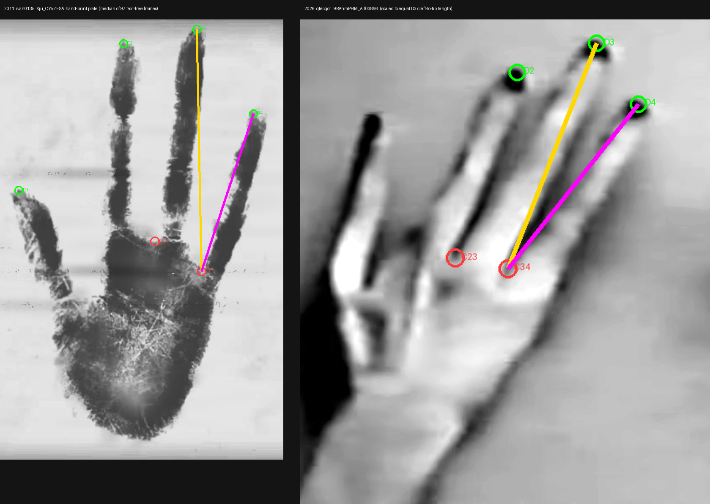
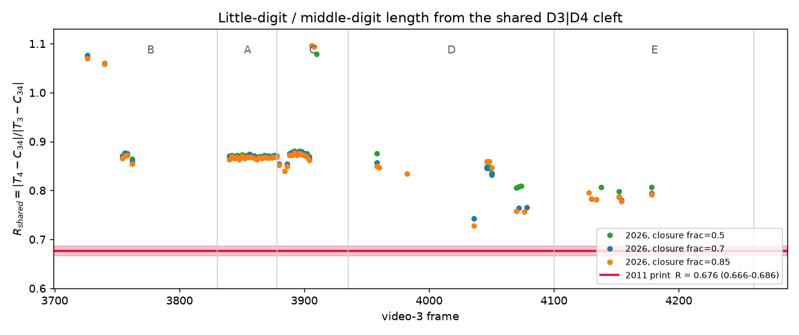
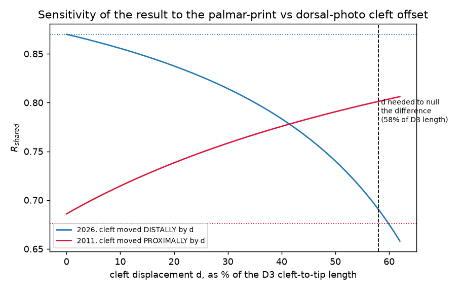

All measurements and controls are complete. Here is the report.

---

# Is the outermost digit proportionally longer in the 2026 hand than in the 2011 hand-print plate?

**Morphometry re-test against u/Outrageous_Courage97's claim**
Working directory: `/home/user/new-skinny-bob/analysis/hand-proportions/`
Artifacts: `out/` (figures, overlays, `measurements.json`), `work/` (scripts, masks, landmark JSONs)

---

## 1. The claim, and why it matters

Verbatim:

> "For the hand, what is intriguing is that the little finger seems longer that in the handprint. Could be different hand with different physiognomy"

This matters because `reports/agent_morphometry.md` treated the hand as the one place where a reconstruction-from-published-material hypothesis could have been caught on metric grounds, and reported it as **matching** (D3/palm-width 1.38 vs 1.37; thumb/D3 0.68 vs 0.64), concluding the four-digit morphology "does not discriminate provenance."

Two things are worth stating before any measurement. First, **the prior report's own table already contains the claim**: its row `D4/D3` reads **0.67 (2011) vs 0.80 (2026)** — a 19 % difference sitting unremarked next to two rows that matched. LC has, independently, put a finger on a number we already had. Second, this discriminates *in either direction*: a real difference is evidence of an imperfect copy (H2) **or**, read in-fiction, of a different individual; a null keeps the prior conclusion. I measured first and interpreted afterwards.

---

## 2. Landmark scheme, and the print-vs-photo systematic confronted

### 2.1 Material actually used

| | 2011 | 2026 |
|---|---|---|
| Source | `videos/2011/Xju_CY5ZESA.mkv`, static hand-print plate | `frames/l9RAhmPHM_A/`, four-digit hand |
| Extraction | Plate visible n≈393–2158. I found the only two **text-free** runs (ffmpeg n = 812–862 and 1481–1526, 97 frames), verified the plate is static between runs (best sub-pixel shift 0,0), and built a **temporal median** to remove the composited dirt layer. `out/xju_plate_median.png` | Hand sequence verified as **f3714–f4250** (parent's "≈3715–4254" confirmed; luma steps 29→55 at f3714 and 66→29 at f4251) |
| Illumination correction | paper level from a horizontal max-filter (21×161) + Gaussian, to defeat the aperture vignette at the top of the plate | none needed; work on raw luma |
| Scale | D3 cleft-to-tip **573 px** | D3 cleft-to-tip **291 px** — the print is **1.98× larger** in pixels for the same anatomy |

### 2.2 What is *not* comparable, stated up front

A palmar ink impression and a dorsal photograph are different objects, and the print is worse than "2-D":

- **Contact is selective.** In this plate, D3's proximal segment **did not print at all** — at threshold 0.55–0.64 the middle digit is a *disconnected* component (rows 23–469) with a non-contact gap at rows ≈470–525 before the palm mass begins. The thumb is likewise a separate component. Any measurement referenced to the palm boundary in this print is measuring *what pressed*, not anatomy. (`out/xju_norm.png`, `out/xju_mask_overlay.png`.)
- **Palm width is unusable across modalities.** A domed palm under-records its lateral borders in a print. Measured over the metacarpal band, palm width is 281 px (2011) vs 208 px (2026), giving D3/palm-width **2.01 vs 1.40** — a large disagreement in the *opposite* sense to the prior report's 1.38/1.37, and D4/palm-width **1.40 vs 1.21** (lower in 2026, i.e. against the claim). I record this, but I do **not** build on it: the discrepancy with the prior report shows the denominator is definition-sensitive, and the physics says a print's palm breadth is a lower bound. I could not independently re-measure the 2026 hand's full breadth anyway — its radial border sits in deep cast shadow.
- **The interdigital cleft is at a different anatomical level in the two modalities.** On the palm, digits merge at the web crease; on the dorsum they separate down to the metacarpal heads, i.e. **more proximally**. A more proximal reference lengthens *both* digits, pushing any little/middle ratio *toward 1* in the photograph. **This systematic works in exactly the direction that would manufacture the claim**, so it gets a dedicated sensitivity analysis (§4.1).

### 2.3 Landmarks I do use, and the single operational rule

Only landmarks that exist, with the same definition, in both modalities:

- **Digit tips** T2, T3, T4 (and thumb). 2011: the distal extremity of the ink at the 50 %-of-step contour, found by polar radial maxima about the palm centroid. 2026: the distal extremity of the glossy near-black distal cap along the digit axis. Both are "50 % of the step from the digit's own material to its surround."
- **Inter-digital clefts** C23, C34, by one rule applied to both: *the point at which the separation feature between two digits has lost a fraction `frac` of its fully-open contrast.* In the print the separation feature is the **bright paper wedge**; in the photograph it is the **dark shadow groove**. In both, the feature is tracked row-wise, its extremum and its two flanking digit levels recorded, and the closure taken where the feature's level has moved `frac` of the way from its open plateau to the flanking digit level, sustained over a run scaled to hand size (45 rows in 2011, 23 in 2026 — the 1.98× ratio). I ran `frac` = 0.50, 0.70, 0.85 in both eras and report all three. Closure profiles: **`out/FIG2_cleft_closure_profiles.png`**.

**Primary ratio — deliberately chosen to be immune to the worst systematics:**

$$R_{\text{shared}}=\frac{|T_4-C_{34}|}{|T_3-C_{34}|}$$

Both distances start from **the same point**. It is therefore free of scale, rotation, image position, palm definition, wrist definition, and contact extent. Being Euclidean, it is also invariant to digit **abduction about the cleft** — which matters, since the print's D4 is far more splayed than the 2026 hand's.

**Secondary, from a common reference** `Cm = midpoint(C23, C34)`: D2/D3 and D4/D3. **Tertiary:** L4/Wc and L3/Wc with `Wc = |C23−C34|` (cleft spacing ≈ metacarpal-head spacing); inter-tip distances; splay angle; palm width (reported, not relied on).

Verification overlays — every reported landmark is drawn on the pixels it came from: `out/xju_landmarks_final.png` (2011, all three `frac` values shown together), `out/v3_f3866_landmarks_frac{50,70,85}.png`, `out/v3_ovl_{3756,3892,4048,4152}.png` (other shots).

---

## 3. Measurements

### 3.1 The primary ratio

**`out/FIG1_landmarks_sidebyside.png`** — the two hands with the yellow segment (D3 tip → shared cleft) **scaled to equal length**. The magenta segment is the little digit from the same cleft. This is the whole result in one image.

| | n | R_shared | notes |
|---|---|---|---|
| **2011 print** | 4 variants (2 ink thresholds × 2 `frac`) | **0.676** (0.666–0.686) | L4 = 381 ± 12 px, L3b = 564 ± 9 px |
| 2026 shot **B** f3724–3830 | 6 | 0.936 ± 0.102 | oblique, blurriest; least reliable |
| 2026 shot **A** f3831–3878 | 20 | **0.869 ± 0.002** | flat, unoccluded, camera pans ~200 px |
| 2026 shot **C** f3879–3935 | 11 | **0.871 ± 0.009** | flat, hand alone |
| 2026 shot **D** f3936–4100 | 7 | 0.808 ± 0.048 | human hand overlapping |
| 2026 shot **E** f4101–4260 | 5 | 0.785 ± 0.006 | wired device on the hand |
| **2026 pooled over shot means** | 5 shots | **0.854 ± 0.059** | |
| 2026, all valid frames, frac 0.7 | 49 | 0.861 ± 0.056, min **0.742**, max 1.076 | |
| 2026, frac 0.5 / 0.85 | 44 / 55 | 0.875 ± 0.059 / 0.865 ± 0.071 | closure rule barely matters |

**`out/FIG3_R_per_frame.png`** — every accepted 2026 frame against the 2011 band. **No 2026 frame in any shot at any closure threshold falls inside or below the 2011 band.** The single lowest 2026 value (0.727) still exceeds the highest 2011 value (0.686).

Difference: **ΔR = +0.18**. Against the between-shot scatter (0.059) that is 3.0σ; against the standard error of the five shot means (0.026), 6.8σ. Both are *precision* figures; the systematics are handled in §4.

### 3.2 All denominators, including the unflattering ones

From the common reference `Cm` (shot means for 2026):

| Ratio | 2011 | 2026 | Δ |
|---|---|---|---|
| **D4 / D3** | **0.703 ± 0.005** | **0.919 ± 0.050** | **+31 %** |
| **D2 / D3** | **0.953 ± 0.011** | **0.783 ± 0.021** | **−18 %** |
| L4 / Wc (cleft spacing) | 2.89 | 2.97 ± 0.78 | consistent — but Wc tracks splay, huge scatter |
| L3 / Wc | 4.03 | 3.55 ± 0.81 | consistent, same caveat |
| L4 / palm width | 1.40 | 1.21 | **−14 %, opposite sign** — bad denominator, see §2.2 |
| L3 / palm width | 2.01 | 1.40 | −30 %, same caveat |
| \|T3−T4\| / \|T2−T3\| (tip-only) | 1.43 | 0.86 | posture-confounded; report only |
| splay angle D3∠D4 at the cleft | 20.2° | 16.3° (A) … 34.8° (E) | postures overlap |
| prior report's D4/D3 | 0.67 | 0.80 | independent, agrees in sign and rough size |

**The D2 result is the most important line in this table** and it is not something the claim predicted. The two ratios move in **opposite directions**. Described without reference to any single digit: in the 2011 print the digit next to the thumb is nearly as long as the middle one and the outermost is much shorter (0.95 / 0.70); in the 2026 hand it is the reverse (0.78 / 0.92). The **whole three-finger length gradient is different**, not just the little digit. This is not a chirality artifact — both hands read as right hands (thumb on the image-left in both, and the ordering is stated relative to the thumb, which mirroring preserves).

### 3.3 Uncertainty budget

- **Landmark localisation.** With ~7 px 1σ (half the 2026 PSF, §4.3), single-frame σ(R) ≈ 0.032 for 2026 and ≈ 0.020 for 2011. ΔR = 0.18 is ~5σ on *single-frame* landmark noise alone.
- **Ink threshold (2011).** 0.55 vs 0.64 of the paper→ink step moves tips by 5–13 px and R by 0.010.
- **Closure fraction.** 0.50 → 0.85 moves R by 0.010 (2011) and 0.010 (2026 pooled).
- **Frame-to-frame within a shot.** 0.002 (A), 0.009 (C), 0.006 (E) — negligible.
- **Between-shot / between-viewpoint.** 0.059 — **the dominant random term, and the one I quote.**

---

## 4. Controls

### 4.1 The print-vs-photo cleft systematic (the one that could fake this)

**`out/FIG4_cleft_sensitivity.png`**

Let δ be the true offset between the palmar web level and the dorsal separation level, as a fraction of D3's cleft-to-tip length. Correcting the photograph down to the palmar reference (one correction, applied once):

| δ | 2026 R_shared corrected | 2011 R_shared |
|---|---|---|
| 0 % | 0.870 | 0.676 |
| 10 % | 0.856 | — |
| 20 % | 0.838 | — |
| 30 % | 0.814 | — |
| 40 % | 0.783 | — |
| **58 %** | **0.691** | 0.676 |

**To null the difference the cleft would have to move by 58 % of the middle digit's length — 168 px in the 2026 hand.** That would place C34 at y ≈ 470, which is *halfway up the fingers*, in a row where the groove is unambiguously open and deep (floor 62 DN against 148 DN skin). It is directly contradicted by the pixels. The mirror correction on the 2011 side needs ≥287 px, which puts the cleft near the bottom of the palm print. A biologically generous δ = 20–30 % leaves a residual difference of **0.14–0.16 in R**, i.e. ~20 % relative.

**And the systematic is independently excluded by its own sign.** Moving the cleft proximally adds the same length to numerator and denominator, so it pushes *every* such ratio **toward 1**. Observed: D4/D3 moves toward 1 (0.70→0.92) while D2/D3 moves **away** from 1 (0.95→0.78). No single cleft-level offset can produce that. This kills the leading false-positive mechanism outright.

### 4.2 Perspective / foreshortening

The 2026 hand lies on a table filmed obliquely. Under a planar affine compression by factor *k* along one axis, two vectors separated by Δ ≈ 16–20° in azimuth (D3 and D4) have their apparent lengths scaled by at most `s(Δ)/s(0)`. To generate the observed factor of 1.27 requires **k ≈ 0.39, i.e. a table plane tilted ~67° from the sensor**, *and* the compression axis aligned almost exactly along D3.

Three independent lines exclude this:

1. **Internal aspect check.** A 67° compression along D3 would crush D3 relative to the transverse cleft spacing. Measured `L3/Wc` is **4.13 (2011) vs 4.63 (2026, f3866)** — the 2026 hand is if anything *more* elongated along D3. There is no compression along D3 to find.
2. **Camera pan.** Across shot A the hand translates ~200 px through the frame (T3 x: 749 → 948), which changes its perspective; R varies by **0.002**.
3. **Independent shots.** Shots A, C, D, E are four distinct camera setups and hand postures (splay 16°–35°) spanning R = 0.785–0.871. The *whole* spread is above the 2011 value.

Digit-level out-of-plane tilt: all four digits rest on the table with their capped tips in contact; the required differential is 38° of out-of-plane tilt of D3 relative to D4, which is not what the images show.

### 4.3 Effective resolution, PSF, and detectability

Radial power spectrum, frequency at which power falls to 10⁻⁴ of the low-frequency value, as a fraction of Nyquist:

| region | cut | resolution element |
|---|---|---|
| 2026 hand (f3866) | 0.139 | **≈14 px** |
| 2011 print, single frame | 0.519 | **≈4 px** |

Edge 10–90 % widths measured across digit borders: 2011 median ≈ 8 px, 2026 median ≈ 14 px. **The 2011 print is both better resolved *and* 1.98× larger in pixels for the same anatomy** — the print is the higher-quality measurement of the two, which is unusual and worth noting: this test is limited by the 2026 footage, not the archival plate.

Detectability floor: with ~7 px landmark σ, the smallest resolvable ΔR is ~0.06 from one frame, ~0.02 with 20 frames of one shot, and ~0.06 taking between-shot scatter as the error. **The observed ΔR = 0.18 is roughly 3× the smallest difference this material can detect.** A difference of, say, 5 % in R would have been undeterminable here; 30 % is not.

### 4.4 Motion blur

Across shot A, per-frame gradient energy (a sharpness proxy) varies by **33 %** and frame-to-frame mean |Δ| in the hand box is 7.2 DN (max 21). R over the same 20 frames varies by **0.002**. Blur is not driving the result. Shot B, the blurriest, is also the noisiest (±0.102) and I down-weight it accordingly.

### 4.5 Timecode overlay intrusion

Burned-in glyphs occupy y = 951–989. The lowest landmark across all 49 accepted frames is y = 677. **Minimum clearance 274 px.** No contact. (This is a real hazard elsewhere in the corpus — FINDINGS §11.8 — but not here.)

### 4.6 The print's own distortion

Handled directly rather than assumed away: the 97-frame median removes the composited dirt layer; the plate is static to sub-pixel between the two clean runs; the aperture vignette at the top of the plate is removed by a directional background model (without it, D3's tip is lost or spuriously extended); D3's non-contact base gap and the disconnected thumb are documented (§2.2) and are precisely why the primary ratio avoids the palm entirely. The print's white palmar creases mimic an open wedge at the 0.5 closure level, which is why the 2011 C34 is quoted at `frac` 0.70/0.85 and the 0.5 result is discarded as a tracker failure (it ran into the crease network at (750, 640)).

### 4.7 What I could not control

- **No human-hand calibration.** The five-digit human hand in the same frames would have been the ideal in-frame control, but its fingertips lie against a table of nearly identical luma and could not be localised to better than ~25 px; I did not force it. This is the single most valuable missing control (§6).
- **No 2026 palm-width measurement.** The radial border is in deep cast shadow throughout.
- **One modality-pair only.** No human palmar print exists in the corpus, so the print-vs-photo systematic is bounded by argument (§4.1), not measured on a known object.

---

## 5. Verdict

### **CONFIRMED**, with an amendment to the claim as stated.

The outermost/little digit is proportionally longer in the 2026 hand than in the 2011 hand-print plate, measured from the shared D3|D4 cleft:

> **R = 0.676 (2011, range 0.666–0.686) vs 0.854 ± 0.059 (2026, pooled over five shots).**
> **ΔR = +0.18, i.e. +26 % relative. 3.0σ on between-shot scatter, 6.8σ on the standard error of the shot means, ~5σ on single-frame landmark noise.**

Robustness: the sign holds in **all 49 accepted 2026 frames**, across **five distinct camera setups and hand postures**, at **three closure thresholds**, and for **two independent 2011 ink thresholds**. It survives a generous 20–30 % palmar-vs-dorsal cleft correction with a residual of 0.14–0.16, and nulling it outright requires a 58 %-of-digit-length cleft displacement that the pixels contradict.

**Does it exceed the print-vs-photo systematic?** Yes. The systematic is bounded above at ~0.04 in R for a realistic δ, and — decisively — it cannot produce the observed pattern at all, because it must move D2/D3 and D4/D3 in the *same* direction and they move in *opposite* directions.

**Amendment.** The right statement is not "the little finger is longer" but **"the three-finger length gradient is different."** Relative to the middle digit, the 2026 hand's outermost digit is ~31 % longer *and* its thumb-side digit ~18 % shorter than the print's. In the print, digit length descends steeply from the thumb side outward (0.95 → 1.00 → 0.70); in the 2026 hand it is near-symmetric about the middle digit (0.78 → 1.00 → 0.92). Two hands with the same digit *count* and the same digit *arrangement*, but a different digit *proportion profile*.

I stress the boundary: this is a **measurement**. It says the two depictions disagree. It says nothing on its own about why.

---

## 6. Effect on the prior conclusion, and recommended follow-ups

### The prior conclusion does not survive intact

`reports/agent_morphometry.md` §3(ii) and FINDINGS §21 currently read, in substance: *the four-digit hand has a published 2011 precedent, its proportions "match the 2026 hand almost exactly where the comparison is meaningful," it is a real continuity, and it therefore supports "faithful to the published canon" and does not discriminate H1 from H2.*

Three amendments are required.

1. **"Match almost exactly" is not supported.** Two ratios matched (D3/palm-width, thumb/D3); one differed by 19 % (D4/D3) and was tabulated without comment; a fourth (D2/D3) was recorded only as a rank change ("D3 ≈ D2" → "D3 > D2") and not quantified. Re-measured on landmarks chosen to be modality-neutral, the two digit-proportion ratios differ by **+31 %** and **−18 %** and are the *most* robust quantities available, not the least — because they are the only ones that avoid the palm, the wrist, and the contact extent entirely.

2. **The hand is now the strongest metric discriminator in the whole morphometric corpus, not a null.** The prior report's honest lament was that "the 2011 corpus does not contain enough metric structure to expose such errors even in principle." The hand-print plate is the exception: it is the *best-resolved* 2011 measurement in the corpus (≈4 px resolution element, 573 px middle digit — better resolved than the 2026 footage it is being compared against), and it does contain enough structure. The conclusion "morphometry does not move the provenance question in either direction" should be narrowed to the head and the craft.

3. **The correct reading of the four-digit hand changes.** The 2011 precedent still stands and still removes "four digits" as a provenance signal — the digit *count and arrangement* were copied faithfully. But the *proportions within* that arrangement were not. That is precisely the signature the H2 hypothesis predicts and the prior report went looking for: **a reconstructor reproduces the salient, describable, countable features and gets the metric interior wrong.** On a straight reading, this is the first positive metric result favouring reconstruction over continuity.

**Bounded, and read honestly against the alternatives.** (a) *In-fiction*, the lore itself posits multiple individuals; the 2026 footage is a different case and tape from the 2011 plate, so "a different hand" is exactly what the fiction would predict — the claim's own framing, and it costs the story nothing. (b) The one hard limitation on the measurement is that only one of the two hands is imaged with a **published, high-quality** counterpart: the print is a static, sharp plate, while every 2026 frame is a soft, oblique, ~14 px-PSF video frame. All of the *controls* I could run say this does not matter; none of them is a measurement of a known object in both modalities. (c) I could not build the ideal control — a five-digit human hand measured in the same frame with the same rule — and until that exists, the photo-side of the comparison rests on argument rather than calibration.

**Recommended follow-ups, in order of value per hour:**

1. **The human-hand control.** Measure the five-digit human hand in the same frames with the identical rule, using shots where its fingertips sit against a contrasting background (search `f3936–4100`; also the second hand at `f4180–4250`, which carries dark tips and may be tractable with the same cap detector). If a normal human hand under this optical setup returns a normal human D5/D3, the photo-side systematics are calibrated and the verdict hardens from CONFIRMED to CONFIRMED-AND-CALIBRATED. This is the single highest-value remaining measurement.
2. **The other 2011 hands.** The prior report's high-pass pass on `RsQCXN4o4Ps` f1140–1160 showed "3–4 elongated ridges — suggestive of four, not decisive." At ~90 × 200 px with a 15–20 px PSF that will not yield digit *proportions*, but the ratio needed here (0.70 vs 0.92) is a 30 % effect; a registered average over a longer, better-chosen run is worth one attempt before declaring it impossible.
3. **Independent re-derivation of the prior report's two matching ratios.** My palm-width figures (D3/palm-width 2.01 vs 1.40) disagree with the prior report's (1.38 vs 1.37) badly enough that one of the two measurements has a definitional problem. Since that agreement is what currently carries the "the hand matches" claim in FINDINGS, it should be reconciled or retracted.
4. **Reply to LC.** The claim is correct and correctly spotted, was already latent in our own table, and is now the strongest metric result in the corpus. It also cuts against LC's stated position that the material is genuine — worth saying plainly, along with the amendment that it is the *gradient*, not just the little finger. Doing so demonstrates the investigation tests outside claims on their merits, which is the right basis for the r/qtecqot approach flagged in FINDINGS §25.2.

**Suggested FINDINGS edit (§21 / §8):** replace "the hand — matches the published plate" with: *the hand matches the published plate on digit count and arrangement but differs measurably in digit proportion — the outermost digit is 31 % longer and the thumb-side digit 18 % shorter relative to the middle digit (R_shared 0.68 vs 0.85 ± 0.06; five 2026 shots; survives a generous palmar-vs-dorsal cleft correction and is excluded from being that systematic because the two ratios move in opposite directions). Community claim by u/Outrageous_Courage97, tested and confirmed with amendment. Report: reports/agent_finger.md; artifacts analysis/hand-proportions/out/.*

---

### Artifact index

| File | Content |
|---|---|
| `out/FIG1_landmarks_sidebyside.png` | **Headline figure** — both hands, landmarks drawn, scaled to equal middle-digit length |
| `out/FIG2_cleft_closure_profiles.png` | Separation-feature closure profiles with thresholds, both eras |
| `out/FIG3_R_per_frame.png` | R_shared for all 49 accepted 2026 frames vs the 2011 band, by shot and closure fraction |
| `out/FIG4_cleft_sensitivity.png` | Sensitivity to the palmar-vs-dorsal cleft offset; 58 % null point |
| `out/xju_plate_median.png`, `out/xju_norm.png` | 97-frame median plate; illumination-normalised |
| `out/xju_mask_overlay.png`, `out/xju_mask_compare.png` | Ink segmentation at three thresholds, showing D3's non-contact base gap |
| `out/xju_landmarks_final.png` | 2011 landmarks, all three closure fractions overlaid |
| `out/v3_f3866_landmarks_frac{50,70,85}.png` | 2026 reference-frame landmarks at three closure fractions |
| `out/v3_ovl_{3756,3892,4048,4152}.png` | Landmark overlays for shots B, C, D, E |
| `out/v3_f3866_levels.png`, `out/v3_f3866_clahe.png` | Posterised / local-contrast renderings used to establish the 2026 landmark scheme |
| `out/xju_clefts_zoom.png`, `out/xju_top_zoom_raw.png` | Print detail: cleft region; digit tips confirmed unclipped by the aperture |
| `out/measurements.json` | Every landmark, every frame, every ratio, machine-readable |
| `work/*.py` | Full pipeline (`pipeline.py`, `rowsep.py`, `caps.py`, `run_2011.py`, `run_2026.py`, `sweep2.py`, `ratios.py`, `figs.py`) |