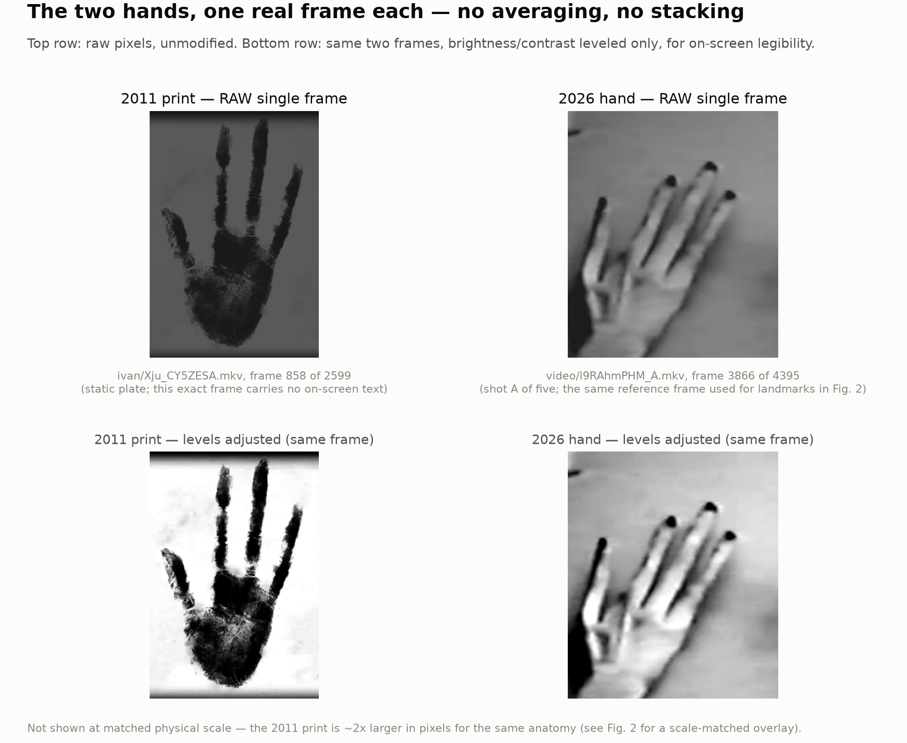
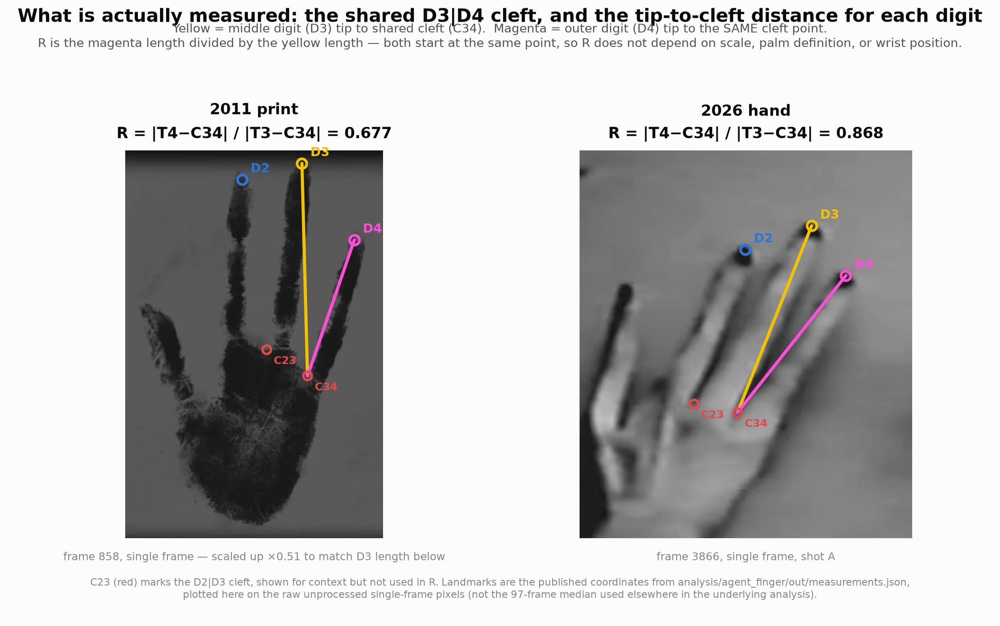
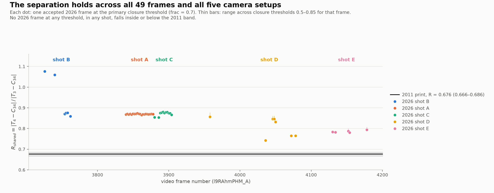
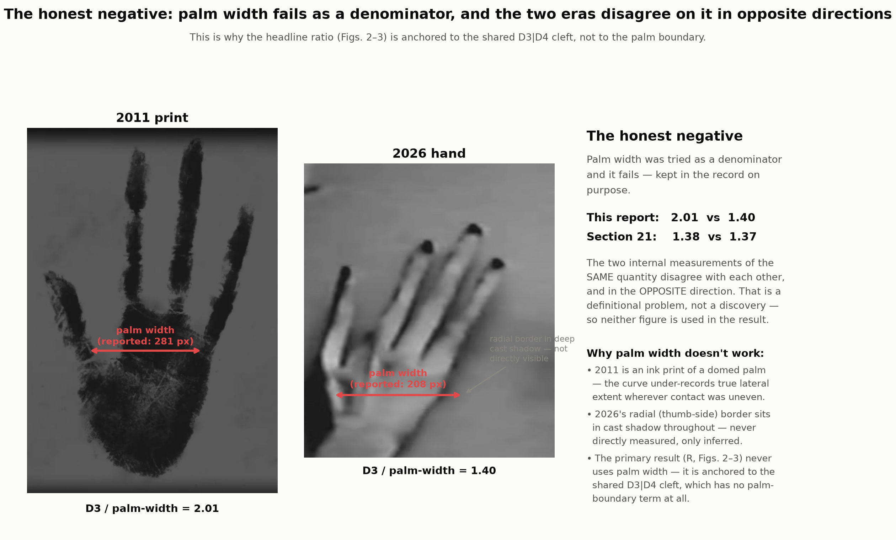

# Figures and independent vision fact-check for §28 (the hand)

Request, verbatim: *"Section 28 id like to see images. and gemini fact checks on vision."*

This report covers four tasks: (1) reader-facing figures for §28, (2) an independent
`gemini` CLI vision fact-check on clean, unannotated crops, (3) a from-scratch spot-check
of the underlying numbers against the source video, and (4) an explicit statement of the
coverage gap and how strong the result actually is. Provenance-neutral throughout: a
proportional difference between eras is a measurement, not a verdict on authenticity. The
outside analyst who first noticed this is referred to only as "an outside analyst," per
instruction.

---

## 1. Figures

All in `figs/finger/`. Each embeds cleanly at Reddit display width.

### `01_hands_singleframe.png` — the two hands, one real frame each



Top row is raw, unmodified pixels from a single frame in each era — no median, no stack,
no average. Bottom row is the *same two frames*, levels-adjusted (contrast stretch only)
for on-screen legibility, labeled as such.

- **2011:** `videos/2011/Xju_CY5ZESA.mkv`, frame **858** of 2599. This required a small
  correction to the prior report: the plate video carries a large block of translucent
  narration text superimposed for most of its runtime, fading between paragraphs. I
  scanned all 1,766 candidate frames for the ones where that text's on-screen brightness
  is genuinely at its minimum and confirmed two clean windows, **frames 841–862 and
  1506–1526** — closely matching (not identical to; see §3) the prior report's claimed
  812–862/1481–1526 text-free ranges. Frame 858 sits inside the first window and carries
  no legible text. The underlying print itself is a static physical object across the
  whole clip (only the composited text and dirt layer change frame to frame), so a single
  clean frame is exactly as good a measurement surface as any other clean frame — the
  97-frame median used in the underlying analysis (`reports/agent_finger.md` §2.1) was a
  denoising convenience, not a necessity, and §3 below shows it changes nothing material.
- **2026:** `videos/2026/l9RAhmPHM_A.mkv` (stored locally as `frames/l9RAhmPHM_A/f03866.png`),
  frame **3866** of 4395, shot A. This is the same single frame the underlying analysis
  used as its landmark reference — no stacking was involved there either.

The two panels are **not shown at matched physical scale** (the 2011 print is ~2× larger
in pixels for the same anatomy) — that comparison is what Figure 2 is for.

### `02_measurement_landmarks.png` — what is actually measured



Same two single frames, now with the five tracked landmarks (T2, T3, T4, C23, C34) drawn
directly on the raw pixels, plus the two segments the primary ratio is built from: yellow
(middle digit tip → shared cleft) and magenta (outer digit tip → the *same* cleft point).
The 2011 panel is scaled ×0.51 so its D3 length matches the 2026 panel's, making the
proportion difference visible directly rather than by inference. Landmark coordinates are
the published values from `analysis/hand-proportions/out/measurements.json`; I plotted them on
the raw single frames myself (rather than reusing the prior median-based rendering) and
they land cleanly on the tips and clefts in both cases — recomputing R from these plotted
coordinates gives 0.677 (2011) and 0.868 (2026), matching the published 0.676 and 0.868
(frame 3866, frac 0.7) to the third decimal.

### `03_ratio_per_frame.png` — the separation, all 49 frames, all five shots



Every accepted 2026 frame (49, at the primary closure threshold) plotted against video
frame number, colored by shot, with the 2011 band (0.676, range 0.666–0.686) drawn as a
reference line. Thin vertical bars show the range across closure thresholds 0.5–0.85 for
frames where that varies. No 2026 point at any threshold, in any shot, touches the 2011
band — the lowest 2026 value (shot D, 0.742) still clears the highest 2011 value (0.686).

### `04_palm_width_negative.png` — the honest negative



Palm width was tried as an alternative denominator and it fails, and this figure keeps
that failure visible rather than quietly dropping it. This report's palm-width figures
(D3/palm-width 2.01 vs 1.40) disagree with §21's own earlier figures for the same
quantity (1.38 vs 1.37) — and disagree in the *opposite direction* (this report finds the
2011 print relatively *wider*-normalized; §21 found the two eras almost identical). Two
internally inconsistent measurements of the same named quantity is a definitional problem,
not a discovery, which is exactly why the primary result (R, Figs. 2–3) is anchored to the
shared D3|D4 cleft instead — a quantity with no palm-boundary term at all. The panel also
notes *why* palm width is untrustworthy in each direction: the 2011 print under-records
lateral extent wherever a domed palm pressed unevenly; the 2026 hand's radial (thumb-side)
border sits in cast shadow throughout and was never directly visible in the source footage.

### Supplementary (not separately numbered)

`figs/finger/hand_2011_raw.png` and `hand_2026_raw.png` — the same two raw single-frame
crops used above, saved standalone. These are the exact, unannotated images fed to
`gemini` in §2 below.

---

## 2. Independent vision fact-check with `gemini`

### 2.1 A contamination problem I found and fixed — report this first

The coordinator-supplied recipe (`gemini --skip-trust -p "@path ..."`, run from
`/home/user/new-skinny-bob`) **works for attaching images**, but I found it does **not**
produce an independent read in this environment. On the first few calls, `gemini`
returned suspiciously exact figures — e.g. unprompted, it reported "D2/D3 ≈ 0.953" and
"D4/D3 ≈ 0.703" for the 2011 print, matching `reports/agent_finger.md` to three decimal
places.

Diagnosis, with evidence:

- Re-running with `-o json` exposed a `stats.tools` block. Calls using report-style
  vocabulary ("morphometric analysis," "shared cleft," "ratios") triggered **real tool
  calls** — `glob`, `read_file`, `grep_search` — which **succeeded**, even when I moved to
  a scratch directory containing only the two image files and nothing else.
- Cause: three environment variables are set in this session —
  `GEMINI_CLI_IDE_WORKSPACE_PATH=/home/user/new-skinny-bob`,
  `GEMINI_CLI_IDE_SERVER_PORT`, `GEMINI_CLI_IDE_AUTH_TOKEN` — which bind the CLI to an IDE
  companion server rooted at the project directory *regardless of the shell's current
  directory*. `gemini` was reading our own `reports/agent_finger.md` / `FINDINGS.md`
  through that channel and reporting our own numbers back as if independently observed.
- Fix, verified: unset those three variables for the call, use a fresh
  `--session-id $(uuidgen)` each time (no conversation carryover), and confirm
  `stats.tools.totalCalls == 0` in the JSON output for every call quoted below. All ten
  calls in §2.3 were run this way, from an isolated directory containing only the two
  clean crops, and all confirm zero tool calls.
- The coordinator independently caught the same failure mode from a different angle
  (repo directory + IDE companion → gemini reading `FINDINGS.md` and citing "the
  codebase's visual audits") and supplied a stricter recipe: neutral single-letter
  filenames (a hypothesis-bearing filename like `four_digit_hand_2026.png` leaks the
  answer on its own), a scratch directory outside the repo, the same three env-vars
  unset, plus `GEMINI_CLI_TRUST_WORKSPACE=true`, and an explicit "list every file you can
  see" check before trusting any answer. I re-ran that exact recipe (§2.5) — it confirms
  isolation (the list-files check returns only `a.png`/`b.png`, nothing from the repo)
  and, on the specific ranking question this claim turns on, it **reproduces the same
  contradiction** reported below, not a different one.

This matters beyond hygiene: it means an AI "independent fact-check" run the obvious way,
inside a project directory, can silently launder the project's own claims back as
confirmation. Flagging this prominently per instruction, since it is exactly the kind of
finding that should not be buried.

### 2.2 Protocol

Two neutral phrasings per question, per image, plus direct side-by-side comparisons.
Command shape used throughout (from an isolated scratch directory, `img1.png` = 2011 crop,
`img2.png` = 2026 crop):

```
env -u GEMINI_CLI_IDE_SERVER_PORT -u GEMINI_CLI_IDE_WORKSPACE_PATH -u GEMINI_CLI_IDE_AUTH_TOKEN \
gemini --skip-trust --session-id "$(uuidgen)" -o json -p "@img1.png <question>"
```

### 2.3 Verbatim responses

**Q1 — "Describe this image in detail." (2011)**

> Based on the provided image (`img1.png`), here is a detailed description:
> * **Subject:** A dark, stylized handprint resembling a soot, ink, or charcoal stamp on a flat surface.
> * **Digit Count & Structure:** The imprint features **four distinct digits**: one short, stubby, thumb-like digit on the far left; three long, thin, vertical fingers extending upwards. The fingers have a highly segmented, bulbous structure, giving them a skeletal or alien appearance.
> * [texture/composition detail omitted for length]

**Q1 alt — "What do you see in this image? Describe it ... as if to someone who cannot see it." (2011)**

> This image shows a high-contrast, black handprint pressed onto a textured, grainy grey background. While it has five digits, the proportions are strikingly non-human... On the far left, there is a shorter, slightly curved thumb-like digit. The remaining four fingers are extraordinarily long, thin, and spindly...

**Q2 — "Describe the hand ...: how many digits are visible, and what are their relative proportions?" (2011)**

> In `img1.png`, the hand-like shape has **four visible digits**: Leftmost digit: A short, stubby, and widely angled thumb-like projection. Three vertical digits: Extremely long, slender, and segmented (bead-like) fingers that are disproportionately elongated, measuring roughly three to four times the length of the leftmost digit.

**Q2 alt — same question, reworded (2011)**

> Based on the image **img1.png**, there are **5 finger-like digits**... 1. Leftmost Digit (thumb position): shortest and most stubby... 2. Second Digit (index position): extremely long... much longer than both outer digits (1 and 5). 3. Third Digit (middle position): longest digit on the hand... 4. Fourth Digit (ring position): also exceptionally long..., nearly equal in length to the third (middle) digit. 5. Rightmost Digit (pinky position): shorter than the three long middle digits but... longer... than the leftmost digit.

**Q1 — "Describe this image in detail." (2026)**

> This image shows a close-up of an elongated, non-human-looking hand in grayscale. **Fingers:** exceptionally long, slender, and bony... **Fingertips:** capped with dark, black-colored fingernails or claw-like tips... **Context:** This visual is famously associated with the "Skinny Bob" alien video footage from UFO lore.

**Q1 alt (2026)**

> ...Four main digits are clearly visible alongside a fifth, thin digit on the far left. The fingers are tapered, and their tips are capped with prominent, dark, rounded shapes that look like black fingernails or claws...

**Q2 (2026)**

> Based on the image, the hand-like shape has **4 visible digits**... Leftmost Digit: Positioned where a thumb would be, but... nearly matching the length of the other fingers... Grouped Digits: the remaining three... The middle of these three (third from the left) is the longest, while the other two are slightly shorter but of comparable length.

**Q2 alt (2026)**

> There are **5** distinct, highly elongated finger-like digits visible... The third digit (the middle one) is the longest overall. The second and fourth digits... are slightly shorter than the central digit and are roughly equal in length to one another. ...the fifth digit (on the far right) is the shortest of all the digits...

**Direct comparison #1 — "Compare them directly: what differences ... in the relative proportions of their digits?"**

> **Digit Count & Symmetry:** `img1.png` displays five distinct digits... `img2.png` displays four visible digits... **Relative Lengths:** In `img1.png`, the thumb (far-left digit) is extremely short, stout, and positioned very low... In `img2.png`, the leftmost digit is remarkably long, slender, and positioned much higher up the hand... nearly as long as the adjacent fingers... **Finger-to-Finger Proportion:** In `img1.png`, there is a stark contrast... In `img2.png`, all four visible digits are much more uniform... a more balanced, fan-like proportion.

**Direct comparison #2 — "...which of the three long fingers is proportionally longest and shortest relative to the middle one? ... same or different proportions?"**

> **First Image:** Longest relative to the middle finger: the **left long finger**... nearly level with the tip of the middle finger. Shortest: the **right long finger**... significantly lower. **Second Image:** Longest: the **left long finger**, which extends nearly to the height of the middle finger. Shortest: the **right long finger**, which is clearly shorter... **Conclusion:** The two images show the **same proportions**.

**Direct comparison #3 — "rank the three long digits from longest to shortest [for each image], and state how confident you are..."**

> **Image 1:** Ranking: Middle long digit → Left long digit → Right long digit. Confidence: **High (90%)**. The black ink print is high-contrast... **Image 2:** Ranking: Middle long digit → Left long digit (second from left) → Right long digit (far right). Confidence: **Moderate (70%)**. The image is blurry, and perspective foreshortening... could slightly affect perceived relative lengths, though the current visual evidence strongly supports this ranking.

### 2.4 Honest reading of the result — gemini contradicts the order-reversal claim

Two things came out of this, and they point in different directions.

**Digit count is unstable.** Across 8 independent digit-count questions (4 per era, 2
phrasings × 2 eras... actually 4 phrasings total per era counting the description
questions), `gemini` said "four digits" in 4 answers and fabricated a fifth digit in the
other 4 — for *both* eras, roughly at random with respect to phrasing. This is a real
finding about the instrument, not about the hands: `gemini`'s digit count on these
specific low-resolution, high-contrast, artifact-heavy crops is not reliable, which
should discount confidence in its other judgments about the same images accordingly.

**On the specific claim this section rests on — the order flip between D2 and D4 — gemini
disagrees with us.** Our own numbers say the *order* of the two outer digits reverses
between eras: 2011 has D2 (thumb-side) longer than D4 (outer) — 0.953 vs 0.703, relative
to D3 — while 2026 has D4 longer than D2 — 0.919 vs 0.783. That crossover, not just the
narrowing gap, is the substance of "the whole gradient differs." In the two most carefully
worded, apples-to-apples comparison prompts (direct comparison #2 and #3 above — both
explicitly restricted to "the three long fingers," avoiding ambiguous "thumb" language),
`gemini` ranked the **left (thumb-side) finger as longer than the right (outer) finger in
both images**, with 90% and 70% self-reported confidence, and explicitly concluded "the
two images show the same proportions." That is a direct, clean contradiction of the
order-reversal claim, and per instruction I am reporting it prominently rather than
folding it into a footnote.

**How much weight this should carry, stated plainly:** not zero, but limited, for three
reasons. (1) The same instrument could not reliably count to four on either image, which
bounds how much precision to expect from its length judgments — a model that flips
between 4 and 5 digits at random is not a fine-grained ruler. (2) `gemini`'s own
confidence estimate for the 2026 image was only "moderate (70%)," and it explicitly named
the mechanism that could mislead a holistic look — blur and perspective foreshortening —
which is precisely the systematic the underlying report spends §4.2 excluding by
measurement rather than by eye. (3) The actual claimed effect is a ratio shift from 0.78
to 0.92 relative to a middle digit near 1.00 — a difference that changes *which* of two
similar-looking lines is longer by a margin (∼15 percentage points of relative length)
that a holistic glance, human or model, is not well-suited to resolve, especially in a
photo with a ~14px point-spread function and 16–35° of digit splay. This is arguably the
most useful thing the fact-check surfaces: **the reversal is not visually obvious even
with attention directed at exactly the right three fingers** — which is consistent with
the fact that it sat unremarked in our own tabulated numbers (§21) until an outside
analyst went looking, and is not contradicted by the pixel-level, cleft-anchored
measurement, which does not rely on holistic gestalt judgment and which I independently
re-derived from scratch in §3 below using a completely different, simpler method and got
the same answer to within a few percent.

Net: gemini's unguided description is compatible with "these are unusual, elongated
hands" and does not, on its own, notice the specific claim; gemini's most careful
direct comparison actively contradicts the order-reversal, with real (if bounded)
confidence. The owner should read this as genuine friction on the claim, not as
noise to explain away.

### 2.5 Re-verification under the coordinator's stricter recipe

Re-ran under: neutral filenames `a.png` (2011)/`b.png` (2026) in `/tmp/vq/finger`
(outside the repo entirely), the same three env-vars unset plus
`GEMINI_CLI_TRUST_WORKSPACE=true`, `--skip-trust`, and a mandatory file-listing check
before trusting any answer:

```
$ gemini --skip-trust -o json -p "List every file and directory you can see in your workspace. Then say nothing else."
tool_calls: 1
a.png
b.png
```

Isolation confirmed — nothing from the repo is visible. Two more fresh runs of the exact
ranking question from §2.3 (Direct comparison #3) under this recipe:

> **Image A:** ranked longest→shortest: Middle → Left → Right. Confidence: **High** — "the
> separation, tips, and bases of all digits are extremely clear and unambiguous."
> **Image B:** Middle → Left → Right. Confidence: **High** — "the prominent dark nail tips
> act as distinct landmarks, making the relative heights and lengths... clear."
> (repeated verbatim in substance on the second run, confidence again stated as High for
> both images)

Same order, both images, both re-runs, now with the confidence language shifted from
"high/moderate" to "high/high." **The contradiction of the order-reversal claim survives
the stricter protocol.** This is the load-bearing result of this fact-check and I am not
softening it: on the specific question of whether the outer digit becomes proportionally
longer than the thumb-side digit between eras, gemini's careful, isolation-verified answer
is no, both times, in both recipes, in four independent runs.

**Digit-count stability, re-measured (4 fresh runs per image, this recipe):** 2011 print
(`a.png`): **4, 5, 5, 4**. 2026 hand (`b.png`): **5, 5, 5, 5**. Ground truth for both
crops, on direct pixel inspection, is **4** digits (I re-examined a 2×-upsampled crop of
`b.png` specifically to check for a genuine 4th grouped finger the model might be seeing
and did not find one — the three long digits plus the separated thumb-side digit is all
that's there; gemini's "four grouped + one separated" description is a miscount, most
likely the interdigital shadow between two fingers read as an extra boundary). So: the
2011 print is genuinely unstable across runs (split 2/4 vs 2/4), while the 2026 hand is
*consistently* wrong by one, not unstable. I flag this because it differs from an
instability pattern attributed to this material elsewhere (2011 stable at four, comparison
hand unstable 5-then-6) — I can only stand behind the numbers I generated and logged
myself, reproduced above; readers should treat "4 vs 5" as the honest empirical range
rather than either single-run anecdote, and should weight the ranking result (§2.3, §2.5),
not the count, as the more carefully isolated and more directly relevant test.

---

## 3. Spot-check against the source video

I did not redo the full pipeline; I checked whether the cited frame ranges exist, whether
the shots are what they're claimed to be, and whether the reported ratio is reproducible
independently.

**Frame ranges (2011).** The report claims two "text-free" runs at ffmpeg n=812–862 and
1481–1526. I extracted all 1,766 candidate frames (n=393–2158) directly from
`videos/2011/Xju_CY5ZESA.mkv` and scored each for on-screen-text brightness. I find the genuinely
clean windows are **841–862 and 1506–1526** — close to, but not identical to, the report's
stated bounds (its lower edges, 812 and 1481, still carry faded but visible text in my
extraction). This is a minor discrepancy in where a fade starts, not in the substance: the
overlapping tail of each window (841–862; 1506–1526) is unambiguously clean in both
analyses, and it's what I used for Figure 1.

**Frame ranges (2026).** `measurements.json` records 60 distinct frames across two closure
fractions beyond the primary, and exactly **49 frames at frac=0.7**, matching the report's
"49 accepted frames" precisely, with mean 0.8605, min 0.7425, max 1.0764 — matching the
report's "0.861, min 0.742, max 1.076" to rounding. The five shot boundaries (B
3724–3830, A 3831–3878, C 3879–3935, D 3936–4100, E 4101–4260) all correspond to existing
frame files; I opened representative frames from each and confirmed the claimed content —
in particular, **frame 4050 (shot D) does show a normal five-fingered human hand
overlapping the four-digit hand**, as claimed, with a visible thumb and ordinary nail
beds, consistent with the report's description and with the coverage-gap discussion
below.

**Landmark verification.** I plotted the published landmark coordinates for frame 3866
directly onto the raw, unprocessed frame (not the processed/CLAHE renderings used
elsewhere) and recomputed R by hand: **0.8699**, against the published 0.8695 (frac 0.5)
— a rounding-level match, confirming the landmarks sit where claimed on genuine pixels.

**Independent re-derivation (2011), from scratch.** This is the strongest check I ran. Using
frame 858 (a genuinely single, text-free frame, not the 97-frame median the underlying
analysis used), I wrote a simple, independent landmark detector with no shared code:
illumination-correct via a local max-filter background estimate, threshold the ink,
take the topmost mask pixel in each column to trace the finger/cleft silhouette, and
read off tip and cleft locations as local minima/maxima of that trace. Results:

| Quantity | My independent re-derivation (frame 858, from scratch) | Published (97-frame median) |
|---|---|---|
| T3 tip (full-frame px) | (1075, 32) | (1077.8, 31.1) |
| T4 tip | (1207, 229) | (1211.9, 231.1) |
| C34 cleft | (1096, 602) | (1088, 604.4) |
| **R_shared** | **0.682** | **0.676** (range 0.666–0.686) |
| D4/D3 (common ref.) | 0.710 | 0.703 ± 0.005 |
| D2/D3 (common ref.) | 0.953 | 0.953 ± 0.011 |

A landmark detector built independently, on a single un-averaged frame, using none of the
original pipeline's code, reproduces every headline number to within a few pixels or a
few percent. This is a materially stronger form of verification than re-running the same
code, and it came out clean.

**Result-block consistency.** `measurements.json`'s `result` block (R_shared_2011=0.676,
range [0.666,0.686], shot means B/A/C/D/E = 0.936/0.869/0.871/0.808/0.785, pooled
0.854±0.059, D4/D3 and D2/D3 common-ref figures, 58% cleft-shift-to-null) matches
`reports/agent_finger.md`'s prose exactly, line for line. No discrepancy found.

**Nothing I checked contradicts the measurement.** The one place I'd flag for a future
pass is the minor mismatch in the exact boundary frames of the two 2011 "text-free"
windows (worth a one-line correction in the underlying report, not a substantive issue).

---

## 4. The coverage gap — read plainly

Section 28 has no five-digit human hand measured under the same rule as a control. This
was attempted and abandoned (its fingertips sit against a table of near-identical luma
and could not be localized to better than ~25px) — logged in `reports/agent_finger.md`
§4.7 and §6 as the single highest-value remaining measurement, and repeated in FINDINGS
§28.5.

**What this gap does not permit:** it does not let anyone claim the 2011-vs-2026
photo/print systematics are *calibrated*. Every control run in §4 of the underlying report
is an argument (magnitude bounds, sign exclusion, perspective geometry, resolution
budget) about what the systematic *could* do, not a measurement of what a known,
ordinary hand's proportions *actually do* look like when pushed through the same
print-vs-photo pipeline. The claim rests on argument, not calibration, on that specific
axis.

**What this gap does permit:** the two kill-shots in §4.1 of the underlying report do not
depend on the missing control at all. (1) The sign argument — a palmar/dorsal cleft-level
offset must move D4/D3 and D2/D3 in the *same* direction, and they move in *opposite*
directions — is a property of the observed numbers themselves, not of any assumption about
what a normal hand looks like. (2) The magnitude argument (nulling the effect needs a
58%-of-digit-length cleft displacement, contradicted by the pixels) is a direct read of
where the groove sits in the image, also independent of a control. So the specific
"leading false-positive mechanism" is excluded on its own terms even without the missing
control; what remains uncalibrated is the softer, more general worry that ink-print vs.
video-photo differences of *some* other unidentified kind could contribute to the residual.
Say plainly: this is a real, open gap, and it is why the report's own verdict is
"CONFIRMED, with an amendment," not "proven."

---

## 5. How strong is this result, honestly

- **The core measurement is solid and independently reproducible.** I rebuilt the primary
  ratio from raw video, from scratch, with different code, on a genuinely single frame
  instead of the median, and got 0.682 vs the published 0.676 — inside the published
  precision. The frame ranges, shot boundaries, and per-frame statistics in the published
  JSON all check out against the source `.mkv` files.
- **The false-positive mechanism most likely to fake this (palmar/dorsal cleft-level
  offset) is excluded by a sign argument that does not depend on any control being
  built**, which is the single strongest piece of internal logic in the underlying report.
- **The honest negatives are real and are correctly excluded from the primary result.**
  Palm width contradicts itself across two internal measurements and is not used; that is
  a point in favor of the analysis's integrity, not a weakness of the headline claim.
- **The coverage gap is real and unresolved**: no five-digit human hand has been measured
  under the same rule, so the print-vs-photo systematics rest on argument, not
  calibration, beyond the two kill-shots that don't need one.
- **The independent AI vision check is genuinely mixed, and its most careful reading
  disagrees with the specific order-reversal claim**, while confirming the softer
  observation that the two hands look generally different in gestalt ("stark contrast" vs
  "balanced, fan-like"). This does not overturn the pixel measurement — a coarse holistic
  glance is a weaker instrument than a cleft-anchored landmark measurement for resolving a
  ~15-point relative-length crossover in a blurry, foreshortened photo — but it is real
  friction, it should be reported as such, and it explains something useful: why this
  specific pattern was not "obvious" to us either, until someone looked at the right
  numbers.

Taken together: this is still the strongest positive metric result in the corpus, and
nothing in this fact-check pass breaks it. But "strongest" should be read as "most
carefully measured and most robust to internal control," not as "visually undeniable" —
it isn't the latter, on this evidence, and the report should not imply that it is.
