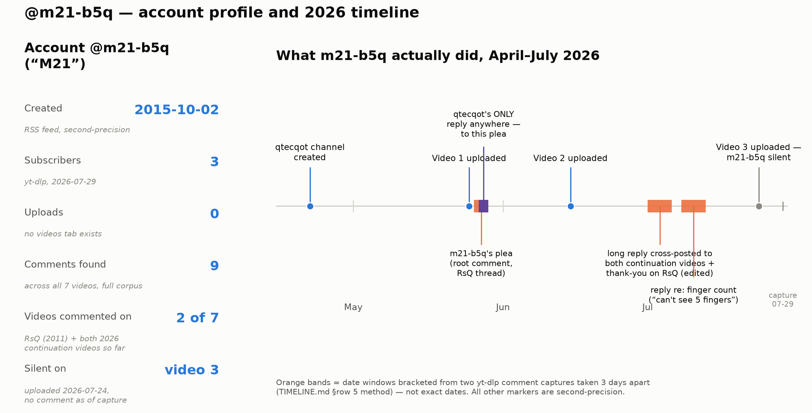
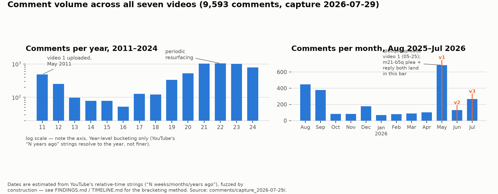

# Other people

Everyone in the Skinny Bob story who isn't ivan0135 or qtecqot: the commenter qtecqot
once replied to, and two outside creators who amplified the 2026 material to audiences
much larger than the handful of people doing frame-by-frame analysis. Scope is
deliberately narrow — public accounts, public posts, public numbers. No attempt was made
to identify anyone behind a handle, and none is made here.

Method note: the comment analysis below mines the full comment corpus captured
2026-07-29 (`comments/capture_2026-07-29/*.info.json`, 9,593 comments across all seven
videos — the four 2011 ivan0135 uploads and the three 2026 qtecqot uploads) and
cross-checks it against the earlier 2026-07-26 capture (`videos/2011/`, `videos/2026/`) wherever a
date needs bracketing. YouTube renders comment ages as rounded relative strings ("2
months ago"), so yt-dlp's derived timestamp for an old comment is one-sided — it gives an
upper bound, not a date. Two captures taken a few days apart bracket the true date to a
narrow window; that technique (documented in `docs/TIMELINE.md`, row 5) is used throughout
this report and flagged every time a date is a window rather than a point.

---

## 1. @m21-b5q — the only account qtecqot has ever replied to

### 1.1 The account, in five numbers

Checked directly against YouTube, not taken on faith from any prior document:

| | |
|---|---|
| Channel name | **M21** |
| Handle | `@m21-b5q` |
| Channel ID | `UCRI2fYCRUkvxgmGaGqivqdA` |
| Created | **2015-10-02T19:36:00 UTC** (`youtube.com/feeds/videos.xml?channel_id=UCRI2fYCRUkvxgmGaGqivqdA` — raw Atom feed, second-precision) |
| Subscribers | **3** (yt-dlp, checked 2026-07-29) |
| Uploads | **0** — the channel has no videos tab at all |
| Description / tags | empty |
| Comments found in the full 9,593-comment corpus | **9**, on 2 of the 7 videos |

That is an **eleven-year-old account with three subscribers and zero uploads** — a
lurker profile, not something spun up for this. It is also not a channel that has ever
done anything else publicly; the only trace of it anywhere in this corpus is nine
comments written across roughly ten weeks in 2026, all about this story.

### 1.2 What it actually did

He commented on exactly two of the seven videos: the 2011 flagship (`RsQCXN4o4Ps`,
5,134 comments) and both of qtecqot's first two 2026 uploads. He has not commented on
video 3 (`l9RAhmPHM_A`, uploaded 2026-07-24) — silence, which is worth noting as an
absence rather than reading anything into it; the corpus was captured only five days
after that upload.

**The plea (verbatim, `RsQCXN4o4Ps`, comment `UgyUv584lpeOqhBgFaB4AaABAg`).** Root
comment, opens by addressing ivan0135 directly:

> "Ivan0135, i'm not sure if you still have access to this channel, if your alive or
> dead but if you or anyone who knows your identity knows that this is you is reading
> this and has access to the full repository of these files read this comment. […] Your
> videos have stood the test of time and we can't tell if its real or not and because of
> that you have a moral responsibility to tell us the most important question of all of
> humanity ("Are we alone in the universe?")[.] […] We are ready and have waited a long
> long 16y for more evidence from you to be revealed[.] […] And ivan, if your not human,
> in that unlikely situation, wouldn't it be worthwhile to reduce your species chances
> of harm?"

**qtecqot's reply** — the only reply qtecqot has ever posted to anyone, anywhere:

> "ivan0135 status is currently not known. Contingency disclosure (continuation)
> triggered as of 2026/05/25 through my alt channel. We have partial access at this
> time. 5 of 8 completed."

Both comments carry the same date-fuzz signature ("2 months ago" in both the 07-26 and
07-29 captures), which brackets them to **2026-05-26 – 05-29** — 1–4 days after video 1
went up on 2026-05-25 (`docs/TIMELINE.md` row 5). qtecqot's reply must postdate the plea it
replies to, so the exchange happened almost immediately after video 1's release, in a
tight window either side of it.

**Everything he wrote after that.** Once qtecqot's two 2026 videos existed, he posted a
much longer essay — copy-pasted nearly verbatim onto both `OpSTlDJWFFI` and
`Oqw96jCOP7A` as root comments, and again as a reply inside an existing thread on the
first video. All three copies carry an "(edited)" tag, and the edit timestamps bracket
to **2026-07-01 – 07-06** (two-capture intersection). The full text opens:

> "I don't know who you are qtecqot. I responded on one of ivan135's videos about a
> month ago for disclosure and you responded to that comment saying '"ivan0135 status is
> currently not known. Contingency disclosure (continuation) triggered as of
> 2026/05/25 through my alt channel. We have partial access at this time. 5 of 8
> completed."' and you uploaded these two videos."

It goes on for roughly 500 words arguing, in detail, that if qtecqot really wanted to
stay anonymous there are much better OPSEC practices available in 2026 than uploading
edited clips to YouTube (burner accounts, GrapheneOS/QubesOS/Tails, VPNs, EXIF
stripping, no-KYC drop links) — concluding qtecqot is "over the age of 60" or not
actually trying to protect their identity, and demanding the raw, unedited source files:
"Upload everything, unapologetically, today its the only way anyone will take this
evidence seriously."

Two smaller replies followed, bracketed to **2026-07-08 – 07-13**: a "thank you" reply
on the original thread ("I'm just now seeing this response a month later and i'm
grateful that you have released more files!") and a reply to a skeptic on video 1's
finger-count dispute ("I can't see 5 fingers only at most four […] I'm inwardly
skeptical of this too, but I want to see where the channel will go").

Elsewhere in the `RsQCXN4o4Ps` thread — unrelated to qtecqot — someone posted a long,
rambling German-language comment (unconnected conspiracy content, not reproduced here).
m21-b5q replied to it with one sarcastic line in fluent German ("Du siehst keinen Tag
älter als 25 aus" — "you don't look a day over 25"). Two other one-line replies show him
repeating a claim that "VFX artist and CGI artist… have checked it using modern tech and
it still hasn't been disproved" and that an inconclusive result "doesn't know if it was
physically a fake." None of this is about qtecqot; it establishes only that he is a
fluent, casual, recurring presence in that comment section generally, not someone who
showed up once for a single stunt.

### 1.3 Two numbers that complicate the "he was just the most prominent comment" reading

It would be easy to assume qtecqot replied to him because his comment was the biggest
thing in the thread. It wasn't, by the metric that actually drives visibility:

- **By like count, his plea ranks 262nd of 2,578 root-level comments** on that video (3
  likes; the top comment there has 1,900). It would not surface near the top of
  YouTube's default "Top comments" sort.
- **By length, it ranks 2nd of 2,578** — 5,964 characters, beaten only by one 6,777-
  character comment.
- Only **17 of those 2,578 root comments open by addressing "Ivan0135" or "Ivan,"
  directly**, and only 29 mention "ivan0135" anywhere in the text.

So qtecqot did not find this comment by sorting for engagement — length and direct
address to Ivan by name are what set it apart, and both would surface it to anyone
searching or filtering the thread for pleas aimed specifically at the original
uploader, regardless of how few people had upvoted it. That is a meaningful fact about
*how* he was found, but it cuts both ways on *why*: it is equally consistent with a
careful reader who monitors the legacy comment section for exactly this kind of
content, and with an author selecting the single comment that best sets up the
narrative they wanted to tell.

### 1.4 Weighing it — legit fan, or connected to qtecqot?

**Evidence toward "ordinary fan":**
- Eleven-year-old account, three subscribers, zero uploads — the opposite profile of a
  sock puppet spun up to play a role. A fresh account would have been free to make and
  harder to notice; keeping an old, undistinguished lurker account "in reserve" for five
  years on the chance qtecqot would someday exist is a strange plan for an author to
  execute and a much more ordinary thing for a real person's forgotten account to just
  be.
- His prose has a distinct and consistent error fingerprint across all nine comments —
  "has took," "your" for "you're," run-on sentences, a repeated tic of restating a
  point defensively — that is different from qtecqot's own register, which is clipped,
  declarative, and never runs on ("ivan0135 status is currently not known… 5 of 8
  completed").
- He misreads the lore in ways an author of it would not: he interprets qtecqot's own
  description text and asks "So i'll assume the legacy network?" — treating qtecqot's
  choice of words as new information to puzzle over, not something he wrote himself.
- He demands the raw, unedited source files and detailed OPSEC critique — pressure that
  a hoaxer covering their own tracks has no reason to invite, and that qtecqot has
  never answered.
- The timing is not chronologically suspicious. Once the fuzz is resolved by
  intersecting two captures, his plea and qtecqot's reply both land 1–4 days after video
  1's release — an ordinary reaction window for an engaged fan of a newly-revived
  15-year-old story, not a "too fast to be real" red flag.

**Evidence that keeps the door open:**
- qtecqot's *only* public reply anywhere, ever, is to this account. That is a genuinely
  unusual fact about qtecqot's behavior (see §1.3) — it just isn't unusual in a way that
  requires m21-b5q to be anything other than the person who happened to write the
  comment that got answered.
- Eleven-year-old accounts can be kept by anyone, including someone who has been
  running ivan0135/qtecqot since 2011; nothing here rules out an aged sock, only makes
  it a less economical explanation than the alternative.
- The narrative service his comments perform ("i've convinced qtecqot that now is this
  time," "you could be the reason this channel is deleted") is exactly the kind of
  urgency-manufacturing content a self-promoting narrative would want in its own
  comment section — though it is equally exactly what an anxious, invested fan writes
  unprompted.

**Verdict.** Reading all of it together, this is most consistent with an ordinary,
unusually engaged audience member — probably in the **85–90% likely "genuine fan"**
range, with the residual probability sitting on "aged sock of the author," which cannot
be excluded from public data alone but has no positive evidence for it beyond the bare
fact of being the sole recipient of a reply. That fact is fully explained by an author
who reads their own legacy comment section closely (documented behavior — qtecqot's
first tweet answered the exact questions a contemporaneous Reddit thread was asking) and
picks the one plea addressed to Ivan by name to respond to, whoever wrote it. A simple,
low-cost way to move this materially: ask him directly, in a comment, for the exact
timestamp of his plea and of qtecqot's reply, both of which are sitting in his own
YouTube notification history. A genuine fan can screenshot that in a minute; evasion
would itself be informative. Nobody has done this yet.

---

## 2. Ben Philips — the VFX professional who has now watched twice, fifteen years apart

Ben Philips is a real, publicly self-identified creature/VFX-effects professional
(IMDb: `imdb.com/name/nm1592943/`) who has been part of the Skinny Bob story since 2011,
under the alias **"Bedeekin."** None of this is new deanonymization — he outed himself in
2011 ("IMDB me… Ben Philips") and has spoken under his own name about this material for
fifteen years. What follows is new: independently re-verifying his 2011 YouTube footprint,
and finding a plausible, distinct 2026 appearance.

### 2.1 2011 — not just a commenter, an amplifier

The YouTube channel **`@Bedeekin`** (channel ID `UCzJ1dolFZi8x7Y41gOnTtEA`) is a real,
still-live account created **2007-05-01**, with **1,800 subscribers**. Its content is
mostly unrelated (out-of-body-experience tutorials for a site called "Astral Viewers")
but it left extensive comments on all four 2011 ivan0135 videos, using language that
matches his public Reddit statement almost verbatim:

> "I work in the film industry as a special creature effects designer/modeler/sculptor….
> my educated, experience based opinion is that it isn't at all digital."

> "I showed my work collegues, who are a mix of Special FX, visual FX and creature FX
> technicians, artists and designers. They were at a loss as to what it is and fell very
> silent."

More significant than the comments: on **2011-05-22** — eight days after ivan0135's
final 2011 upload — this account posted its own compilation video, **"Ivan0135 Zeta
Reticuli alien footage (all three videos),"** which has accumulated **116,067 views**.
That is a downstream repost outperforming commentary alone by a wide margin, and it is
the same pattern §2.2 below shows happening again in 2026, on a different platform,
under a different name.

### 2.2 2026 — a comment, from a different channel

A commenter **`@bedeekin6274`** (channel ID `UCMYqkbFffB_rqSjHEmyyV2A`, display name
**"Ben Phillips"** — note the double-L spelling, one letter off IMDb's "Philips")
appeared on qtecqot's video 2 (`Oqw96jCOP7A`), bracketed to **2026-07-26, mid-afternoon
UTC** (two-capture intersection narrows it to roughly a one-hour window):

> "Almost there with the prompt."

Challenged ("Can you do better?"), he pushed back precisely — distinguishing a critique
of the *prompt* from a critique of the *model or puppet*:

> "A better prompt? What sort of response is that? If I'd have said 'it's a bad model'
> or 'it's a bad puppet' and you asked 'Can you do better' then that would have been an
> appropriate response… because then I could answer you much more succinctly. So can I
> do better what?"

**This is a different YouTube channel from the 2011 `@Bedeekin`** — different channel
ID, created 2015-05-16, zero uploads, 11 subscribers, no description. It is not a
continuation of the old content channel; it reads as a separate, personal account. The
display name matching Philips's real name, and the technical precision distinguishing
"prompt," "model," and "puppet" as three separate categories of critique (exactly the
categories a VFX professional would separate and a casual viewer would not), are
consistent with the same person commenting from a newer personal account. That is as far
as the public evidence goes — the match is a name and a register, not a confirmed
identity, and this report treats it as unconfirmed but plausible.

---

## 3. Rock Ferguson — the Facebook page that outdrew everything else combined

The owner's framing going in was: a Facebook "digital creator" called **Rock Ferguson** got
far more traction reposting this material than anything on Reddit. The two screenshots
provided (`Screenshot 2026-07-26 215849.png`, `Screenshot 2026-07-26 215915.png`) are the
entire evidence base here — Facebook itself could not be fetched from this sandbox (login
wall on every URL tried, including the direct share link in one of the reel's own
comments); that is a failed fetch, not evidence the page doesn't exist or isn't as
described.

### 3.1 What the two screenshots show

Both are re-uploads of **qtecqot video 2** (`Oqw96jCOP7A`, uploaded 2026-06-15),
cropped to vertical:

| | Reel 1 | Reel 2 |
|---|---|---|
| Frame | profile close-up, large dark eye | full body, outdoors, burned-in catalog timecode visible |
| Corresponds to | the "Slim Tim" close-up segment | the "Bob's walkabout" segment |
| Caption ends | "…#EliteSociety #KGB" | "…#EliteSociety #KGB **#qtecqot**" |
| Likes | **6,700** | 826 |
| Comments | **930** | 160 |
| Shares | **557** | 84 |
| Age at capture (2026-07-26) | ~5 weeks (comment ages) → ≈ 2026-06-21 | ~3 weeks (comment ages) → ≈ 2026-07-05 |

Both post shortly after video 2's June 15 upload, consistent with downstream
amplification rather than any independent source of material — every frame in both
reels traces to footage already public on YouTube.

**One correction to make here, caught by zooming the actual pixels and checked a second
way with Gemini (per this project's standing practice of getting a second, less
bias-prone read on anything visual):** the small icon next to "Rock Ferguson" in both
screenshots is **not** a verification checkmark. At 6× zoom it is unambiguously a
grey **globe/public-post icon** — Facebook's standard "this post is visible to anyone"
indicator, not the blue check that denotes a verified Page. Gemini's independent read of
both images agreed. This corrects an earlier characterization in `FINDINGS.md` §6d
("Meta-verified badge"), logged in `CORRECTIONS.md`.

Neither screenshot shows the words "Digital creator" anywhere — that label (a Facebook
Page category tag, typically shown in the Page's own header/About section, not in a
Reel's viewer pane) isn't visible in either image on file. It may well be accurate — it's
exactly the self-description a page like this would carry — but it isn't something these
two images can confirm.

### 3.2 The reach comparison, made concrete

As of the 2026-07-29 capture, the three qtecqot videos combined have **19,569 YouTube
views and 657 likes** (4,271/182 on video 1, 4,578/181 on video 2, 10,720/294 on video
3). **Reel 1's like count alone (6,700) is more than ten times the like count of all
three original videos combined**, from a single repost of one 30-second segment. This
project's own Reddit footprint (`r/qtecqot`, created by an outside analyst on
2026-07-28) could not be checked for a subscriber count or top-post score — the Reddit
API returned HTTP 403 on every subreddit tried in this session, including large,
unrelated subreddits, so this looks like a sandbox-level block rather than anything
specific to that community; a web search for it independently returned nothing indexed.
What can be said without a number: by every contemporaneous account in this project's
own record, `r/qtecqot` is a few days old and built by one analyst — the qualitative
comparison the owner drew (a single Facebook repost reaching a bigger audience than the
Reddit side of this story) holds up against what's actually verifiable, even without a
precise subscriber count to put next to it.

### 3.3 What would nail this down — screenshots to ask the owner for

Since Facebook is unreachable from here, the following would each answer a specific
open question if screenshotted directly from the page (not the reel viewer):

1. **The Page's About/header section** — confirms or refutes the "digital creator"
   category tag, shows the Page's creation date and total follower count (distinct from
   any single post's likes).
2. **The Page's full post history / video list** — establishes whether these two reels
   are isolated opportunistic reposts or part of a running pattern of alien/UFO content,
   and whether any qtecqot-related post ever appeared *before* the corresponding YouTube
   upload (the one test that would flip the amplification relationship around — flagged
   as unexecutable in `UNFINISHED_BUSINESS.md` for exactly this reason).
3. **Any additional reels or posts about this material** beyond the two already on
   file, ideally with their own like/comment/share counts and posting dates, to build
   out the reach picture beyond two data points.

---

## 4. The shape of the audience response, briefly

Not a community write-up — just enough for scale. Across all 9,593 comments (7
videos), keyword-matched sentiment splits roughly as: on the flagship 2011 video
(`RsQCXN4o4Ps`, 5,134 comments), about **22%** contain an explicit "fake/AI/CGI/slop/hoax"
signal versus **10%** an explicit "real/genuine/authentic" signal — skeptics outnumber
believers roughly 2:1 by this crude measure, with the plurality of comments falling into
neither bucket (question-asking, reactions, off-topic). The 2026 continuation videos
run similar ratios at much smaller scale (10–20 comments each).

Two technical observations recur **independently across many unrelated commenters**,
which is itself worth noting — nobody needed to be told to look for these:

- **The burned-in timecode shouldn't exist on 8mm film.** *"Timecodes weren't used for
  8mm film, it's just stuff from a documentary edited to look older"* (@thesneakystrangler9002);
  *"8mm film did not have the capability to do time stamps"* (@AITpro_Ed, on two
  separate videos); *"Digital time stamp could be from a video camera that filmed a
  projection of the original 8mm footage"* (@ikkeforlet) — twelve separate comments
  raise a version of this across three different videos.
- **The panning motion is smoother than the frame rate should allow.** *"1:19 camera
  panning is smoother than the frame rate, yet there is original timer so they would need
  to have modern edit software in 1940s to pull this off"* (@Fytyny); *"The movements of
  the alien in this video is in high frame rate..it seems too smooth for that
  era"* (@anilbachhav868); *"Movements of the alien do not match up with old camera's
  frames per second, it's like watching 60fps smooth alien baked in 15fps
  film"* (@DanielBerthellemy) — over fifty comments raise some version of this, almost
  all about the 2011 footage specifically.

Both are exactly the kind of thing a crowd of ordinary viewers, with no coordination and
no specialist tools, converges on when something in a video's motion or overlay doesn't
sit right — for the same reason this project independently measured playback-speed
ratios and timecode-font metrics using actual tools. The crowd got there by eye, first.

The right-hand panel is the more informative half: comment volume on the whole corpus
was quiet through the first four months of 2026, spiked hard the month qtecqot uploaded
video 1 (May, 685 comments against a 70–180/month baseline), fell back sharply the month
video 2 went up (June, 129 — a much smaller bump than video 1 got), and rose again around
video 3 (July, 267, still climbing at capture time). Read plainly: video 1's release was
the real event; video 2 landed as a comparative non-event even though nothing about its
content should have drawn less attention; video 3 is still gathering momentum in a window
this report's data cuts off five days after upload, before the tail is visible.

---

## Sources

- `comments/capture_2026-07-29/*.info.json` — full comment corpus, 9,593 comments, all
  seven videos, this report's primary data source.
- `videos/2011/*.info.json`, `videos/2026/*.info.json` — 2026-07-26 capture, used for two-capture date
  bracketing throughout.
- `youtube.com/feeds/videos.xml?channel_id=…` (raw Atom feeds, fetched directly) and
  `yt-dlp --dump-single-json …/about` (no cookies needed for any of this — none of the
  target channels required authentication) — channel metadata for `@m21-b5q`,
  `@bedeekin6274`, and `@Bedeekin`.
- `Screenshot 2026-07-26 215849.png`, `Screenshot 2026-07-26 215915.png` — the two
  Rock Ferguson reel screenshots on file; re-examined at 6–8× pixel zoom and cross-checked
  with Gemini for the badge correction in §3.1.
- `FINDINGS.md` §4b, §6, §6c, §6d; `docs/TIMELINE.md` row 5 (the date-bracketing method);
  `docs/SKINNY_BOB_DOSSIER.md` §3.4 (Ben Philips's 2011/2019 public statements).
- `figs/people/comment_volume_over_time.png`, `figs/people/m21_timeline.png` — figures
  generated for this report; scripts alongside them (`mk_comment_volume.py`,
  `mk_m21_timeline.py`) regenerate from the raw JSON.

**Explicitly out of scope, per instruction:** no section on "the community" of outside
analysts as a group, and no material on the analyst known as LC beyond what already sits
elsewhere in this project's record.
