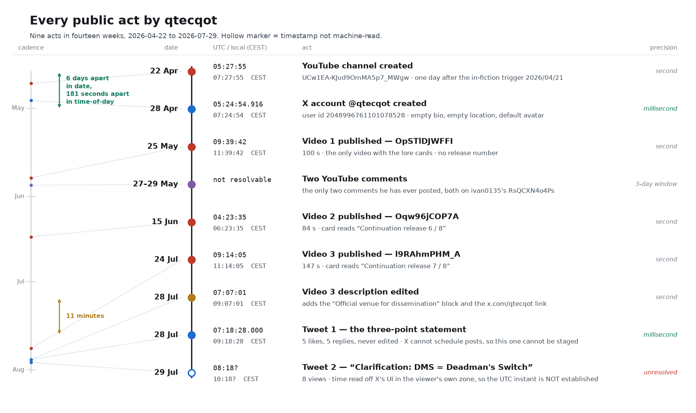
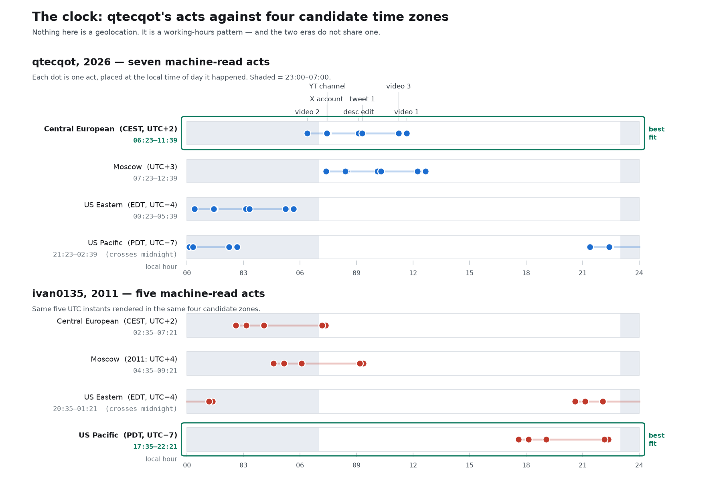
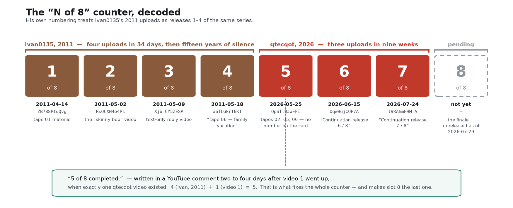

# qtecqot — the complete record

*Reader-facing dossier section. Everything a stranger needs in order to know exactly what this
account has done, exactly what it has said, and exactly how much of that is measurable.*

**Compiled 2026-07-29.** Folds in and supersedes FINDINGS.md §6, §6b, §6d, §6e, §6e.1, §15, §22,
§29, §32, all of TIMELINE.md, and the tweet analysis in `reports/agent_community_lc.md` §5.

Two ground rules for this section. First, **provenance is not adjudicated here.** Whether the
footage shows anything real is a question about the footage; this section is about the account and
the person operating it. Second, **no private individual is identified.** Other commenters appear
by handle only.

---

## 1. The account, on one page

| | |
|---|---|
| **YouTube** | `youtube.com/@qtecqot` · channel ID `UCw1EA-KJud9OmMA5p7_MWgw` |
| created | **2026-04-22 05:27:55 UTC** (channel RSS `published`) |
| uploads | 3, all category "News & Politics", all 1920×1080 / 29.97 fps |
| traffic (2026-07-29 10:00 UTC) | 21,149 views total · 712 likes · 5.00 average rating on all three |
| subscribers | 388 (machine read, 2026-07-26) → 408 (observed on the About page, 2026-07-27) |
| monetisation | none. No links, no merch, no membership, no affiliate anything |
| comments made on his own videos | **zero, out of 177** |
| **X** | `x.com/qtecqot` · user ID `2048996761101078528` |
| created | **2026-04-28 05:24:54.916 UTC** — confirmed two independent ways, see §2 |
| display name | `qtecqot` (identical to the handle) |
| bio | **empty string** |
| location field | **empty string** |
| avatar | **X's default placeholder** — no picture was ever uploaded |
| header image | **none** (`bannerUrl` empty) |
| verification | not verified, not X Premium |
| posts | **2** |
| follows | 3: `@UAPJedi`, `@roscosmos`, `@elonmusk` |
| followers | 1 (Jul 27) → 7 (Jul 28) → 8 (Jul 29 ~02:00) → **14 (Jul 29 10:13 UTC)** |
| username changes | 1, in April 2026. The prior handle is not recoverable (see §9) |
| **YouTube comments made, all time** | **2**, both on ivan0135's video `RsQCXN4o4Ps`, neither on his own channel |
| **replies to anyone, ever** | 1 (the nested comment in §5.3). Nothing since. |

**The handle itself.** "qtecqot" had essentially zero web footprint before 2026-05-25. It survives
no standard decode — Caesar (all 25 shifts), Atbash, reversal, QWERTY-neighbour shift, Russian
keyboard-layout transliteration, T9, dictionary anagram: nothing. But it is not keyboard mash
either. Seven letters with a near-doubled skeleton, `q·t·e·c | q·o·t` — both halves open on `q`
and close on `t`. Two `q`s with no `u` makes it unpronounceable and, more usefully to its owner,
**perfectly unsearchable**. That is what a password generator gives you, and it is the property
that makes the registration dates in §2 load-bearing.

**On "based in United States".** X shows an "Account is based in" panel for this account. The
profile's own `location` field is an **empty string** — he never typed a country. That panel is
X's own inference from network signals, and the YouTube channel's country flag is self-set and
VPN-dependent. Neither is a self-declaration and neither should be quoted as one.

---

## 2. Every public act, in one timeline



Nine acts in fourteen weeks. Precision class is stated on every row because the classes differ by
six orders of magnitude, and several published claims about this account come from reading a
low-precision figure as though it were a high-precision one.

| # | UTC instant | precision | act | how we know |
|---|---|---|---|---|
| 1 | 2026-04-22 **05:27:55** | second | **YouTube channel created** | Atom `published` field in the channel RSS feed |
| 2 | 2026-04-28 **05:24:54.916** | **millisecond** | **X account created** | `createdAtMs` in x.com's server-rendered state blob, cross-checked against a snowflake decode of the user ID (see below) |
| 3 | 2026-05-25 **09:39:42** | second | **Video 1** `OpSTlDJWFFI` published — 100.06 s | yt-dlp `timestamp` |
| 4 | 2026-05-27 … 05-29 | **3-day window** | **Two YouTube comments** on ivan0135's `RsQCXN4o4Ps` | two yt-dlp captures intersected — method below |
| 5 | 2026-06-15 **04:23:35** | second | **Video 2** `Oqw96jCOP7A` published — 83.54 s | yt-dlp `timestamp` |
| 6 | 2026-07-24 **09:14:05** | second | **Video 3** `l9RAhmPHM_A` published — 146.68 s | yt-dlp `timestamp` |
| 7 | 2026-07-28 **07:07:01** | second | **Video 3's description edited** to add the "Official venue" block and the x.com link | RSS `updated`, corroborated by a content diff against our 2026-07-26 archive |
| 8 | 2026-07-28 **07:18:28.000** | **millisecond** | **Tweet 1**, the three-point statement — status ID `2082002737362039094` | X's own state blob, and independently the public syndication endpoint, and independently a snowflake decode of the status ID |
| 9 | 2026-07-29, ~10:18 in the viewer's local zone | **unresolved** | **Tweet 2**, "Clarification: DMS = Deadman's Switch" — 8 views | screenshot of X's UI. **The UTC instant is not established** |

**Why row 2 is trustworthy to the millisecond.** X user IDs are snowflakes: the creation time is
encoded in the integer. `(2048996761101078528 >> 22) + 1288834974657 ms` = **2026-04-28
05:24:31.022 UTC**, and the account record's own `createdAtMs` field reads **05:24:54.916 UTC**.
Two entirely different mechanisms, agreeing to 23.9 seconds — the ID is minted moments before the
record is finalised. The same double-check on tweet 1 gives 07:18:28.984 from the ID against
07:18:28.000 from the record, agreeing to under a second.

**Why row 4 is a window and not a date.** YouTube deliberately fuzzes comment timestamps to a
rounded-down relative string ("2 months ago"). yt-dlp derives a `timestamp` by subtracting that
string from the scrape time, which makes any single capture **unbounded above** — the reason an
earlier version of this record said "~2026-06-27", which was an artifact. Two captures bracket it
properly: `"1 month ago"` at scrape epoch 2026-07-26 20:11 puts the true time in (05-26, 06-26];
`"2 months ago"` at scrape epoch 2026-07-29 02:30 puts it in (04-29, 05-29]. **Intersection:
(2026-05-26, 2026-05-29].** The nested comment must also postdate its parent, which falls in the
same window. So both comments land **two to four days after video 1 went up**, and his own text
names 2026/05/25 — the video-1 publish date — as the trigger.

**Why row 9 is marked unresolved.** X renders post times in the *viewer's* local zone. The only
record we have of tweet 2 is a screenshot taken on the owner's machine, so "10:18" is 10:18
*somewhere*. If that device is on CEST it is 08:18 UTC, which lands inside the band in §3 and
makes the pattern eight-for-eight — but that is a conditional, not a measurement. It is closable
in one click: the public endpoint `cdn.syndication.twimg.com/tweet-result?id=<ID>&lang=en&token=<t>`
returns an exact `created_at` with no login, and it needs only the numeric status ID from the
tweet's own URL. Tweet 2 is a self-reply, and X's logged-out profile timeline serves only
*original* posts, which is why we can see the count ("2 posts") but not the second post itself.
`x.com/qtecqot/with_replies` is login-walled — confirmed 2026-07-29 10:13 UTC.

**The 181-second signature.** The two registrations are six days apart in date and **181 seconds
apart in time of day**:

| | UTC | CEST |
|---|---|---|
| YouTube channel created | 2026-04-22 **05:27:55** | 07:27:55 |
| X account created | 2026-04-28 **05:24:54** | 07:24:54 |
| | 5 d 23 h 56 m apart | **181 s apart in time-of-day** |

Two platforms, two separate sittings, six days apart, both begun within three minutes of 07:25 in
the morning Central European time. It is the tightest behavioural signature in the corpus, and it
is the kind of thing nobody stages, because nobody thinks anyone will ever look.

**The eleven-minute activation of 2026-07-28.** At 07:07:01 the description of video 3 is edited
to add a block naming `x.com/qtecqot` as the "official venue". At 07:18:28 — **eleven minutes
later** — that account, dormant since April, posts for the first time in its life. The account was
built in April, left empty for three months, then pointed at and switched on inside a quarter of
an hour. Note also that **X has no scheduling in its normal interface**: of every timestamp in
this dossier, tweet 1 is the one that cannot have been staged in advance.

---

## 3. The clock



Take the seven machine-read UTC instants and render each one as a local time of day in each
candidate zone. That is the whole method; there is nothing to tune.

| UTC | CEST (+2) | Moscow (+3) | US Eastern (−4) | US Pacific (−7) |
|---|---|---|---|---|
| 04-22 05:27 | **07:27** | 08:27 | 01:27 | Apr 21 22:27 |
| 04-28 05:24 | **07:24** | 08:24 | 01:24 | Apr 27 22:24 |
| 05-25 09:39 | **11:39** | 12:39 | 05:39 | 02:39 |
| 06-15 04:23 | **06:23** | 07:23 | 00:23 | Jun 14 21:23 |
| 07-24 09:14 | **11:14** | 12:14 | 05:14 | 02:14 |
| 07-28 07:07 | **09:07** | 10:07 | 03:07 | 00:07 |
| 07-28 07:18 | **09:18** | 10:18 | 03:18 | 00:18 |
| **span** | **06:23–11:39** | 07:23–12:39 | 00:23–05:39 | 21:23–02:39 |

**Central European is a clean seven-for-seven morning band, 06:23 to 11:39, median about 09:10.**
Moscow works nearly as well, shifted an hour later. US Eastern puts every single act between
00:23 and 05:39. US Pacific scatters them across late evening and after midnight. If row 9 is
CEST, it is eight for eight.

What this is and is not: it is a **working-hours pattern**, not a geolocation. Three uploads can be
scheduled; account registration and tweeting cannot. And the honest counterweight is that a person
building a cover story would stage hours that support the cover — an operator constructing a
Russian or American presentation had every opportunity to post at Russian or American hours and
did not.

**The comparison with ivan0135 is the part worth sitting with.** The same method on the 2011
account's five machine-read acts (four uploads plus the channel creation) gives its tightest fit
in **US Pacific, 17:35–22:21 — an ordinary evening** — and puts two of five in the middle of the
Central European night. The two clocks do not overlap. Buffers of several hours separate them.

| | ivan0135 (2011) | qtecqot (2026) |
|---|---|---|
| best-fit zone | **US Pacific evening**, 17:35–22:21 | **CEST morning**, 06:23–11:39 |
| second best | US Eastern evening | Moscow morning |
| worst fit | CEST (night) | US Eastern (small hours) |
| day of week | favours Monday (3 of 5) | favours Monday (2 of 3 uploads) |
| cadence | disciplined — two uploads 7 days minus 12 minutes apart | 21 days, then 39 days |
| responsiveness | **zero, for fifteen years** | comments once, edits descriptions, tweets |

On clock evidence alone these are two different operators, or one operator who moved across eight
time zones and changed personality. **That is exactly what qtecqot himself claims** — see §7 — and
it is the strongest independent support that claim has. It also converges with the only physical
reading pointing the same way, the 50 Hz mains grid line in the new audio, which is weak evidence
on its own (every 50 Hz country in Europe and Asia satisfies it equally) but does not point the
other way.

**Release 8/8 is a live, unscored prediction.** The cadence (21 days, then 39) and the slot
together put the finale most likely on a Monday around 09:00–10:00 UTC, late August into
September. As of 2026-07-29 it has not happened. A drop far outside that slot — especially in US
daytime — is informative in its own right.

---

## 4. What he actually wrote, all of it

This is the whole authored corpus: about **1,740 characters of his own prose** — descriptions,
comments, tweets and the July 28 insert combined — plus about **760 characters of catalog
listing**, which the on-screen cards then repeat verbatim. Nothing else exists. It is a very small
body of text, and that is why every recurring habit in it carries weight.

Every video opens with a **written section** before any footage appears, and the proportion of
run-time given to text falls with each release:

| | text section | run-time | share of the video |
|---|---|---|---|
| Video 1 | 3 cards, frames 1–882 | 0.0–29.4 s of 100.1 s | **29 %** |
| Video 2 | 1 card, frames 11–414 | 0.3–13.8 s of 83.5 s | **17 %** |
| Video 3 | 1 card, frames 11–456 | 0.4–15.2 s of 146.7 s | **10 %** |

That decline is structural, not stylistic. **All of the narrative is in video 1.** Videos 2 and 3
carry only the catalog listing. Whatever story is being told was fixed in May 2026 and has never
been added to.

### 4.1 Video 1's title cards — the only place the story is told

White monospaced text on a dark grey field, three cards with cross-dissolves. Read at full
resolution from frame 60 and frame 700.

> **Card A** (frames 1–~310)
>
> 0135 location and status unclear as of 2026/04/21.  Incapacitation presumed.
>
> Per provision with network, continuity releases are triggered.
>
> 7 video tapes with material recorded between 1942-1969.
>
> Material containing UFO incidents, recovery and study of extraterrestrial life forms.  Full
> disclosure pending.

> **Card B** (frames ~330–555)
>
> Source anonymity is maintained.
> Failsafe contract is preserved.

> **Card C** (frames ~570–882) — the fragment list, **verbatim identical to the YouTube
> description**, including the `&tell` typo.

Six sentences carry the entire fiction. Note what is in them: a person referred to only as
**0135**; an institution called **network**; a **provision** that **triggers**; a **failsafe
contract**; a date. And note the register — "Incapacitation presumed." and "Full disclosure
pending." are verbless status-report clauses with the determiners stripped out. That habit is the
single most useful stylometric marker in this whole file, and it recurs everywhere.

### 4.2 The three video descriptions

**Video 1** (`OpSTlDJWFFI`, published 2026-05-25) — the only description with a header line and the
only one with the boilerplate:

> Leaked ufo/uap/ebe footage. Confidential. Classified documents.1942-1969.
>
> Relevant information:
>
> 0135 location and status unclear as of
> 2026/04/21.  Incapacitation presumed.
>
> Per provision with network, continuity
> releases are triggered.
>
> 7 video tapes with material recorded
> between 1942-1969.
>
> Material containing UFO incidents,
> recovery and study of extraterrestrial
> life forms.  Full disclosure pending.
>
> Source anonymity is maintained.
> Failsafe contract is preserved.
>
> The video contains sample edited fragments of tapes 02, 05, 06.
>
> Tape duration: 180 min
> Total recorded duration: 1.260 min
>
> Tape 02:
> Case 11/Tin bird unauth 00:33:30 - 00:33:34
> Case 12/Mk.4 taxi 01:08:21 - 01:08:22
> Case 12/Mk.4 pace lap 01:10:55 - 01:11:21
> Tape 05:
> Case 26/Tim's show &tell 01:01:18 - 01:01:19
> Tape 06:
> Case 31/Mk.5 virgin (col/s) 00:57:56 - 00:58:04

Set that header beside ivan0135's from 2011:

> 2011: `Leaked air force ufo footage. Confidential. Classified document.1942-1969.`
> 2026: `Leaked ufo/uap/ebe footage. Confidential. Classified documents.1942-1969.`

The idiosyncratic **missing space after the full stop** is reproduced exactly. "Tape duration: 180
min / Total recorded duration: 1.260 min" is copied verbatim, European decimal point intact. But
in the sentence just above it, ivan's grammatical error is silently corrected: 2011 "The video
contains **a** sample edited fragments" (ungrammatical) becomes 2026 "The video contains sample
edited fragments". A copyist who fixes his source's mistakes.

**Video 2** (`Oqw96jCOP7A`, 2026-06-15) — the apparatus is gone; only the numbering and the two
formulas remain:

> Relevant information:
>
> Continuation release 6 / 8.
>
> Source anonymity is maintained.
> Failsafe contract is preserved.
>
> The video contains sample edited fragments of tapes 02, 04, 05.
>
> Tape 02:
> Case 11/Tin bird primer 00:36:02 - 00:36:07
>
> Tape 04:
> Case 20/Brown boys 00:03:11 - 00:03:18
> Case 20/Brown boys 00:03:55 - 00:04:05
> Case 20/Brown boys 00:04:10 - 00:04:11
> Case 21/Triage 00:15:01 - 00:15:06
> Case 22/Exit EBL04 00:30:26 - 00:31:14
>
> Tape 05:
> Case 25/Bob's walkabout 00:02:07 - 00:02:12
> Case 25/Slim Tim 00:40:12 - 00:40:40

**Video 3** (`l9RAhmPHM_A`, 2026-07-24), as published:

> Relevant information:
>
> Continuation release 7 / 8.
>
> Source anonymity is maintained.
> Failsafe contract is preserved.
>
> The video contains sample edited fragments of tapes 03, 05.
>
> Tape 03:
> Case 18 / Mk.4 early boarding 02:13:18 ~ 02:23:57
>
> Tape 05:
> Case 28 / False Cape study 02:51:01 ~ 02:51:32

Two small things in that last one. The separator changes from `-` to `~`, and the spans it marks
are enormous — 10 minutes 39 seconds and 31 seconds against video 1's 4-second and 26-second
clips. The frame arithmetic confirms the two symbols mean different things: video 3's footage
decomposes into 19 and 3 separate fragments trimmed out of those ranges, matching the measured
frame counts to within one frame. `-` is a contiguous clip; `~` is "sampled from between these
timecodes".

### 4.3 The added block, 2026-07-28 07:07:01 UTC

Eleven minutes before his first tweet, this was appended to video 3's description. It is absent
from our archived copy of 2026-07-26, confirmed by diff.

> Official venue for dissemination of facts and clarification of
> misinformation/misinterpretation.
>   - false claims of ownership/production
>   - false allegations re: intent or motive
>   - other dubious claims which fall within my limited range of authority to address
> https://x.com/qtecqot

Read what he has chosen to pre-empt: **claims of "ownership/production"** — that he made it — and
**"allegations re: intent or motive"** — that he is hoaxing. Those are the two accusations then
being made about him in public. "Within my limited range of authority to address" keeps the
conduit framing intact: he is not the owner, only the channel.

### 4.4 The two YouTube comments — exactly where they are

Both sit on **ivan0135's** 2011 video `RsQCXN4o4Ps` ("alien grey extraterrestrial zeta reticuli ufo
leaked footage"). Neither is on his own channel. Verified 2026-07-29 by exact channel-ID match
across **all 9,593 comments on all seven videos of both channels**: exactly two hits for
`UCw1EA-KJud9OmMA5p7_MWgw`, and **zero** for ivan0135 anywhere.

**Comment 1 — top level.** 6 likes.

> Continuation of series :  https://www.youtube.com/watch?v=OpSTlDJWFFI

**Comment 2 — a nested reply**, not a top-level post. 1 like. This is the load-bearing one.

> ivan0135 status is currently not known.  Contingency disclosure (continuation) triggered as of
> 2026/05/25 through my alt channel.  We have partial access at this time.  5 of 8 completed.

Its **parent** is a 2,148-character plea by **@m21-b5q**, addressed to ivan0135, which opens
"Ivan0135, i'm not sure if you still have access to this channel, if your alive or dead…" and asks
him to "Upload everything." A second reply on the same parent, from **@KizzMyAbs2**, guesses that
"someone sent him this to post". qtecqot's reply is placed under that plea, and because it is
nested it is **invisible when the thread is sorted by newest** — which is why it went unnoticed for
two months.

The timing matters. The plea and the reply both sit in the (05-26, 05-29] window, two to four days
after video 1 published. A three-month-silent operator answered a stranger's plea within days,
once, and then never spoke in a comment thread again.

### 4.5 The two tweets

**Tweet 1** — 2026-07-28 07:18:28.000 UTC, status `2082002737362039094`. 5 likes, 5 replies in the
conversation, never edited. Verbatim:

> 🔹 I am not Ivan0135. I have not met him/her, but I have been in intermittent contact through
> electronic means as circumstances dictated. No contact since April of 2026.
>
> 🔹 I am of Eastern European descent, but fluent in English.
>
> 🔹 I am not suicidal. DMS in use, unlike 0135.

**Tweet 2** — 2026-07-29, time unresolved. 8 views.

> Clarification: DMS = Deadman's Switch

Tweet 2 exists because a replier, **@UfosAroundWorld**, had read "DMS" as "direct messages" and
asked "Your DM isnt available ?". Note how he answered: **not as a reply to that person**, but as a
fresh self-reply on his own thread. It is the same engagement signature as YouTube — he reads
everything, answers almost nothing, and never in-thread.

---

## 5. Stylometry

Two corpora: the 2026 material above (~1,740 characters of his own prose), and ivan0135's 2011
material (~1,600 characters, descriptions and cards). Small samples on both sides. Everything here
is supporting evidence, not proof.

### 5.1 The markers

**1. Bare `0135` as a referring expression.** Video 1's card: "**0135** location and status unclear
as of 2026/04/21." Tweet 1: "DMS in use, unlike **0135**." Nobody else in the corpus does this —
not ivan, not any commenter, not any outside analyst. Everyone else writes "Ivan0135" or "Ivan".
Truncating a handle to its numeric suffix and using it as a personal name is idiolectal, and it is
not the kind of thing an imitator picks up at a glance.

**2. Article-dropped status clauses.** Determiners stripped, often verbless:

> Incapacitation presumed. · Full disclosure pending. · Source anonymity is maintained. ·
> Failsafe contract is preserved. · **DMS in use, unlike 0135.**

The last of those is the tweet. It sits in exactly the same grammar as the cards.

**3. Formal nominal adverbials where an ordinary writer would use a subordinate clause.**

> "through electronic means **as circumstances dictated**" (tweet)
> ↔ "**Per provision with network**, continuity releases are triggered" (card)
> ↔ "Contingency disclosure (continuation) triggered **as of** 2026/05/25" (comment)

**4. Zero contractions, in both corpora.** "I am not", "I have not", "isn't" conspicuously absent —
against the replier's "isnt" one line below in the same thread.

**5. Zero ESL errors, and native-idiomatic American naming.** The case names he invented are
"Tim's show &tell", "Bob's walkabout", "pace lap", "Mk.5 virgin", "early boarding", and the title
word "walkthru". That is a native ear. ivan0135's 2011 prose, by contrast, carries errors with a
Romance-language flavour ("was been filmed") and the misspellings "desclassified" and "rosswel".

**6. Formal date style that avoids European DD/MM.** "as of 2026/04/21", "since April of 2026" —
the latter a slightly bookish American construction.

**7. Double spaces after full stops, in his own prose only.** Five of five sentence breaks in the
novel material double-space: "presumed.␣␣Per provision", "not known.␣␣Contingency", "channel.␣␣We
have", "time.␣␣5 of 8". The only single-spaced breaks anywhere in his corpus are inside the line
copied from ivan, who never double-spaces. Sentence spacing is a subconscious typing habit and it
splits cleanly along the copied/original seam.

**8. No exclamation marks, no hedges, no discourse particles, anywhere.**

### 5.2 Does the tweet voice match the video-card voice?

Yes — at roughly 0.90–0.95 confidence, carried mainly by markers 1 and 2, which are idiolectal
rather than imitable.

Set them side by side:

| video cards / comments | tweet |
|---|---|
| "**0135** location and status unclear as of 2026/04/21." | "…unlike **0135**." |
| "Incapacitation presumed." / "Full disclosure pending." | "**DMS in use**, unlike 0135." |
| "**Per provision with network**, continuity releases are triggered." | "through electronic means **as circumstances dictated**" |
| "Source anonymity is maintained." | "I am not suicidal." |
| no contractions | no contractions |
| "as of 2026/04/21" | "since April of 2026" |

The honest divergences, all weak:

- **Sentence spacing flips.** A pixel-gap measurement on the tweet's text rows puts every
  inter-word gap at 4–5 px including the two sentence breaks, so the tweet is uniformly
  single-spaced — against 5-of-5 double spacing in his prose. But iOS and Android both convert a
  double space into "full stop + single space" automatically, which *mechanically prevents* a
  habitual double-spacer from producing one on a phone. Needs a control before it counts.
- **"Ivan0135" capitalised**, mid-sentence, against the canonical lowercase he himself used in the
  YouTube comment. Small, real, unexplained.
- **Person and number shift.** The YouTube corpus is almost entirely agentless, with one "**my**
  alt channel" and one "**We** have partial access" — institutional framing. The tweet is dense
  first-person singular, five "I am / I have" in three bullets, with no "we" and no "network". A
  self-description invites that shift, but it is a shift.
- **🔹 bullets and "him/her"** appear nowhere in the card register. Platform and modern-web
  convention respectively; near-zero weight.

And in the end the stylometry is not what settles it. **The handle settles it.** `@qtecqot` was
registered 2026-04-28, a month before the string "qtecqot" existed anywhere in public. No fan and
no impersonator can squat a name they have never seen.

### 5.3 Where the 2026 writer differs from the 2011 writer

The 2026 material copies ivan's template and then diverges from it in a consistent direction:
**errors get corrected**.

| | ivan0135, 2011 | qtecqot, 2026 |
|---|---|---|
| header typo (missing space after `.`) | present | **reproduced exactly** |
| grammar | "contains **a** sample edited fragments" | "contains sample edited fragments" — **fixed** |
| hidden tag lists | `desclassified`, `rosswel` | video 1 **removes both and appends corrected** `declassified`, `roswell`; video 2 drops them silently; video 3 keeps ivan's whole list including the misspellings |
| sentence spacing | never doubles | always doubles, in original prose |
| ESL errors | present, Romance-flavoured | none |
| naming register | plain | native-idiomatic American |
| the lore layer he extends | treaties, documents ("treaty 23/04", "document 072 / E") | **never mentions them.** Only the tape/case catalog is continued |

That last row is worth a beat. ivan's fourth video is a prose account of diplomatic treaties and
numbered documents. The 2026 author never touches any of it. What he does continue, in careful
detail, is the **catalog metadata** — which is precisely the layer that is visible and copyable
from the published 2011 uploads.

The tag finding is the same story from another angle: all three 2026 tag lists are per-video copies
of ivan's hidden tag lists, scraped rather than seen (raw tags are not shown in YouTube's UI).
Video 3 uses ivan's *reply-video* tag list, in order, starting `reply, Ivan0135, …` — keeping the
tag `reply` on a footage video makes no sense for search, only as a copy artifact.

**How much weight to put on all this:** individually every item is weak, and fifteen years can
improve anyone's English. Jointly it is consistent with a different and more native-English writer
working from the published 2011 material, and it adds no evidence at all for same-author
continuity. Moderate confidence, supporting, not decisive — and note that it is now *aligned* with
what he says about himself rather than against it.

---

## 6. The lore system, decoded



### 6.1 The release counter

"5 of 8 completed" was written in a YouTube comment two to four days after video 1 published, when
**exactly one qtecqot video existed**. Video 2's card then reads "Continuation release 6 / 8" and
video 3's "7 / 8". The arithmetic only closes one way: **4 (ivan0135's 2011 uploads) + 1 (video 1)
= 5**. His numbering treats the 2011 videos as releases 1 through 4 of the same series, and that
makes **release 8/8 the last one**.

Two consequences. First, the finale is a fixed, finite commitment — one more video, then the series
is over by his own accounting. Second, note that video 1 itself carries **no release number** on
its card. The numbering appears only from video 2 onward, i.e. only after the comment established
it. He worked out the counter in a reply to a stranger and then adopted it on his own cards.

### 6.2 The tape and case scheme

Every fragment is stamped with a burned-in overlay at the lower left, format
`T{tape}-02/{case}  HH:MM:SS`, monospaced, white with a dark halo. In almost every fragment the
tape prefix is covered by a soft-edged suppression zone, leaving only `/11`, `12`, `/26` and so on
legible. It slips exactly twice in the whole 2026 corpus: video 1's colour segment shows the full
string **`T6-02/31`**, and video 2's Case 22 shows **`BL04 /22`** — a fragment of the case name
"Exit EBL04" bleeding in from the left. The middle field, `-02`, is unexplained.

Cases cited across both eras:

| tape | 2011 cases | 2026 cases |
|---|---|---|
| 01 | 07 "Tin bird" | — |
| 02 | — | 11 "Tin bird unauth / primer", 12 "Mk.4 taxi / pace lap" |
| 03 | 15 "Flying twin" | 18 "Mk.4 early boarding" |
| 04 | 23 "Blue boys", 24 "Blue boys meeting" | 20 "Brown boys", 21 "Triage", 22 "Exit EBL04" |
| 05 | 25 "skinny Bob", 26 "How to drive" (read off the 2011 on-screen cards — that video's description is empty) | 25 "Bob's walkabout / Slim Tim", 26 "Tim's show &tell", 28 "False Cape study" |
| 06 | (2011's tape-06 video gives prose, no catalog) | 31 "Mk.5 virgin (col/s)" |
| 07 | — | — |

**This is internally consistent, and non-trivially so.** Within every tape, case number increases
monotonically with the cited timecode — and it goes on doing that when the 2011 and 2026 citations
are interleaved. (The 2026 citations are also confirmed against the burned-in overlays frame by
frame; the 2011 ones are taken from ivan's own descriptions and cards.) On tape 04, the 2026 additions (Cases 20, 21, 22 at 00:03, 00:15, 00:30) sit
entirely *before* ivan's fifteen-year-old Cases 23 and 24 (00:42 to 00:58), in both number and
time. On tape 05, five citations from two eras interleave in correct order: C25 at 00:02 (2026),
00:08 (2011), 00:27 (2011), 00:40 (2026); C26 at 00:55 (2011), 01:01 (2026); C28 at 02:51 (2026).
On tape 03, C15 at 00:27 (2011) precedes C18 at 02:13 (2026). No collision anywhere, and no
timecode is ever reused.

Cross-era **case identity** also holds: Case 25 is "Bob" in both eras and Case 26 is an
interior-instruction scene in both. Whoever wrote the 2026 catalog extended ivan's structure rather
than inventing a parallel one, and did the bookkeeping to keep it clean. The one ordering exception
in the whole table is inside ivan's *own* 2011 list, where Case 23's second citation (00:48) falls
after Case 24's first (00:47).

Tapes **01 and 07 have never been cited by qtecqot**. If the finale is a single video, tape 07 is
the obvious candidate.

### 6.3 The claim ledger

| # | claim, verbatim | where | status |
|---|---|---|---|
| 1 | "0135 location and status unclear as of 2026/04/21.  Incapacitation presumed." | v1 card + desc | **datable commitment.** Consistent: the channel was created 2026-04-22, one day later. Truth unfalsifiable |
| 2 | "Per provision with network, continuity releases are triggered." | v1 card + desc | **unfalsifiable.** Introduces a third party, "network", which is never named or described again |
| 3 | "7 video tapes with material recorded between 1942-1969." | v1 card + desc | **internally consistent** with the tape numbers cited across all three videos (02–06 used; 01 and 07 unused). Note 7 tapes ≠ 8 releases — the two counters are unrelated |
| 4 | "Material containing UFO incidents, recovery and study of extraterrestrial life forms.  Full disclosure pending." | v1 card + desc | **unfalsifiable** |
| 5 | "Source anonymity is maintained.  Failsafe contract is preserved." | all three | **unfalsifiable.** Repeated on every release; pure register |
| 6 | "The video contains sample edited fragments of tapes 02, 05, 06" (and the v2/v3 equivalents) | all three | **mostly untestable by construction** — the tape prefix is masked in every fragment but one. The single unmasked case, `T6-02/31`, **agrees** with the claimed Tape 06 for Case 31 |
| 7 | per-fragment timecode ranges | all three | **checkable to the frame, and they check out.** Every burned-in timecode falls inside its claimed range and none is non-monotonic. Two range *ends* fall about a second short of the claim (video 1's "pace lap" last reads 01:11:20, not :21) |
| 8 | "Tape duration: 180 min / Total recorded duration: 1.260 min" | v1 desc | **not his claim** — copied verbatim from ivan0135's 2011 boilerplate |
| 9 | "ivan0135 status is currently not known." | comment 2 | **unfalsifiable**, consistent with #1 |
| 10 | "Contingency disclosure (continuation) triggered as of 2026/05/25" | comment 2 | **datable commitment**, and it matches: video 1 published 2026-05-25 09:39:42 UTC |
| 11 | "through my alt channel" | comment 2 | describes the qtecqot channel as **secondary to some other account he holds**. That other account is never identified. Unfalsifiable, but a hostage to fortune |
| 12 | "We have partial access at this time." | comment 2 | **unfalsifiable.** First-person plural, matching the "network" framing |
| 13 | "5 of 8 completed." | comment 2 | **datable commitment.** Internally consistent only if ivan's four count as 1–4. Fixes the series length at 8 |
| 14 | "Continuation release 6 / 8", "7 / 8" | v2, v3 cards + descs | **internally consistent** with #13 |
| 15 | "other dubious claims which fall within my limited range of authority to address" | v3 desc, added 07-28 | **unfalsifiable**, and a deliberate limitation of his own standing |
| 16 | "DMS in use, unlike 0135." | tweet 1 | **unfalsifiable**, and structurally useful to him — see §6.4 |

### 6.4 "DMS", and why the term is doing work

Tweet 2 settles the reading: **Deadman's Switch**. That is also the reading the rest of the corpus
predicted — "unlike 0135", a person who vanished with the material undelivered, is only a contrast
if a switch is the thing 0135 lacked; and the cards already say "Failsafe contract is preserved"
and "Per provision with network, continuity releases are triggered", which is a dead man's switch
described in contract language.

Operationally, the claim is free. It costs nothing, cannot be checked, promises future automated
content, and pre-justifies material appearing even if the account goes permanently silent. Combined
with the finite 8-release counter, it makes the finale semi-deterministic in the story's own terms.

### 6.5 The structural point, which is the important one

He says he has had **no contact with 0135 since April 2026**. He has published **three videos
since**, in May, June and July. Two things follow, and neither is deniable within his own account:

1. **Everything already released, and the finale too, must come out of a batch fixed by April
   2026.** There is no channel by which new material could have arrived. The releases are a
   scheduled drip from a closed set.
2. He also says he has **never met 0135** ("I have not met him/her"). That forecloses any physical
   handover. So he received **files, not tapes** — which quietly concedes that every "8 mm", "7
   video tapes", "Tape duration: 180 min" claim is a property of digital material he was given
   rather than of any object he can produce, and that no chain of custody can ever be demonstrated
   from his end. It is a large concession phrased as a small biographical detail.

---

## 7. His self-description, and what it does and does not commit him to

The whole of it is three bullets, posted 2026-07-28 07:18:28 UTC, to seven followers.

**"I am not Ivan0135."** Flat denial of the same-person continuation. Note what this does to the
evidence: the strongest technical result on record is that the 2026 material was *not* made with
the 2011 production pipeline — different timecode font metrology, different playback ratio, no
step-printing, different colour-grading geometry, 29.97 against 25 fps. Under "same person, fifteen
years later" that was a problem for the story. Under "different person who never met 0135" it is
what the story *predicts*. What the pipeline evidence still shows is narrower and unchanged:
whoever built the 2026 material worked from measurements taken off the **published** 2011 videos,
not from inherited masters or project files.

**"I have not met him/her."** Forecloses physical handover; commits him to files (§6.5). The
**"him/her"** professes ignorance of 0135's gender — plausible for purely electronic contact, and
simultaneously a genericising move that removes a detail he would otherwise have to keep straight.

**"…intermittent contact through electronic means as circumstances dictated."** Unfalsifiable
filler in a formal register. "As circumstances dictated" asserts nothing.

**"No contact since April of 2026."** The one hard datable commitment in the tweet. It brackets
last contact to the same month as the in-fiction trigger (2026/04/21), the YouTube channel creation
(04-22) and the X registration (04-28). **Everything in this operation dates to April 2026.** Both
readings explain that equally well — under the fiction, contact ceased and the failsafe fired;
under reconstruction, April was chosen as story-zero and the accounts were built then. It adds no
discriminating information, but it creates a hostage to fortune: any qtecqot-linked artifact
predating April, or any later claim that contact resumed, breaks it.

**"I am of Eastern European descent, but fluent in English."** This is the sentence most often
over-read, so be precise about it.

- **"Descent" is a claim about ancestry, not residence.** It is compatible with living anywhere on
  earth. An American of Eastern European descent satisfies this sentence and the channel's
  self-set United States flag *simultaneously*. It is engineered to read as an admission to
  anyone who wants one while retracting nothing.
- It sits alongside an **empty X location field** — he has never typed a country anywhere — and a
  **Central European working-hours clock**. Those are three different kinds of thing and they do
  not resolve into a location.
- Functionally it is **anticipatory defence**. One biographical fact is offered to pre-explain the
  Cyrillic captions hidden in video 1, the overt Russian caption on the Mk.5 clip, the borrowed
  KGB crest, and the `@roscosmos` follow — all of it folded into "descent", in advance of anyone
  asking.
- **"but fluent in English" answers a stylometric objection before it was published.** His prose
  has zero ESL errors and native-idiomatic American naming. Eastern European descent predicts
  non-native English; the "but" concedes exactly that and patches the seam. Two readings are
  available: an honest bilingual heading off an obvious challenge, or an author who has noticed
  the join between his Russian set-dressing and his native English and is stitching it shut.
- The genuine methodological point, which should not be lost: **three measurements made before
  this tweet existed** — the 50 Hz mains reading in the new audio, the Central European upload
  clock, and the `@roscosmos` follow — all pointed at Europe, and he then volunteered Europe. That
  is a successful out-of-sample prediction. It is corroboration of the instruments, not of his
  story.

**"I am not suicidal."** The whistleblower genre's pre-emptive death-denial: the *if I turn up
dead, it wasn't suicide* formula. It commits him to a persecution frame and raises the stakes at
zero cost.

**"DMS in use, unlike 0135."** §6.4.

**And the shape of the tweet is more informative than its content.** It is a formal three-point
FAQ, broadcast to seven followers and ninety-three views, answering three questions nobody had
publicly asked *on X*. Those three questions — is this ivan, why is it all Russian, what happened
to him — had just been asked in a public discussion thread that opened days after video 3 dropped.
The description edit eleven minutes earlier names "false claims of ownership/production" and "false
allegations re: intent or motive", which are that thread's two accusations almost word for word.
The most economical reading is that **he reads the discussion and responds to it**, days later,
never in-thread, never to the person who asked.

---

## 8. His email

One thing is established and it is worth stating carefully, because the temptation to over-read it
is strong.

**What was done.** X's password-reset lookup was run on the bare handle `qtecqot` and the masked
recovery hint was captured **without requesting a code**, so no mail was sent to the account and
nothing was delivered to its owner. (The first attempt failed because the handle was entered as
`@qtecqot`; X's form rejects the at-sign. That failure screenshot is the only visual record of the
negative response.) Viewing the option list does not send mail and does not normally notify the
holder; only selecting a method does.

**What X returned.**

```
cc*****@*****.com
```

**What that mechanically constrains — established:**

1. **The address is not persona-named.** It does not begin with `q`. Fifteen `qtecqot@…` variants
   had previously been probed passively against Gravatar, GitHub and web indexes and all came back
   negative; those negatives are now explained rather than merely unresolved.
2. **The local part begins `cc`.** Two characters. This is the only character-level datum we have
   on the operator's naming habits outside the persona.
3. **The domain's TLD is `.com`.** That excludes `proton.me`, `mail.ru`, `yandex.ru`, `tutanota.de`
   and every ccTLD provider. It leaves gmail, yahoo, outlook, hotmail, gmx and protonmail.com
   live.

**What it constrains only conditionally — not established:**

4. **If** X's mask is character-for-character length-preserving, the local part is 7 characters and
   the domain is 5 characters before `.com`, which fits `gmail.com` and `yahoo.com` and excludes
   `outlook`/`hotmail` (7) and `proton` (6). The owner's own note on the capture reads "x.com is
   letter-by-letter changed to *", which is an observation, not a test. **Many services emit
   fixed-width asterisk runs regardless of the real length.** Until the mask is calibrated against
   an address whose true layout is known, the length reading carries no weight, and any candidate
   full address derived from it would be a guess dressed as a finding.

**The test that settles it, and it is cheap.** Run the same reset lookup on a handle whose recovery
address you control and whose layout you therefore know, and compare the asterisk count to the
truth. One minute of work; it either promotes item 4 to established or kills it.

**What we have not done and will not do.** No mail has been sent to this address or to any
candidate for it. No candidate address appears in this document. Nobody on this project has
contacted qtecqot by any channel — no email, no DM, no comment, no reply. A recovery mask
identifies an *account*, and stating what it constrains is fair. The line is that the moment any of
this would converge on a named private individual, it stops.

**Two loose ends on the same question.** The YouTube channel's About page has a "View email
address" button (captcha-gated) that has never been checked, and it is independent of the X mask.
And there is no Google-side equivalent of the X trick: Google's recovery flow starts from an
address, not from a handle, so a channel cannot be reversed into a mask that way.

---

## 9. Engagement behaviour — what he does not do

The negatives here are as characteristic as the positives.

- **He has never commented on his own videos.** Not once, out of **177 comments** across the three
  uploads (29 / 52 / 96, captured 2026-07-29 02:38). Zero `author_is_uploader` flags.
- **He has never hearted a comment.** Zero `is_favorited` flags across all 177.
- **He has never pinned anything.**
- His **only** dialogue anywhere on YouTube is one nested reply to one stranger, in May, on someone
  else's video.
- On X he has **two posts and no replies to anyone**. When a follower misread "DMS", he corrected it
  in a fresh self-reply rather than answering the person.
- **No monetisation of any kind.** No links (until the July 28 edit, which points at his own X
  account), no merch, no memberships, no affiliate codes, no Patreon, no crypto address. Whatever
  this is, it is not being run for money in any visible way.

**The shape of it:** engagement is directed at the *legacy* audience, on ivan0135's fifteen-year-old
video, and at nobody else. He reads — the July 28 edit and tweet prove that beyond reasonable doubt
— and he almost never answers.

**The username change.** X's "About this account" panel records one change, in April 2026, and never
displays the old handle. `api.memory.lol/v1/tw/qtecqot` and `/Qtecqot` both return empty, and the
API was verified live against a busy account, so the null is real. That is the expected result: the
rename happened when the account was days old with zero posts and one follower — there was nothing
to observe and nobody watching. The dull explanation is also the likeliest: X auto-assigns a handle
derived from your display name at signup (`@qtec483920174`-style), and changing it once shortly
after joining is the commonest cause of "1 username change". Now that the account has tweeted,
trackers will begin to see it; memory.lol is worth one re-query.

**Downstream amplification, for completeness.** Video 2 has been re-posted as cropped vertical
reels on Facebook by a Meta-verified account, hashtagged `#qtecqot`, with engagement an order of
magnitude above the YouTube source. The reels are straight re-uploads of public material with no
novel content, and there is no evidence of access to anything beyond the public uploads. The one
thing worth watching: if that account ever posts qtecqot material *before* the corresponding
YouTube upload, the relationship inverts.

---

## 10. Screenshots to capture

Some of these are login-walled or client-rendered and **only the owner can obtain them**. Marked
**[R-only]**.

| # | screenshot | what it evidences | who |
|---|---|---|---|
| 1 | **YouTube About page** of `@qtecqot`, full panel | "Joined Apr 22, 2026", subscriber count, view count, country flag, and the presence or absence of a description and links. The primary visual record of §1 | **[R-only]** — client-rendered |
| 2 | The About page's **"View email address"** panel, after the captcha | Whether a business email is published at all. Currently unknown, and independent of the X mask (§8) | **[R-only]** — captcha-gated |
| 3 | **X profile page** `x.com/qtecqot`, full-height | The empty bio, the empty location, the default avatar, no header, "Joined April 2026", the post/following/follower counts as displayed | **[R-only]** for the rendered view (we have the machine read) |
| 4 | X's **"About this account"** panel | "1 username change · last in April 2026", and the "Account is based in" line — the panel that is X's *inference*, not his declaration (§1) | **[R-only]** |
| 5 | The **follow list**, all three accounts | `@UAPJedi`, `@roscosmos`, `@elonmusk` — the follow graph is behind a login wall and cannot be read from a script | **[R-only]** |
| 6 | **Tweet 1** in place, with the reply from `@UfosAroundWorld` visible | The three-point statement as published, and the "DMS" misreading that produced tweet 2 | already captured — `community/Screenshot 2026-07-29 005049.png` |
| 7 | **Tweet 2** in place, **plus its `status/<digits>` URL** | Closes timeline row 9 to the millisecond via the public syndication endpoint. This is the single highest-value item on the list | **[R-only]** |
| 8 | The **X email-mask screen** showing `cc*****@*****.com` | The only evidence for §8. Should be captured with the asterisk run legible at full resolution so the count can be recounted by a reader | **[R-only]** |
| 9 | The **failed lookup** with `@qtecqot` entered including the at-sign | Documents *why* the first attempt returned nothing — a red herring that would otherwise be re-chased | on disk — `Screenshot 2026-07-29 015857.png` |
| 10 | The **calibration** run of the same mask screen against a handle whose recovery address is known | Promotes or kills the length reading in §8 item 4. Redact the known address in the published version | **[R-only]** |
| 11 | **Comment 1 in place**, on `RsQCXN4o4Ps`, sorted so it is visible | Shows the top-level comment with its 6 likes on ivan0135's video, not qtecqot's | **[R-only]** |
| 12 | **Comment 2 in place**, expanded under the `@m21-b5q` parent | The critical one. Shows that the "5 of 8" statement is a *nested reply*, invisible under newest-first sorting — which is why it went unnoticed for two months | partially covered by `comments.png`; a fresh expanded capture is better |
| 13 | The three **video description panels**, fully expanded | The primary text of §4.2, as a reader sees it. Video 3's should show the "Official venue" block | **[R-only]** |
| 14 | The **video 1 title cards** at frames 60 / 400 / 700 | The three cards of §4.1 as published | can be produced from our frame archive |
| 15 | The three-channel **RSS `published` values** | The machine source for the channel-creation and upload timestamps | already held — `watch/latest.json` |

---

## 11. Open items on this account

Ordered by value per unit effort.

1. **Get tweet 2's status ID** and resolve timeline row 9 to the millisecond. One click, no login,
   and it either makes the morning band eight-for-eight or breaks it.
2. **Calibrate the X reset mask** against a known address (§8). Decides whether item 4 there means
   anything.
3. **Check the YouTube About page for a published email** (§8, screenshot 2). Never done.
4. **Re-query memory.lol** now that the account has tweeted and is being observed (§9).
5. **Archive everything**, to web.archive.org and archive.today: the X profile, both tweets, the
   channel About page, all three video pages with descriptions expanded. This account has already
   edited a description once; nothing here is guaranteed to persist.
6. **Watch for release 8/8.** The RSS feed gives exact publish timestamps, costs nothing, and does
   not touch his account. The prediction on record is Monday, ~09:00–10:00 UTC, late August into
   September, most likely tape 07 — and it is unscored.
7. **A caution for the watcher.** YouTube re-touched its old catalogue in April–May 2026, so RSS
   `updated` values move on unrelated fifteen-year-old videos too (51 of 51 old videos on a matched
   control sample of unrelated accounts show 2026 `updated` values). An `updated` bump is only
   evidence of an edit when a **content diff** confirms it — which is exactly how the July 28
   description edit was established, and why videos 1 and 2's `updated` values of 2026-07-26 are
   *not* recorded here as edits.

---

## Figures

| file | what it shows |
|---|---|
| `figs/qtecqot/timeline.png` | All nine public acts, with precision class and real cadence |
| `figs/qtecqot/clock.png` | The seven machine-read acts against four candidate time zones, with ivan0135's five for contrast |
| `figs/qtecqot/counter.png` | The "N of 8" release counter and the arithmetic that fixes it |
