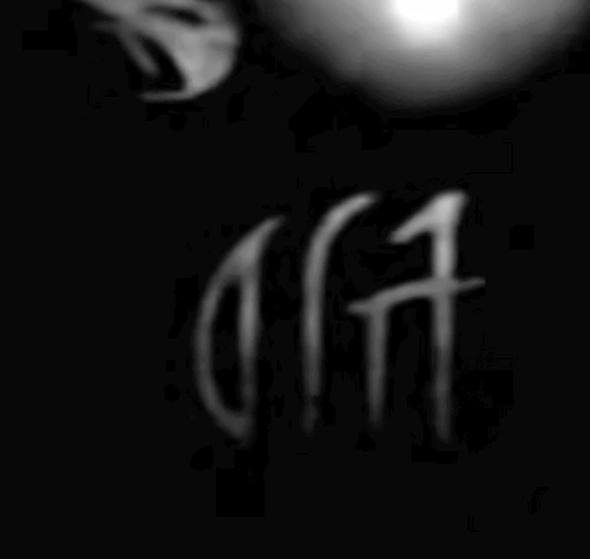
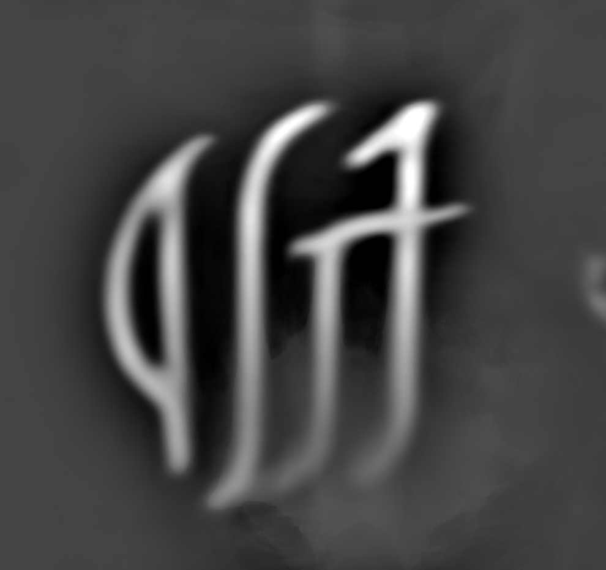
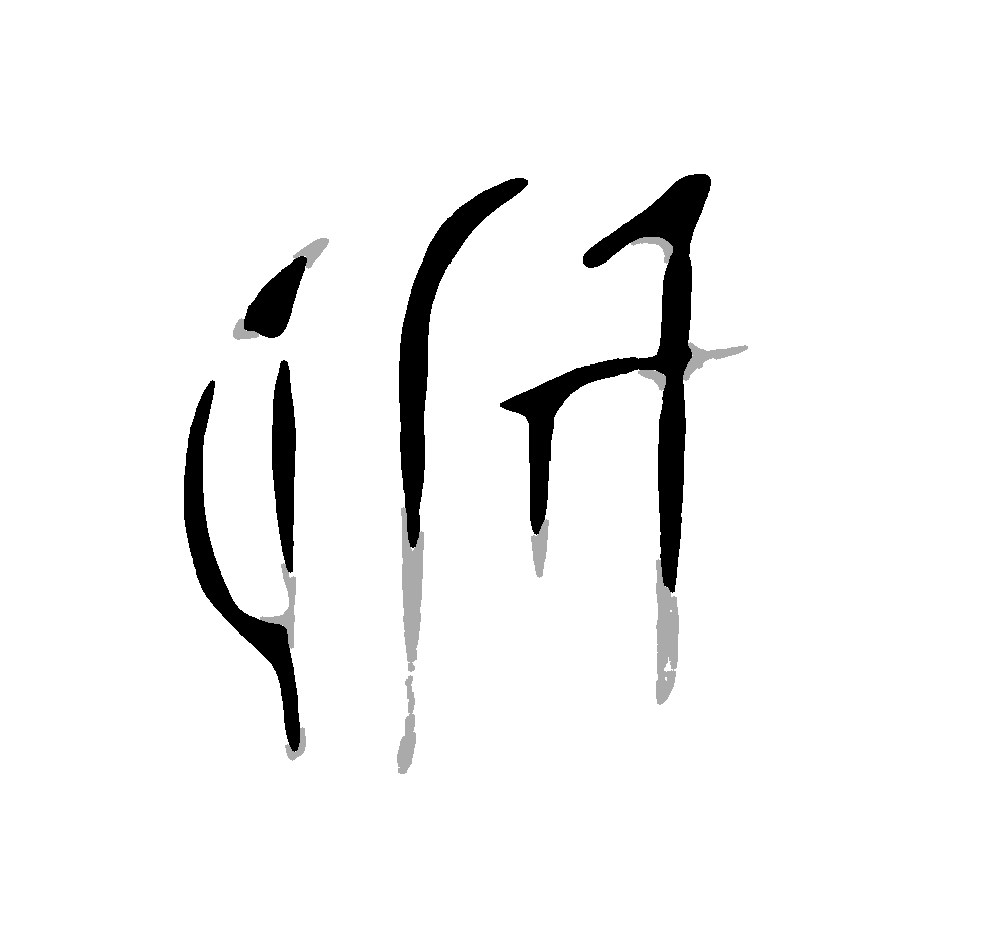
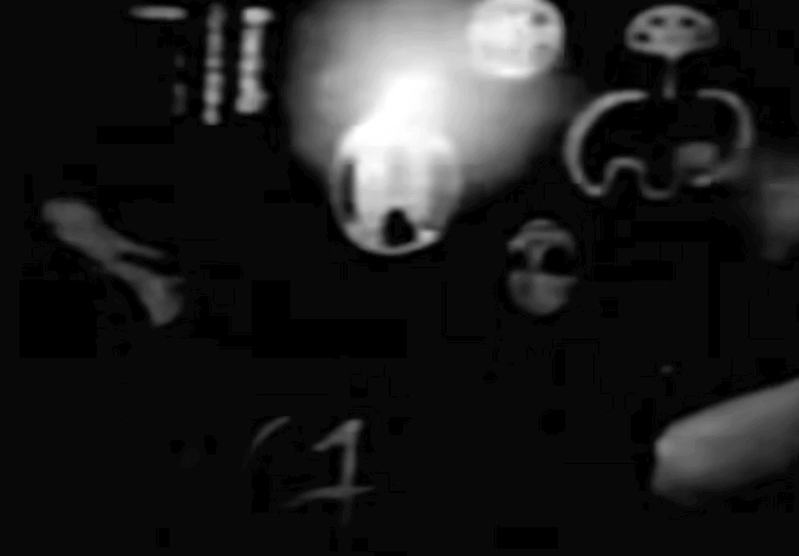
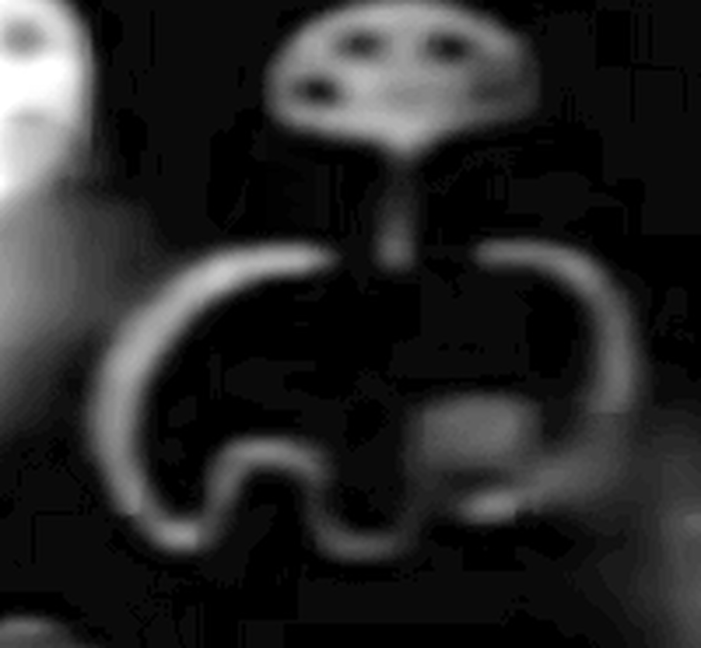
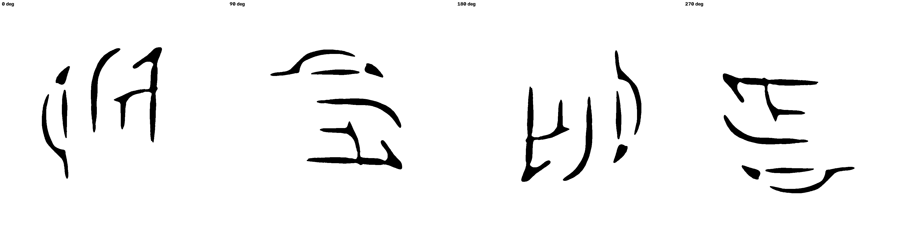
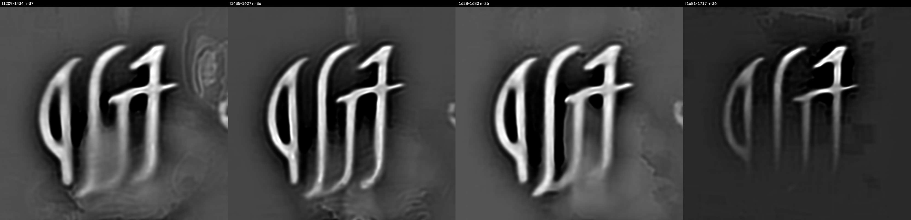
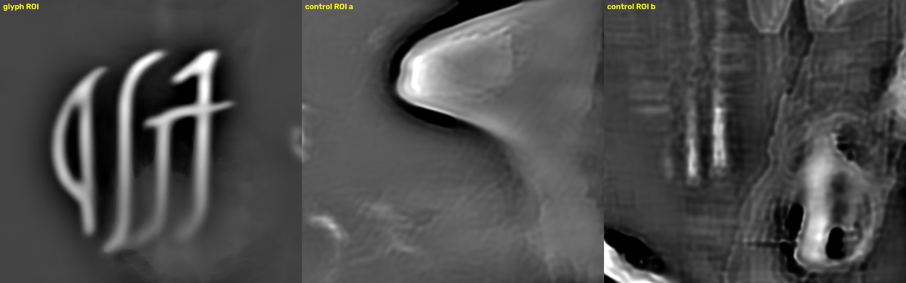
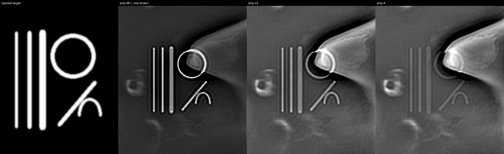

# Recovery and identification of the "symbol panel" marks — video 3, `l9RAhmPHM_A`

Agent report, 2026-07-29. All images and code under `analysis/symbol-panel/`.
Provenance is treated as undetermined throughout. The job here was to recover the marks as
faithfully as the material allows, state what the recovery can and cannot support, and say
what the marks resemble.

**Headline results, up front:**

1. The mark is **real in the data and survives all four anti-pareidolia controls comfortably.**
   It is not a marginal detection — the strokes sit 5–20× above the pipeline's measured
   detection floor and are recovered independently in four disjoint frame windows.
2. **It is not Cyrillic and not engineering labelling.** The `2Ц` reading in
   `reports/agent_video3_l9RAhmPHM_A.md:51` does not survive resolution; I could not reproduce
   it anywhere. It is best explained as a low-resolution artefact of two other panel devices.
3. **It is not Devanagari either**, although that is the family it most resembles and is where
   an unprimed Gemini independently landed. It fails the decisive structural test (§7.3).
4. A geometric result that was *not* asked for but is the most consequential thing I found:
   over the whole shot **the mark never foreshortens and never rotates** (§5.5). That is hard to
   reconcile with a mark on a surface being orbited by a camera. It is heavily caveated.
5. **No reuse from 2011.** Nothing resembling this panel or these marks exists in any of the four
   ivan0135 videos, nor in the two sibling 2026 videos (§6).

---

## 1. What was measured

| Quantity | Value | How |
|---|---|---|
| Picture area inside the letterbox | **x 263–1560, y 60–1042** | 50 % crossing of a max-projection over 212 frames spanning the whole file. The edge is *feathered over ~80 px*, not hard. Outer field is a flat three-level fill, values 26–30 |
| Frames registration attempted | 1099–1760 (662) | |
| Frames that produced a homography | 172 | SIFT + RANSAC to reference, ECC-refined |
| **Frames actually stacked** | **145, spanning f01209–f01717** | gate: NCC ≥ 0.40 in the glyph canvas *and* ≥ 12 RANSAC inliers |
| Time span of the stacked set | 40.3–57.3 s; burned-in `/18 02:17:49` → `02:18:09` | spans **both** catalogued fragments (17:48–54 and 18:01–09) |
| Canonical reference view | **f01694** | sharpest frame in which the whole mark is unoccluded and well exposed |
| **PSF, 10–90 % edge rise, panel region** | median **7.2 px**; p10 6.5, p90 8.3; **best frames 5.5–6.5 px** | 3 400–4 100 edge profiles per frame, 221 frames sampled at every 3rd |
| Equivalent Gaussian | σ 2.1–2.8 px → **FWHM 5.0–6.6 px = 1 resolution element** | 10–90 rise = 2.563 σ |
| Same metric on the burned-in timecode graphics | 5.5–5.8 px | so the *imagery* is at most marginally softer than the *graphics overlay*; the whole delivered picture is soft |
| Glyph cluster size | **183 × 192 px** (original frame pixels) | thresholded stack, back-scaled from the 3× canvas |
| → **resolution elements across the glyph** | **28 × 30** | 183/6.4, 192/6.4 |
| Median stroke width | **≈ 8 px** | 85th pct of the distance transform, ×2 |
| → **resolution elements per stroke** | **1.2–1.6** | |
| Stroke separations | 25–35 px = **4–7 resolution elements** | |
| Stroke contrast above local background | **25–90 DN** (8-bit), varying ~5× across the shot | local background floor ≈ 31 DN, local noise σ 0.15–4 DN |

### What that means for what is claimable

The cluster as a whole spans ~30 resolution elements, so **its overall form, the number of
strokes, their paths and their connectivity are well resolved and supportable.**

Individual strokes are **1.2–1.6 resolution elements wide** — at or just below the limit. So the
strokes are effectively *unresolved lines*: their position is measured, their **width and
cross-sectional profile are not**. Any claimed feature smaller than ~13 px in the original frame
(2 resolution elements) — a serif, a small barb, whether a terminal is pointed or blunt, whether
two strokes touch or merely approach — **is not supportable from this material.** Where I describe
terminals below I say so as an impression, not a measurement.

---

## 2. Method

The camera moves a lot over this shot, so nothing was averaged in frame coordinates.

1. **Picture extraction.** Crop to the measured picture area; work in float32 throughout; the
   burned-in timecode band (picture coords x 206–705, y 878–942) is masked to NaN before any
   stacking, and neutralised before feature detection.
2. **Per-frame normalisation for feature detection only.** Subtract a σ=25 background, divide by
   4σ of the residual. This makes SIFT work on frames whose absolute level varies by 3×.
3. **Registration.** SIFT (up to 5 000 features) on the whole picture, brute-force matched to the
   reference f01694 with a 0.8 ratio test, homography by RANSAC (3 px, 10 000 iters). Then an
   **ECC refinement in the canonical canvas** (`MOTION_HOMOGRAPHY`, 100 iterations, 1e-7) to get
   sub-pixel alignment on the region of interest specifically rather than on the whole frame.
4. **Canonical canvas.** A 3× upsampled 990 × 930 canvas defined by the mark's bounding region in
   the reference view. Every frame is warped into it with Lanczos-4 and NaN borders.
5. **Stacking.** Per-layer robust photometric normalisation (5th/99th percentile match to the
   running median layer, gain clipped to 0.2–5×), then a **2.5 σ-clipped mean** with per-pixel
   coverage counting. 145 layers.
6. **Enhancement.** Flat-field (σ=65 background subtract), percentile stretch, then optional
   **Richardson–Lucy** with the measured Gaussian PSF (σ = 8.1 px in canvas units), 25 iterations.
   Both the linear and the deconvolved versions are shipped; **the linear one is the honest one**
   and is what the line art was traced from. The RL version has visible ringing.
7. **Line art.** Not traced by eye. Each of the four disjoint window stacks is thresholded at the
   same *area fraction* (5.5 %), so a dimmer window is not penalised for being dim — what has to
   agree is *where the ink is*. Pixels inked in ≥ 3 of 4 windows are rendered **black**; pixels
   inked in exactly 2 are rendered **grey** in `glyph_lineart_uncertain.png`.

`analysis/symbol-panel/reg2.py` (registration), `stack.py` (stacking + controls), `build.py`
(deliverables), `motion_test.py`, `tilt_test.py`.

---

## 3. The recovery

**Single best raw frame (f01694), 1 %/99.7 % stretch only, 3× Lanczos — no stacking:**

The owner's standing complaint applies here too, and he is right that this raw frame is already
excellent. The stack below adds SNR and removes per-frame noise but does not add resolution.

**145-frame homography-registered stack, linear (no deconvolution):**

**Line art, window-agreement traced (black = agreed by ≥3 of 4 independent windows,
grey = 2 of 4):**

**Wider view of the panel, raw f01710:**

---

## 4. Inventory of distinct marks

### 4.1 The main mark (`glyph_01_full_cluster.png`)

One compact, roughly square, upright cluster, 183 × 192 px. Left to right:

1. **A left bowl.** A stroke bowing strongly left, its upper end curving right to a point; a
   second, inner stroke runs down inside it and the two enclose a narrow vertical lens-shaped
   counter. The inner stroke continues below the bowl as a tapering tail.
2. **A tall stem** with a pronounced **arch at the top curving up and over to the right**, then
   descending in a slight S and tapering to a fine point well below the other feet. This is the
   longest single stroke in the cluster.
3. **A short inner stem** hanging from the crossbar (item 5) and stopping at mid-depth.
4. **A tall right stem** whose top terminates in a sharp **left-pointing beak**.
5. **A horizontal crossbar at ~40 % of the cluster height**, joining stems 3 and 4 and
   **over-running to the right past stem 4**, tapering to a point that lifts slightly.

Weight is calligraphic: heavy at the tops and along the crossbar, hairline at the descenders,
roughly 5:1 modulation. **There is no headline along the top** — every stem top is free and
independent. This is the single most diagnostic negative feature (see §7.3).

Crops shipped: `glyph_02_left_crescent.png`, `glyph_03_double_minim.png`,
`glyph_04_flag_and_bar.png` (each also in a `_sharp` deconvolved variant).

### 4.2 The other panel devices (from raw f01710, not stacked)

| File | Description |
|---|---|
| `glyph_05_tick_ladder.png` | Two or three parallel vertical columns of short dashes, evenly spaced — reads as a graduated scale or bar indicator |
| `glyph_06_double_lobe_bracket.png` | A bilaterally symmetric device: a horizontal oval cap containing 4–5 dark dots, a central vertical stem, and two large C-arms curving out and down, each ending in an inward hook. Stable and legible over ~90 frames |
| `glyph_07_small_dial.png` | A small ring with two dark spots and an internal arc — dial- or gauge-like |
| `glyph_08_lamp_with_slot.png` | A bright bulbous form with a dark vertical slot — an indicator lamp, or simply a specular highlight on a curved body |
| `glyph_09_wing_object.png` | An elongated, tapering, wing- or blade-like form with an internal split |

**On the `2Ц` reading.** I could not reproduce it. The only candidates that would collapse to
something like `2Ц` at ~1/4 of full resolution are the bracket ornament above and the small dial;
resolved, neither is Cyrillic — the bracket is bilaterally symmetric with rounded arms and Ц is
not. I regard the earlier `2Ц` as an artefact of reading a small, soft feature.

---

## 5. Controls — all four, stated plainly

### 5.1 Rotation test — **PASS, with a caveat**

At 0° the mark has a coherent ductus: weight concentrated at the top, hairline descenders all
falling the same way, a consistent baseline region. At 180° and 270° it reads as an incoherent
tangle. **The caveat is 90°**, which retains some plausibility as an East-Asian-looking character.
So the mark is not orientation-agnostic, but the discrimination against 90° is weaker than against
180°/270°. The owner should try reverse-image search at 0° and 90°.

### 5.2 Four independent non-overlapping window stacks — **PASS, strongly**

Windows f1209–1434 (n=37), f1435–1627 (n=36), f1628–1680 (n=36), f1681–1717 (n=36). These are
disjoint in frames *and* in viewpoint, and the first two straddle the boundary between the two
separately-catalogued burned-in fragments.

- Pairwise IoU of the binarised stroke masks: **0.52 – 0.74**
- 58 % of all inked area is agreed by ≥3 of the 4 windows; **42 % by all 4**
- Cross-IoU of a control-ROI window against a glyph window: **0.037**

Every stroke listed in §4.1 appears in all four. Nothing appears in only one.

### 5.3 Matched control ROI — **PASS**

Three control ROIs of exactly the same canvas size (990 × 930 at 3×), using the same 145 frames,
the same homographies, the same stacking and the same enhancement. They yield blur, deconvolution
ringing and low-level mottling. **No stroke-like structure is manufactured.** Total bright area is
comparable (frac > threshold 0.035–0.040 vs 0.054 for the glyph) — this is a busy scene, not an
empty one — but the *coherence* is absent: the control output has no connected linear elements.

The 4-up version of the control ROI is `control_roi_4up.png`; unlike the glyph 4-up, its four
windows do **not** agree with each other.

### 5.4 Injection control — **PASS, with a measured detection limit**

A synthetic target — vertical bars of 3, 6 and 10 px stroke width, a 6 px ring, a 6 px diagonal
and a 4 px arc — was warped by each frame's inverse homography onto an empty part of the panel and
added at amplitude 40, 12 and 4 DN, then put through the identical pipeline.

| Injected amplitude | Result |
|---|---|
| 40 DN (≈ the real strokes) | everything recovered cleanly, including the 3 px bar |
| 12 DN | everything recovered; 3 px bar slightly soft |
| 4 DN | 6 and 10 px strokes and the ring recovered; **3 px bar marginal** |

**Detection limit: ≈ 4–6 DN for strokes ≥ 6 px wide, ≈ 10–12 DN for 3 px strokes.** The real
strokes are 25–90 DN, i.e. **5–20× above the floor.** This is not a marginal recovery.

*Limitation, stated:* the injection reused the already-solved homographies, so it tests
stacking + enhancement, not re-registration. Re-registering the injected frames from scratch would
have cost another full 19-minute SIFT pass.

### 5.5 An extra geometric control that was not requested — and it does NOT come out clean

The brief assumed a camera orbit. **I cannot confirm one at the mark.** Over the 145 registered
frames, polar-decomposing each frame's image transform at the mark's centre gives:

| | measured |
|---|---|
| in-plane rotation | **−4.4° to +8.5°** (median ≈ 1°) |
| isotropic scale | **0.82 – 1.36** |
| **anisotropy (foreshortening) s₁/s₂** | **1.00 – 1.42, median 1.04** |
| translation of the mark's centre in-frame | 140 px in x, **380 px in y** |

The mark **translates a long way, changes size by only ±25 %, never rolls, and never foreshortens** —
across 17 s during which the surrounding scene composition changes completely. A flat mark on a
surface being orbited should shear and foreshorten substantially.

Three honest caveats, any of which could dissolve this:

- **Selection bias.** Only 145 of 662 frames registered. SIFT is only weakly affine-invariant, so
  strongly foreshortened appearances would fail to match and be silently dropped. I tried to close
  this with an ASIFT-style affine-simulated template search over all 662 frames
  (`tilt_test.py`) — **it failed** (4 matches, degenerate homographies; pooling the simulated
  descriptors into one database defeats the ratio test). I did not have time to rewrite it as a
  per-simulation match. **This gap is real and I am flagging it as unclosed.** As a partial
  substitute I eyeballed a montage of the non-registering frames in which the mark is visible
  (f1183, 1195, 1303, 1315, 1363, 1518–1598, 1662, 1740): in all of them it also looks upright and
  unforeshortened, but that is an impression, not a measurement.
- **The scene-vs-glyph motion test was inconclusive.** `motion_test.py` estimates a homography
  from features *outside* the mark and asks whether it predicts the mark's position. Where enough
  scene features exist (f1673–1706, 20–607 inliers) the two agree to **0.2–18 px**, i.e. the mark
  does move with the scene. But those frames are all near the reference, so the baseline is short.
  Everywhere else the dark scene yields only 6–8 inliers — too few for a meaningful homography, and
  the large disagreements reported there are noise, not evidence.
- **Plane-normal estimation is unconstrained.** `decomposeHomographyMat` over the registered set
  gives a tilt of **17°, 31° and 24°** for assumed focal lengths of 0.9×, 1.2× and 1.6× the picture
  width. Because the homographies are near-similarities the decomposition is ill-conditioned. **No
  deskew was applied** to `panel_rectified_stack.png` — the mark already presents fronto-parallel
  in every frame, so the canonical stack *is* the fronto-parallel view. A speculative 24° deskew is
  shipped separately as `panel_deskew_alt24deg.png` for comparison only.

One observation that cuts the *other* way and is worth weighing: the mark's own amplitude varies
**5-fold** (16.7–89.1 DN) across the shot, brightening when the nearby light is close. A flat
constant-opacity 2D overlay would not do that; a lit surface or a rendered decal would.

---

## 6. Does this appear in the 2011 material, or the sibling 2026 videos? — No

- **ivan0135, 2011** (`videos/2011/`, four files: `RsQCXN4o4Ps`, `Xju_CY5ZESA`, `ZB788PtqQvg`,
  `a6TLGkrfNKI`). All four extracted at 2 fps (610 frames) and read as contact sheets. Content is:
  text/title cards, the FSB shield, a UFO over a treeline, aerial footage, bodies on the ground, the
  alien portrait and full-body shots, and a document with a four-digit handprint. **There is no
  interior panel and there are no glyph-like markings anywhere in the 2011 corpus.**
- **2026 siblings** `OpSTlDJWFFI` and `Oqw96jCOP7A`, sampled at every 15th frame (367 frames).
  Exterior craft, a lit ellipse over landscape, the alien portrait, hands and the beach/dune
  sequence. **No panel, no glyphs.**

So the symbol panel is unique to video 3, and **non-reuse is the finding.** Whoever made the 2026
material did not lift this from Ivan.

---

## 7. Ranked identification hypotheses

Mundane first, as instructed. My confidence in any single identification is low — what I can do
firmly is *rule things out*.

### 7.1 A designed decorative or fictional-script mark, most likely a typeface glyph or a 3D-asset decal — **most likely**

Everything about the mark's construction is typographic rather than utilitarian: calligraphic
weight modulation of roughly 5:1, a consistent implied pen angle, beaked terminals, minim-based
construction, a compact near-square body, and a deliberate balance between the left bowl and the
right crossbar assembly. It sits on a surface furnished with *other* designed devices — a graduated
tick ladder, a bilaterally symmetric bracket ornament, a small dial. That is set dressing, not
instrumentation.

This project already has an established thread (`docs/PIPELINE.md`) showing that the 2011 post-processing
was assembled from identifiable purchasable assets. A commercial "alien"/fantasy display font or a
sci-fi console decal pack is exactly the kind of thing that would produce this. **I cannot name the
font from memory and I would be making it up if I tried** — this is precisely the question a reverse
image search should answer, which is why the line art is the priority deliverable.

### 7.2 Generative-AI pseudo-script — **plausible, and consistent with several measurements**

The mark resembles Brahmic script, blackletter and East-Asian brush writing *simultaneously* while
matching none of them. That is the characteristic signature of generated writing: correct
statistics of stroke type and weight, wrong structural grammar. Also consistent: the complete
absence of foreshortening (§5.5); the fact that the mark's homography does not describe the rest of
the panel (registering on the panel furniture smears the mark and vice versa —
`panel_stack_panelreg.png`); and the organically-arbitrary, uniformly low-detail character of the
whole interior.

Against it: the mark is **topologically stable over 17 s and across two separately-catalogued tape
fragments** (§5.2), and its brightness tracks the scene light. Neither is impossible for a
generated or rendered sequence, but both are more than the null expectation. **Undetermined.**

### 7.3 Brahmic script — Devanagari, Siddham, Ranjana or Tibetan — **family resemblance, but fails the decisive test**

This is where an unprimed Gemini landed (§8), and I had independently thought the same thing, so it
deserves to be taken seriously and then tested rather than waved away.

The resemblance is real: vertical stems, a left-side bowl, and — most temptingly — stroke 2's tall
arch curving over to the right, which is exactly the shape of the Devanagari *i*-matra `ि`.

**It fails on the shirorekha.** The defining, non-optional feature of Devanagari (and of Tibetan,
mutatis mutandis) is a continuous horizontal **headline along the top** from which the letters hang
and which ties a word together. In the recovered mark:

- there is **no top headline** — all four stem tops are free, separate and pointed;
- the one horizontal bar sits at **~40 % of the height**, not at the top;
- it crosses only the **right pair** of stems, not the whole cluster;
- it **over-runs to the right past the last stem**, which a shirorekha does not do.

The bar is in the wrong place, spans the wrong extent, and terminates wrongly. Devanagari is
therefore ruled out as a match, and Siddham/Ranjana/Tibetan with it. Family resemblance without
identity — which is itself evidence for §7.1/§7.2.

### 7.4 Blackletter / Fraktur-derived display type, or a "gothic / metal / tattoo" display face — **possible**

Minim-based construction, a left bowl, hairline connecting strokes and spiky terminals are all
blackletter conventions, and the "gothic display" genre extends them into exactly this kind of
elongated tapering descender. Against: Textura and Fraktur feet are diamonds or hairline spurs, not
long tapering tails, and no blackletter letterform I know carries a mid-height crossbar that
over-runs to the right.

### 7.5 Cyrillic / Soviet instrument-panel labelling — **tested seriously and rejected**

This was the brief's headline mundane hypothesis and I wanted it to work. It does not.

- **Structurally wrong.** Ц is two verticals joined by a **baseline** with a descender at bottom
  right. The recovered mark has a bar at mid-height with **free tops** and **four** tapering
  descenders. Щ, Ш, Ц, Ц-adjacent forms all join at the bottom; this joins in the middle.
- **Stylistically wrong.** Soviet-era equipment legends — switch and dial captions, units,
  abbreviations — are stencilled or engraved in plain grotesque or slab Cyrillic with **uniform
  stroke weight**. The recovered mark has 5:1 calligraphic modulation. Nobody labels a control panel
  in a calligraphic display hand.
- **The `2Ц` observation does not survive resolution** (§4.2).

I note the tension: the project has a live Cyrillic thread elsewhere (the `Mark 5 (1961 год)`
caption in `OpSTlDJWFFI`, `analysis/cyrillic/gen1*`). That caption is a separate matter. **This mark is not
Cyrillic**, and treating it as such would be a wrong turn.

### 7.6 Standard technical / engineering symbol sets — **rejected**

IEC 60417 / ISO 7000 electrical and control symbols, aviation instrument legends, the trefoil and
other hazard marks, and astronomical/alchemical symbols are all **geometrically constructed** from
circles, straight lines and fixed angles at **uniform stroke weight**. None of them has calligraphic
modulation, and none has four tapering descenders. Confidently excluded as a family.

### 7.7 Other real writing systems considered and excluded

| Script | Why not |
|---|---|
| Glagolitic | built from circles, triangles and crosses; no long descenders |
| Old Turkic / Orkhon | angular, sparse, straight lines only; runiform |
| Tifinagh | geometric dots, lines and simple shapes; no modulation |
| Georgian Mkhedruli | round even-weight bowls; distinctive ascender/descender alternation absent here |
| Armenian | even weight, two-storey, distinctive hooks; no match |
| Linear A / B | small pictographic signs; no calligraphic hand |
| Cuneiform | wedge impressions; no curves at all |
| Ogham | tally strokes across a stemline |
| Norse runes (Elder/Younger Futhark) | straight lines only, deliberately curve-free for carving |
| Hangul jamo | geometric strokes, syllable-block layout |

**Nearest real-script families I could not fully exclude on look alone:** Thai/Lao and
Javanese/Balinese, which share the loops-plus-stems-plus-flags vocabulary. But Thai puts its loop
terminals at the *start* of strokes and Javanese has quite different baseline behaviour. Neither
produces this arrangement.

---

## 8. Gemini's answers — verbatim, and **unverified**

⚠ **Treat as a hypothesis generator only.** Gemini has a documented confabulation record on exactly
this corpus: it invented a Russian speech transcription that it retracted when given an isolated
audio stem, and it produced a Cyrillic caption reading now flagged as possibly primed. Nothing below
is evidence. Both calls were unprimed — no mention of aliens, UFOs, symbols, scripts, or the `2Ц`
reading — and were made separately.

### Call (a) — purely descriptive, on `glyph_stack_lin.png`

> Prompt: *"Look at the image file @imageA.png in this directory. Describe purely what you see: the
> strokes, curves and shapes, their number, their relative positions, their thickness and how they
> terminate. Do not speculate about what it is or what it means. Just describe the marks. Do NOT use
> any tools."*

> Based on a visual analysis of **imageA.png**, here is a detailed description of the physical marks, strokes, and shapes:
>
> ### General Characteristics
> * **Style:** The strokes are rendered in a glowing white with soft, blurred edges (motion blur or glow effect) against a dark, textured gray background.
> * **Thickness:** The strokes maintain a relatively uniform medium thickness throughout their main vertical bodies, tapering primarily at curved ends and horizontal tips.
>
> ---
>
> ### Description of the Three Main Structures (Left to Right)
>
> #### 1. Leftmost Structure
> * **Strokes and Shapes:** Consists of a vertical stem with a closed loop attached to its left side.
> * **Curves:**
>   * The main stem curves slightly to the right at the very top.
>   * A thin, outward-bowing curve (convex to the left) begins near the upper-middle of the stem and arcs downward, rejoining the stem near its lower end to form a hollow, leaf-like or loop-like negative space.
> * **Terminations:**
>   * **Top:** Curves to the right and tapers to a sharp, pointed tip.
>   * **Bottom:** Continues straight down past the loop, terminating in a blunt, rounded tip.
>
> #### 2. Middle Structure
> * **Strokes and Shapes:** A single, continuous vertical-ish stroke with significant curves at both ends.
> * **Curves:**
>   * The top arches smoothly to the right.
>   * The main body has a very slight wave or "S" curve.
>   * The bottom arches smoothly to the left.
> * **Terminations:**
>   * **Top:** Tapers to a sharp, pointed tip pointing to the right.
>   * **Bottom:** Curves to the left and tapers to a soft, pointed tip.
>
> #### 3. Rightmost Structure
> * **Strokes and Shapes:** A more complex, composite shape consisting of two vertical stems connected by a horizontal cross-stroke.
> * **Curves and Horizontal Strokes:**
>   * A horizontal cross-stroke intersects the main vertical elements, originating near the middle-left (bridging towards the middle structure) and extending outward to the right.
>   * The top of the far-right vertical stem has a short, sharp curve pointing down and to the left.
> * **Relative Positions & Terminations:**
>   * **Far-right Stem:** A straight vertical stem. Its top terminal is a sharp, left-pointing hook/beak. Its bottom terminal is blunt and rounded.
>   * **Inner Vertical Stem:** Drops down vertically from the middle-left of the horizontal cross-stroke, running parallel to the far-right stem. Its bottom terminal is blunt and rounded.
>   * **Horizontal Cross-Stroke:** Extends horizontally to the right beyond the far-right stem, terminating in a sharp, tapered point pointing slightly upward.

*My note:* this is an independent read and it agrees with §4.1 stroke-for-stroke, including the
crossbar's over-run to the right. That agreement is the useful part. Its claim that the descenders
are "blunt, rounded" is **below the resolution limit** and should not be relied on (§1).

### Call (b) — identification, on `glyph_lineart.png`

> Prompt: *"Look at the image file @imageB.png in this directory. Does this resemble any known
> writing system, logo, or technical symbol set? Give a ranked list of your best candidate
> identifications with your reasoning for each. Do NOT use any tools."*

> Based on a visual analysis of the image, the glyphs strongly resemble characters from **Brahmic writing systems**, specifically a calligraphic or handwritten rendering of the **Devanagari script** (used for Sanskrit, Hindi, Marathi, etc.).
>
> ### **1. Devanagari Script (Sanskrit / Hindi): "इति" (*iti*) or "एति" (*eti*)**
> This is the most precise and structurally consistent identification. The characters read from left to right as a single Sanskrit word.
>
> * **Syllable-by-Syllable Analysis:**
>   * **The Second and Third Glyphs — "ति" (*ti*):**
>     * In Devanagari, the short vowel modifier **"ि"** (short *i*) is written as a vertical bar to the left of the consonant it modifies, with an elegant arch connecting over the top of both characters.
>     * The second stroke in the image (the vertical line with the sweeping arch curving to the right) is the **"ि"** vowel sign.
>     * The third glyph is the consonant **"त"** (*ta*), characterized by its vertical stem and left-extending curved leg/shoulder.
>     * Combined, the arch of the vowel sign meets the top of the consonant, forming **"ति"** (*ti*) perfectly.
>   * **The First Glyph — "इ" (*i*) or "ए" (*e*):**
>     * In modern print, **"इ"** has a complex S-curve and tail. However, in calligraphic, older manuscript, and fast handwritten styles, it is often simplified into a left crescent stroke followed by a vertical stroke with a top dot or small wedge—matching the first glyph exactly.
>     * Alternatively, it can be read as **"ए"** (*e*) in a stylized brush-hand.
> * **Linguistic Meaning:**
>   * **"इति" (*iti*)**: An extremely common Sanskrit word meaning *"thus"*, *"so"*, or *"end"* (traditionally used at the end of texts, chapters, or direct quotes, similar to "finis" or quotation marks).
>   * **"एति" (*eti*)**: A Sanskrit verb meaning *"goes"* or *"approaches"*.
>
> ### **2. Northern Brahmic Calligraphy (Siddham or Ranjana Script): Sanskrit Mantra Glyphs**
> The stylistic features of the writing suggest a brush-written Sanskrit variant rather than standard modern printing.
>
> * **Reasoning:**
>   * The strokes exhibit a distinct calligraphic weight modulation (thick-to-thin transitions) characteristic of flat-tip brushes or reeds.
>   * The sharp, triangular wedge-like shapes at the tops of the first and third characters resemble the "head-stroke" (*shirorekha* or *coif*) typical of historical Northern Indian/Nepalese scripts like **Siddham** (used for Buddhist mantras in East Asia) or **Ranjana**.
>
> ### **3. Stylized Latin Cursive / Cursive Monogram: "uti" or "iti"**
> If interpreted as Western writing, it could be a stylized or artistic cursive signature or monogram.
>
> * **Reasoning:**
>   * The first glyph could represent an **"i"** (with the dot stylized as a wedge) or a stylized **"u"**.
>   * The second glyph resembles an **"l"** or **"r"**.
>   * The third glyph resembles a cursive **"ti"** or **"fi"** with a high crossbar.
>   * *Why it ranks lower:* The connections, stroke directions, and structural grouping (especially the sweeping overhead arch of the middle stroke) are highly unusual for Latin scripts but are perfectly standard conventions in Sanskrit-derived scripts.

*My note:* the Devanagari reading is worth chasing but I do **not** endorse it. Its own reasoning
contains the refutation — it invokes the shirorekha in candidate 2 while candidate 1 requires a
word that has none. `इति` in any hand carries a continuous top headline over both syllables; the
recovered mark has no top headline at all. I read this as Gemini pattern-matching the family and
then constructing a specific word to fit, which is the same failure mode as the retracted
transcription.

---

## 9. What I could not determine

- **Whether the mark is on a photographed surface, a rendered decal, or a composited layer.** §5.5
  leans away from "on a surface being orbited", but the selection-bias hole is not closed and the
  motion test was starved of scene features. This is the most important open question and it is
  answerable with more compute: rewrite `tilt_test.py` to match per affine simulation instead of
  against a pooled descriptor database, and re-run over all 662 frames.
- **The identity of the mark.** No font, script or franchise matched stroke-for-stroke.
- **Whether the panel is planar.** Registering on the mark smears the panel furniture and vice
  versa. That is consistent with a non-planar surface, with two different depths, or simply with
  registration failure on a low-contrast region. Not resolved.
- **Whether the panel furniture (tick ladder, bracket, dial) carries any information.** They are too
  soft to trace reliably; only the main mark survives clean binarisation.
- **Reverse image search.** Not available in this sandbox for image queries. This is the single
  highest-value next step and it needs a human at a browser.

---

## 10. For the owner — what to search, in what order

**Search these files, in this order:**

| # | File | Engine | Why |
|---|---|---|---|
| 1 | `analysis/symbol-panel/glyph_lineart.png` | **Google Lens** first, then **Yandex** | Clean black-on-white line art. Reverse search works far better on line art than on grey mush. Yandex is historically the strongest on stylised glyphs and fonts |
| 2 | `analysis/symbol-panel/single_best_frame.png` | Google Lens, Yandex | The raw frame, lightly stretched. Some engines do better on natural-looking input than on binarised art |
| 3 | `analysis/symbol-panel/glyph_stack_lin.png` | Google Lens, Yandex, TinEye | The linear stack — the best grey-scale recovery |
| 4 | `analysis/symbol-panel/glyph_lineart.png` **rotated 90° CW** | Yandex | The rotation control could not confidently rule 90° out (§5.1) |
| 5 | `analysis/symbol-panel/glyph_06_double_lobe_bracket.png` | Google Lens, Yandex | The symmetric bracket ornament is distinctive and is a *different* mark — a hit on it would identify the asset set even if the main glyph never resolves |
| 6 | `analysis/symbol-panel/single_best_frame_wide.png` | Yandex, TinEye | Whole-panel view. Aimed at finding the *source asset or footage*, not the glyph |
| 7 | `analysis/symbol-panel/panel_lineart.png` | Google Lens | Panel furniture as line art. Lowest expected yield |

Also worth trying, since they are cheap: **WhatFontIs** and **Font Squirrel Matcherator** on
`glyph_lineart.png` (they expect Latin, so expect failure, but a "closest match" list of display
faces would still be a lead); and **Shapecatcher** / the Unicode "draw a character" tools, which
would independently test the Brahmic hypothesis.

**What a hit would and would not prove:**

- **A hit on a commercial font, dingbat set, or 3D/decal asset pack** would be a significant
  finding. It would show the mark is a purchased or downloaded graphic element, and it would slot
  straight into the `docs/PIPELINE.md` thread. It would **not** by itself prove the whole video is
  fabricated — assets get used in reconstructions too — but combined with the no-foreshortening
  result it would be hard to explain innocently.
- **A hit on a franchise script** (Klingon, Tengwar, Aurebesh, a game's in-world alphabet) would be
  equally decisive about origin.
- **A hit on a real script** would be the most interesting outcome and would overturn §7.3. If it
  happens, check the headline question immediately: does the matched form have a top headline? If
  it does, the match is probably wrong.
- **No hit proves nothing at all.** Reverse image search on a soft, low-contrast, non-Latin glyph
  from a video frame fails routinely even when the source exists. A null result here should not be
  written up as "no source found".
- Note also that YouTube, Reddit and web.archive.org are blocked in this sandbox, so **anything I
  did not find is not evidence of absence** — including anything the community may already have
  posted about these marks.

---

## Appendix — file manifest (`analysis/symbol-panel/`)

**Primary deliverables**

| File | Contents |
|---|---|
| `panel_rectified_stack.png` | 145-frame canonical stack, RL-deconvolved, 1.8× upscaled. No deskew applied — the mark presents fronto-parallel in every frame (§5.5) |
| `panel_stack_raw.png` | Wider panel stack in the reference view geometry, no deskew |
| `panel_deskew_alt24deg.png` | Speculative 24° tilt correction, for comparison only — the tilt is not constrained |
| `single_best_frame.png` | f01694, 1 %/99.7 % stretch only, 3× Lanczos. **The honest raw option** |
| `single_best_frame_wide.png` | f01710 wide panel, raw, 2.6× |
| `glyph_stack_lin.png` / `glyph_stack_rl.png` | linear and deconvolved stacks |
| `glyph_stack_upscaled.png` | linear stack, 1.8× |
| `glyph_lineart.png` | traced line art, black on white |
| `glyph_lineart_uncertain.png` | same, with 2-of-4-window strokes in grey |
| `panel_lineart.png` | panel furniture as line art, from raw f01710 |
| `glyph_01…04_*.png` (+ `_sharp`) | individual crops of the main mark's components |
| `glyph_05…10_*.png` | the other panel devices, raw, 6× |

**Controls**

| File | Contents |
|---|---|
| `controls_4up.png` | four disjoint window stacks side by side (control 2) |
| `control_roi.png`, `control_roi_a/b.png`, `control_roi_4up.png` | matched control ROIs (control 3) |
| `injection_test.png`, `injection_amp{40,12,4}.png`, `injection_truth.png` | injection control (control 4) |
| `rotation_test.png` | 0/90/180/270° (control 1) |

**Data and code**

`reg2.py`, `stack.py`, `build.py`, `motion_test.py`, `tilt_test.py` (failed — see §5.5),
`reg2_1099_1760.npz` (145 usable homographies + quality metrics), `usable_frames.json`,
`plane_estimate.json`, `motion_test.json`, `*_stack.npy`, `glyph_win{0..3}.npy`.
