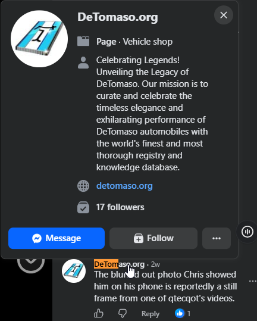

# Facebook chronology and the Zzuss predecessor — 2026-09-08

This follows the [domain archaeology](qtecqot-domain-archaeology-2026-09-08.md).
Browser access recovered the exact comment date, a previous Facebook page name,
and a corresponding older website whose code was reused in the car-registry site.
These results concern account and website history, not footage provenance.

Selected public facts and source hashes are in
`analysis/domain-qtecqot/archaeology-2026-09-08/facebook-public-evidence.json`.
Raw browser captures contain session/account information and remain in a private
temporary directory outside the repository. They are not a publication bundle.
The supplied cookie file was already ignored by Git and was not modified.

## Facebook page history

[Page Transparency](https://www.facebook.com/detomaso.org/about_profile_transparency)
shows page ID **107626098743894**. Opening **See all transparency information**
reveals:

| Event | Facebook display |
|---|---|
| Created under the name Zzuss.com | August 28, 2022 |
| Changed name to DeTomaso.org | March 27, 2024 |

The summary page displays August 27, 2022 as its creation date, whereas the
detailed history displays August 28. Both observations are retained. This
one-day discrepancy does not affect the finding that the page existed in 2022
and adopted the car-domain name in March 2024. Its cause was not determined.

The page explicitly links to detomaso.org. Page-name history connects the same
Facebook page ID across the two brands. It does not establish that the same
individual administered it throughout, or authenticate ownership of the domains.

## The comment date is now resolved

On the normal video-post view, dismissing the login prompt and choosing **View
more comments** exposed the DeTomaso.org comment. Hovering its **2w** label showed:

> Sunday, August 23, 2026 at 1:18 AM

The browser used the host's UTC timezone with no override. A separate default
Playwright context returned UTC from `Intl.DateTimeFormat().resolvedOptions()`.
As a control, the displayed reel time, August 22 at 08:02, agrees with the reel
post's embedded epoch timestamp. The comment time is recorded as
**2026-08-23 01:18 UTC, to the displayed minute**; seconds are not established.

Tooltip association was checked in the captured DOM: the element with
`aria-describedby="_r_4v_"` is within the article labelled as the DeTomaso.org
comment, following the exact supplied text. This prevents accidentally assigning
a neighbouring comment's date to the target.

The underlying post's embedded data gives:

```
post_id: 122128116518775502
creation_time: 1787385722
```

That epoch is **2026-08-22 08:02:02 UTC**. The associated reel media ID is
1745964936337693. The timeline is therefore:

| Event | UTC |
|---|---|
| qtecqot X post linking the interview story and Skinny Bob | August 21, 22:54:09 |
| Underlying Facebook reel post created | August 22, 08:02:02 |
| DeTomaso.org comment | August 23, 01:18, minute precision |

The comment came approximately **26 hours 24 minutes after** qtecqot's X post.
It could follow public discussion; it does not demonstrate advance knowledge.
The Facebook comment specifically identifies a blurred phone image, whereas
qtecqot's X text makes a broader claim about overlap between the stories. The
chronology does not establish copying or resolve the identity of the image.

Sources: [X post](https://x.com/qtecqot/status/2090935518397907328),
[Facebook reel](https://www.facebook.com/reel/1745964936337693),
[comment-targeted post link](https://www.facebook.com/Truthcapsuletv/posts/122128116518775502?comment_id=27872056109118076).

The prior reports' statements that exact ordering was unresolved describe the
earlier stage of work and are superseded here. The correction withdrawing a
date inferred from the rounded 2w label still stands: this date was obtained from
the tooltip, not from interpreting that label.

## Zzuss was a shopping-search site

The former page name led to archived Zzuss.com pages and assets. The
[August 28, 2022 homepage](https://web.archive.org/web/20220828050624/https://www.zzuss.com/)
describes a shopping portal combining marketplace and auction search results.
Its image title is **Shopping made Smooth**, the phrase left inside the later
DeTomaso page's commented-out logo element.

The [March 1, 2024 Zzuss homepage](https://web.archive.org/web/20240301050456/https://zzuss.com/)
and [February 28, 2024 DeTomaso homepage](https://web.archive.org/web/20240228182647/https://www.detomaso.org/)
share an **identical nonempty inline JavaScript block of 2,057 bytes**, SHA-256:

```
b878adbf72587833fd74a4e0f6ddfda45d2bd6543e7acfb61a212fc877a30ce8
```

Their HTML is closely related. Differences mainly replace the shopping-site title,
description and bookmark text; comment out the logo; replace the search box,
audio cue and Go button with the car-registry Coming Soon message; adjust layout
and background colours; and remove the audio-volume function. A cookie-consent
value also differs. The stale shopping keywords remain in the February car page.
The shared-script measurement is saved in `zzuss-detomaso-comparison.json`.

The archived stylesheets use the same custom selector names, including
`.e2-11`, `.tradeButton`, and `.searchbox0`. The shared general-purpose swal.css
asset alone would be weak evidence; the close custom-page code and Facebook's
explicit rename history are more specific.

**Interpretation:** the car-registry frontend is an adaptation of the earlier
shopping-search frontend, or of their common source. Facebook's page identity
was reused as well. This is concrete continuity between public web projects,
not merely an inferred common taste in cars or UFOs. It does not establish continuous
control by an individual or connect that individual to video production.

The car page already existed in the February 28 capture, about a month before
the March 27 Facebook rename. That fits a website being prepared before its
associated social page was renamed; this sequence is an inference, not a record
of the operator's intentions.

## Earlier graphics metadata

The archived Zzuss logo is a **732×331 RGBA PNG** with a **Software: Adobe
ImageReady** metadata field. Its archived 16×16 favicon is also a PNG with that
field, despite being served from an `.ico` path. The car page retained a logo
container sized 732×331, consistent with reuse of the earlier layout.

These metadata fields identify what those files claim as export software. They
do not establish a particular creator, an export date, use of that software today,
or the production software behind the qtecqot logo. The latter file's complete
PNG chunk stream contains no software metadata, as documented in the first report.
Compare the [website logo](../analysis/domain-qtecqot/2026-09-08/logo.png) with
the [similar mark in the original July 24 frame](../analysis/domain-qtecqot/2026-09-08/interior-avc-f01694.png).
The visual resemblance does not establish exact artwork identity or its source.

## Current Zzuss.com is a separate attribution problem

The current [Verisign RDAP record](https://rdap.verisign.com/com/v1/domain/zzuss.com)
has a July 22, 2026 registration event and nameservers under julyDNS.com. Current
DNS gives 45.204.233.144. HTTPS returned a TLS alert; ordinary HTTP returned a
site-stopped page. These are current observations, not the historical shopping site.

Do not attribute today's domain infrastructure to the operator of the 2022–2024
project without evidence of continuity. Similarly, older certificate records
returned by Cert Spotter are not by themselves evidence of current ownership.

## Acquisition notes

Chromium was installed into Playwright's browser cache through the existing
locked shared Python project. The supplied Netscape cookie file was loaded only
into a Facebook-scoped browser context. The first page was authenticated; later
pages identified the viewer as logged out and displayed login prompts. Public
page information and comments remained accessible by dismissing those prompts.
No credentials were entered, messages sent, reactions added, or account settings
changed. The browser context was closed after acquisition.

## Published evidence

See the [evidence index](../analysis/domain-qtecqot/README.md) for the selected
public files and hashes. Some acquisition paths above refer to the larger local
research collection; only files enumerated in the publication manifest are included.



The image is a pixel-preserving crop of the supplied screenshot, retaining the
page card and target comment. Its rounded 2w label is not the source of the exact
comment date, which was obtained separately as described above.
