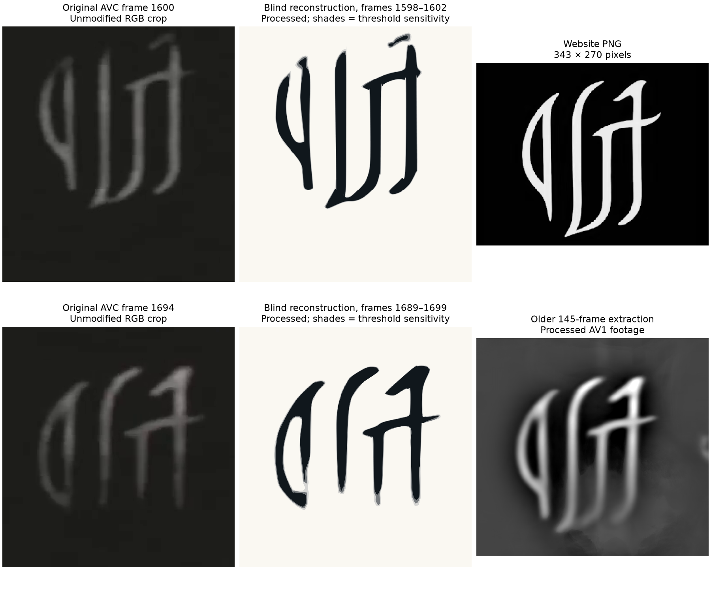
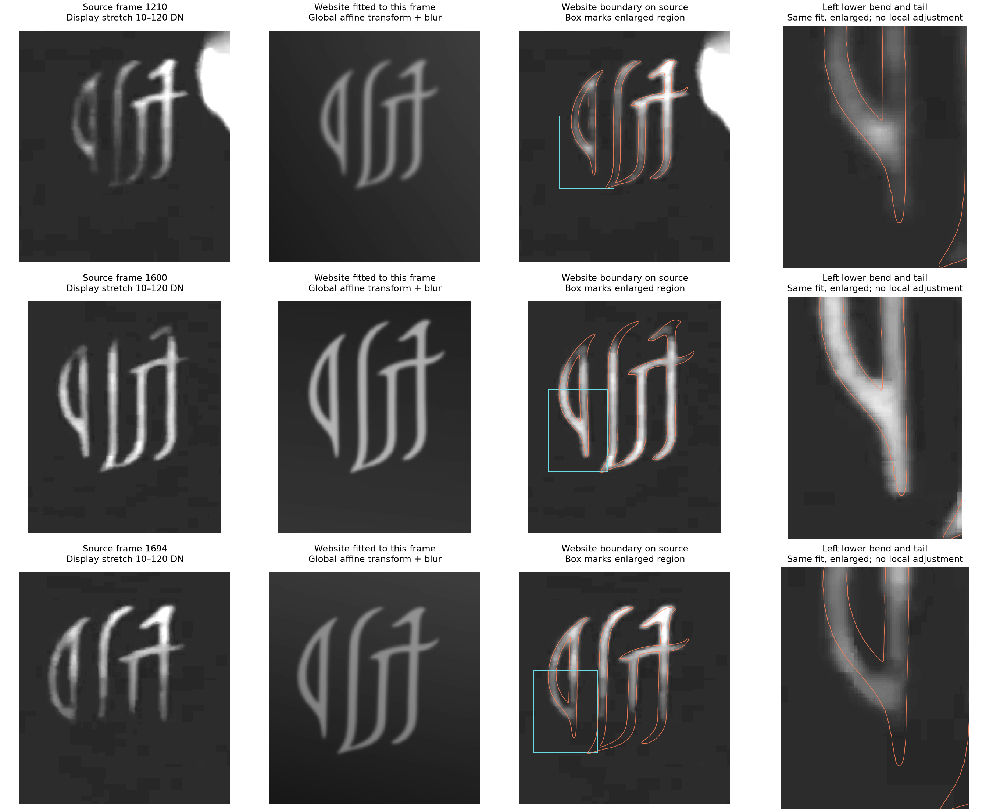
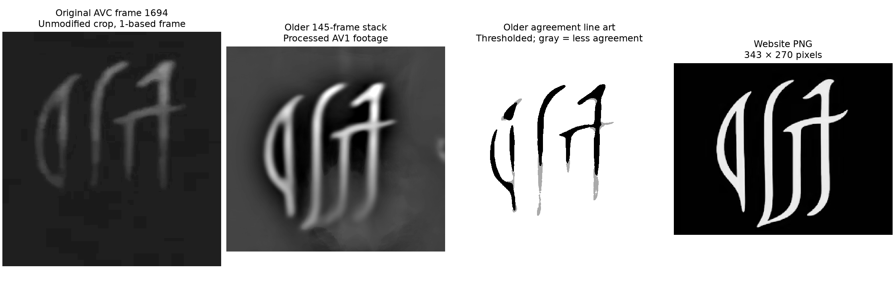
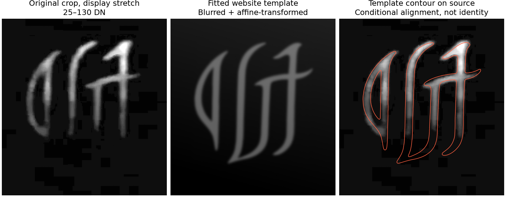

# Website logo and video symbol: two views and a blind reconstruction

2026-09-08. **The public footage contains enough visible structure to make a polished redraw plausible. The comparison does not distinguish a direct video trace from a trace of the older GitHub extraction.** Access to unpublished artwork remains possible, but the clean website logo does not establish it. Footage provenance remains undetermined.

The useful new comparison is [original AVC frame 1600](../analysis/symbol-reconstruction-2026-09-08/raw/frame-1600.png), alongside the previously linked [original frame 1694](../analysis/domain-qtecqot/2026-09-08/interior-avc-f01694.png). Both are from the July 24 video, `l9RAhmPHM_A`, before the August 6 registration of qtecqot.com. Frame numbers here are **1-based**.

The raw crops retain decoded RGB values; enlargement is for display. The vector reconstructions and the older stack are processed images. Gray layers show sensitivity to chosen contrast thresholds, **not confidence intervals**. Panel sizes are for comparison, not a common physical scale.

## What the earlier frame adds

In frame 1600, the two right-hand descending strokes visibly curve left at their lower ends. The inner curve approaches the central upright, and the left group has a downward tail. These features resemble parts of the [website logo](../analysis/domain-qtecqot/2026-09-08/logo.png) that the old conservative line art represented poorly. They are visible in the original crop, before stacking or drawing any contour.

Frame 1694 gives a different view: the upper portions are clearer, while the lower curves are less distinct. A reconstruction from only that later window would be an incomplete reference for judging the website artwork. The two views are kept separate; no canonical logo was assembled by choosing whichever pieces best matched the website.

This is a positive observation of broad strokes, not a recovery of precise edges. Projection, shading, blur, compression and changes within the footage have not been disentangled. No calibrated test for the absence of an individual stroke was performed.

## Does the left bend actually disagree?

**Visual judgment: the lower bend of the left, reversed-D-shaped group is a substantially better match in frame 1600 than the original frame-1694 overlay suggests. It is not persuasive evidence of a careless redraw.** The outline follows the earlier frame's curved side, transition into the upright and downward tail closely at the displayed resolution. Exact boundary identity is not established.

Read each row from left to right: source crop, fitted website raster, website boundary over the source, then an enlarged view of the cyan box. Frames 1210, 1600 and 1694 are separate observations from the same video. Each gets one global affine alignment; the highlighted bend is not moved or reshaped independently. The source columns use a 10–120 DN display stretch, retaining more faint signal than the earlier 25–130 DN figure. The saved raw crops retain original decoded RGB values.

In frame 1694, the visible lower bend looks blunter and shorter than the website outline, while several upper strokes agree well. But the lower portions of the central and right strokes are also much weaker in that frame. Frame 1600 shows both the left tail and the other lower curves clearly. Frame 1210 offers another view with a visible bend and fainter tail. A single bright segment should not be treated as the full boundary of the underlying design.

The visual comparison therefore supports strong overall resemblance, with some apparent discrepancies depending on the frame. It does **not** establish that illumination alone caused those changes: blur, shading, projection, compression and changes within the footage remain possible contributors. The fits use a constant foreground gain and a sloping background, not a model of spatially varying illumination on the strokes. They also do not correct full perspective. Residual offsets can reflect those limitations as well as differences in the artwork.

The orange line is the 50% boundary of the transformed, unblurred website raster, not a measured edge in the source. The original single-frame figure used a 35% contour of the blurred template; its line position consequently differs even before changing the alignment. Neither contour is a confidence boundary. No detection floor or calibrated test of local geometric differences was run, so the apparent agreement cannot exclude a small redraw alteration.

A traced and cleaned-up version remains plausible, as does use of common source artwork. **The left bend does not currently distinguish those explanations.** Establishing a genuine local design difference would require a repeatable offset after testing registration, blur and illumination choices, with injected differences to measure sensitivity. This figure is a visual comparison, not that completed attribution test.

[Multi-frame comparison script](../analysis/symbol-logo-comparison-2026-09-08/compare_multiple_frames.py), [fit settings and parameters](../analysis/symbol-logo-comparison-2026-09-08/multiple-frame-metrics.json), original RGB crops: [1210](../analysis/symbol-logo-comparison-2026-09-08/raw-crop-f01210.png), [1600](../analysis/symbol-logo-comparison-2026-09-08/raw-crop-f01600.png), [1694](../analysis/symbol-logo-comparison-2026-09-08/raw-crop-f01694.png).

## Better line art, with its limits visible

A separate reconstruction agent received the original AVC source, the target panel location and the frame number. It was instructed not to inspect the website logo, old reconstructions or prior symbol interpretations. It completed its outputs before comparison with those references. This reduces reference-driven tracing; it is not an independent source of footage or a statistical validation.

The results are smoother than the old fragmented silhouette, with two useful views:

- **Earlier view, centered on 1600:** [smooth SVG](../analysis/symbol-reconstruction-2026-09-08/earlier-view-reconstruction.svg), [PNG preview](../analysis/symbol-reconstruction-2026-09-08/earlier-view-reconstruction.png), [threshold sensitivity](../analysis/symbol-reconstruction-2026-09-08/earlier-view-with-threshold-sensitivity.png).
- **Later view, centered on 1694:** [smooth SVG](../analysis/symbol-reconstruction-2026-09-08/reconstruction-smooth.svg), [PNG preview](../analysis/symbol-reconstruction-2026-09-08/reconstruction-smooth.png), [threshold sensitivity](../analysis/symbol-reconstruction-2026-09-08/reconstruction-with-uncertainty.png).

These are contour-derived illustrations, not recovered original artwork. Five AVC frames (1598–1602) and eleven AVC frames (1689–1699) were separately aligned by translation and median-combined. Local background subtraction and mild smoothing preceded contour extraction. No generative enhancement or manual joining was used. Threshold selection, contour filtering and Bézier smoothing still introduce analyst choices. The exact upper caps, tips and stroke widths are not determined by the smooth SVGs.

[Method, parameters and reproduction commands](../analysis/symbol-reconstruction-2026-09-08/reconstruction-notes.md), [earlier diagnostic](../analysis/symbol-reconstruction-2026-09-08/earlier-view-diagnostic.png), [later diagnostic](../analysis/symbol-reconstruction-2026-09-08/diagnostic-contact-sheet.png).

## Could the website have used the older GitHub work?

The [July symbol report](agent_symbols.md) includes a [145-frame aligned extraction](../analysis/symbol-panel/glyph_stack_lin.png) and a [conservative line-art image](../analysis/symbol-panel/glyph_lineart_uncertain.png). The files occur in commit [`914c18b`](https://github.com/CraaazyPizza/slim-tim/commit/914c18b22104e222a63289d7babf3ba8995a6bcc), dated July 29, 2026, 23:00:20 UTC. Commit dates alone do not establish when an outside reader could first access them. A local August 2 remote-tracking reflog is additional local evidence of remote availability, not an independently archived public timestamp.

The older pipeline used the AV1 copy. Reproducing its `single_best_frame.png` from that source yielded identical pixels (1,298,700 values compared), supporting that source lineage. Its line-art pipeline deliberately retained only high-agreement bright areas, then applied morphological filtering. This left detached pieces and shortened strokes. The website logo connects or extends several of those areas. It is therefore not an unchanged copy of that fragmented line-art image; producing it from that image would require further editing.

*The older line-art panel shows how thresholding broke up a shape that is more complete in the grayscale extraction. The website is not an unchanged copy of those disconnected pieces.*

The older grayscale extraction is a more plausible tracing reference than the broken silhouette: it retains broader curves visible in the video. However, those curves also appear in raw frame 1600. Their presence in the website logo cannot identify GitHub as the intermediate source. Visual inspection has not supplied a positive, distinctive processing fingerprint that attributes the website artwork to the older extraction; no calibrated exclusion test was performed.

## What each proposed route explains

| Route | Assessment from these images |
| --- | --- |
| Public video → trace and cleanup → website | Plausible. The raw footage supplies the broad curves, uprights and crossbar. Exact sharp tips and widths can be drawing choices. |
| Public video → older GitHub extraction → trace and cleanup → website | Also plausible. The older grayscale stack is a useful reference, but no demonstrated copied artifact separates this route from direct tracing. |
| Original artwork or higher-quality private source → video and website | Compatible, but not required by the observed detail. A reciprocal link from an established uploader account, documented source artwork or a distinctive shared production artifact would be more informative. |

The website file is a 343 × 270 PNG. Smooth boundaries at that size are consistent with ordinary drawing or tracing. Its recorded PNG structure contains no embedded date or software label; that does not identify which application produced it. Even documented access to original graphic artwork would be a production link, not evidence that the depicted events are genuine.

**Working interpretation:** a polished rendition of the public video's mark is sufficient to explain the website logo. Direct tracing and use of the older extraction remain unresolved alternatives. There is no basis here for assigning numerical probabilities or identifying a particular artist or editing application.

## Supplementary fit and reproducibility

[The source comparison](../analysis/symbol-logo-comparison-2026-09-08/source-comparison.png) shows the older line art explicitly. A [supplementary fit](../analysis/symbol-logo-comparison-2026-09-08/website-fit-to-frame.png) applies an affine transform, Gaussian blur, gain and a background plane to the website raster to compare it with frame 1694. This is a conditional illustration of resemblance, **not an identity or origin classifier**; its residual depends on the selected crop, mask and model. It should not override the additional lower-stroke evidence in frame 1600.

*This earlier figure emphasizes the brighter upper strokes. Its lower-stroke discrepancies should be read alongside frame 1600 above, rather than interpreted on their own. It also uses a different display stretch and contour definition.*

[Comparison script](../analysis/symbol-logo-comparison-2026-09-08/compare.py), [fit parameters](../analysis/symbol-logo-comparison-2026-09-08/comparison-metrics.json), [selected-file hashes](../analysis/symbol-logo-comparison-2026-09-08/PUBLICATION-MANIFEST.json). Source frames were decoded with ffmpeg 4.4.2. Reconstruction scripts require the original AVC video at the documented repository path and the shared locked Python environment.
